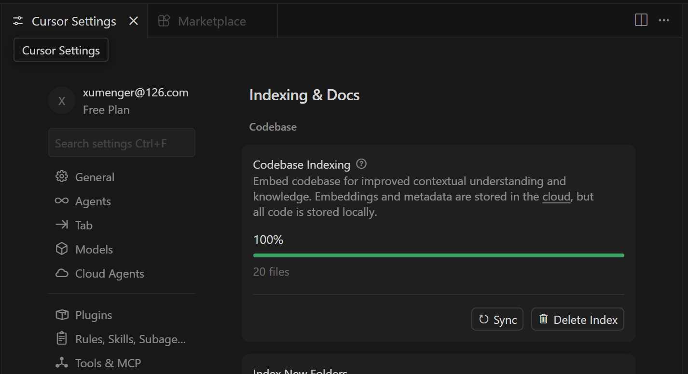

## 参考资料

* [https://github.com/xiaoweidotnet/awesome-cursor-rules-mdc](https://github.com/xiaoweidotnet/awesome-cursor-rules-mdc)
* [https://github.com/modelcontextprotocol/servers](https://github.com/modelcontextprotocol/servers)

## 代码库搜索

代码库搜索是Cursor 最强大的功能之一。它通过为代码文件创建嵌入向量，帮助AI 全面理解你的项目。这个功能让AI 能“看见”整个代码库，而不仅仅是当前打开的文件



代码会分成小块上传到服务器计算嵌入向量，所有明文代码在请求后会立即删除，只有嵌入向量和元数据（如哈希值、文件名）会存储在数据库中，源代码本身不会被保存

Cursor Settings 可以对插件、规则、技能、MCP、工具、钩子进行配置


## command

>本质是把你常用的提示词保存成 .md 文件，需要时一键调用

对于一些相似度很高的编码，可以自定义command，把步骤和约束形成文档，后面使用，来一键生成代码，省的重复沟通，核心也是文档驱动

比如创建一个xm-code-review 的command，然后编写命令（默认创建的是项目级command，放在.cursor/commands/


```
# xm-code-review

请对当前代码进行审查，检查以下方面：

## 功能性
- [ ] 代码按预期运行
- [ ] 边界情况已处理
- [ ] 错误处理适当

## 代码质量
- [ ] 函数小而专注
- [ ] 变量命名清晰
- [ ] 无重复代码

## 字段类型

- [] 日期字段使用Integer或者BigDecimal，不能使用LocalDateTime等时间类型
- [] 时间字段使用Integer或者BigDecimal，不能使用LocalDateTime等时间类型

## 安全性
- [ ] 无硬编码密钥
- [ ] 输入已验证
```

可以用这样的方式来触发对某个文件的代码检视


比如对于DDD 架构的SpringBoot 应用，后续可以针对适配器层（包括DTO 等）、应用层、领域层（实体、领域服务）、基础设施层（PO、SQL 等）分别编写对应的代码检视命令，并且逐步沉淀足够多的代码检视规则

所以核心还是在于你要对每一层代码需要关注哪些点、可能有什么风险有足够的经验，并且进行清晰的总结！

## rule

比如每次沟通都要约束“不要生成中文注释、改代码前先经过我同意”，那么可以把这个约束放到rules 中作为全局约束

Command 与Rule 的区别？Rules 可以理解为“你应该始终这样做”、Command 可以理解为“当我说这个词时，帮我做这件事”

|  维度     | Command           |  Rule |
|  ----    | ----               |  --- |
| 触发方式  | 手动输入/命令       | 自动生效，无需触发 |
| 作用时机  | 执行特定任务时      | 每次对话都生效 |
| 本质      | 任务模板           | 行为约束 |
| 类比      | 菜谱（做特定菜时看）| 厨房规章（始终遵守） |


## MCP


## Plugin


## Superpowers 插件

>[http://github.com/obra/superpowers](http://github.com/obra/superpowers)


## drawio-mcp


## feedBack-enhanced-mcp

>[https://github.com/Minidoracat/mcp-feedback-enhanced](https://github.com/Minidoracat/mcp-feedback-enhanced)

