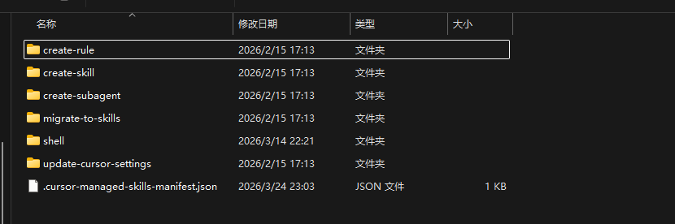
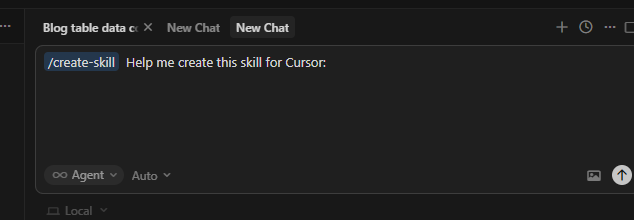
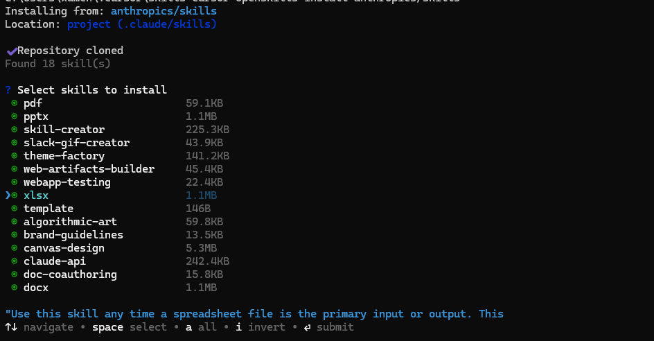
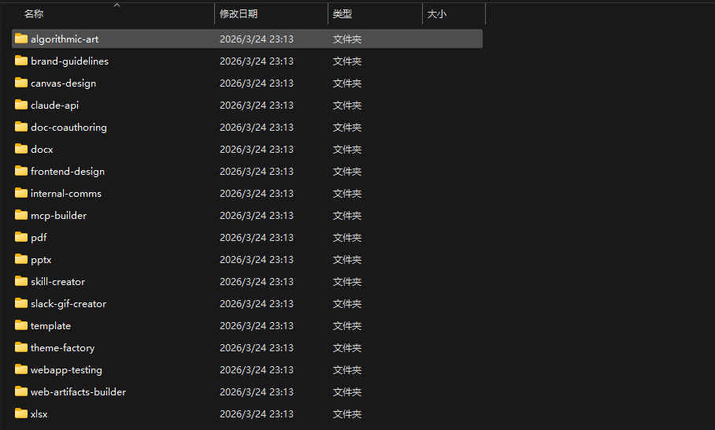
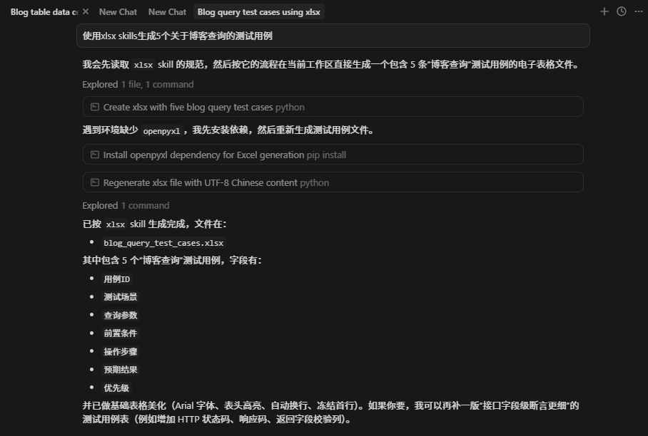
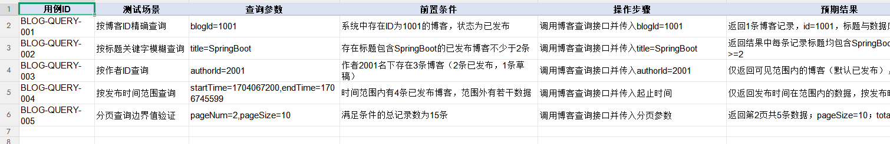

在[《OpenClaw 研究：OpenClaw Agent、Skills 等功能》](https://xumenger.github.io/open-claw-20260320/) 这篇里面，对于Skill 是什么、怎么用大概有了一些认知，本文展示一下Cursor 的Skill

自己要多去看一些好的Skill 是怎么实现的，可以尝试通过与AI 对话的方式辅助自己编写好的Skill

Cursor 的Skill = 预定义的、可复用的“任务型 Prompt 模板”

|  维度     | Rule              |  Skills |
|  ----    | ----               |  --- |
| 是否自动生效  |   是            | 否    |
| 是否需要点击 |     否           |  是   |
| 适合内容     | 项目规范、长期习惯 |  具体任务流程   |
| 是否改写行为  |     约束AI      |  指挥AI   |
| 是否可参数化  |      否         |  是   |

>👉 不要用 Skill 去写“规范”，Skill 里写“一次任务怎么做”

>👉 不要用 rules 去写“流程”，rules 里写“永远成立的事实”

## Cursor 自带的Skill

在【C:\Users\用户名\.cursor\skills-cursor】 目录下面可以看到Cursor 自带的一些Skill



对应可以在Cursor 里面调用这些Skill



## 使用开源Skill

先安装openskill

```shell
npm install -g openskills@1.2.1
```

如果需要全局的Skill，可以进入【C:\Users\用户名\.cursor\skills-cursor】 下，使用openskills 命令安装

```shell
openskills install anthropics/skills
```



可以看到这些技能安装到了【C:\Users\用户名\.cursor\skills-cursor\.claude\skills】 下面



然后就可以在Cursor 里面使用这些Skills 了，比如：使用xlsx skills 生成5 个关于博客查询的测试用例



生成之后，可以看到对应的Excel 内容如下



建议自己去看一下xlsx 这个Skill 是怎么写的，去了解Skill 的工作原理

其他参考资料：

* [ai code工具](https://blog.csdn.net/w_t_y_y/category_13139783.html)
* [工具Cursor（六）Rules&Skill&commands（2）Skill](https://blog.csdn.net/w_t_y_y/article/details/157901239)
