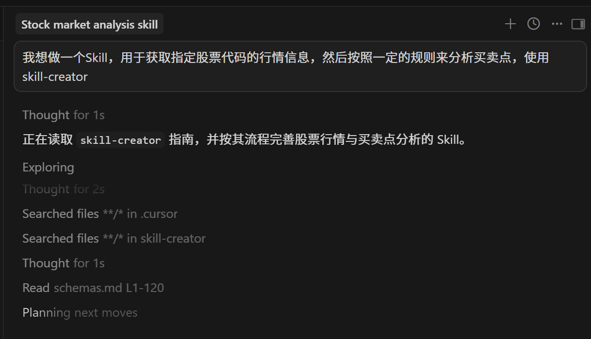
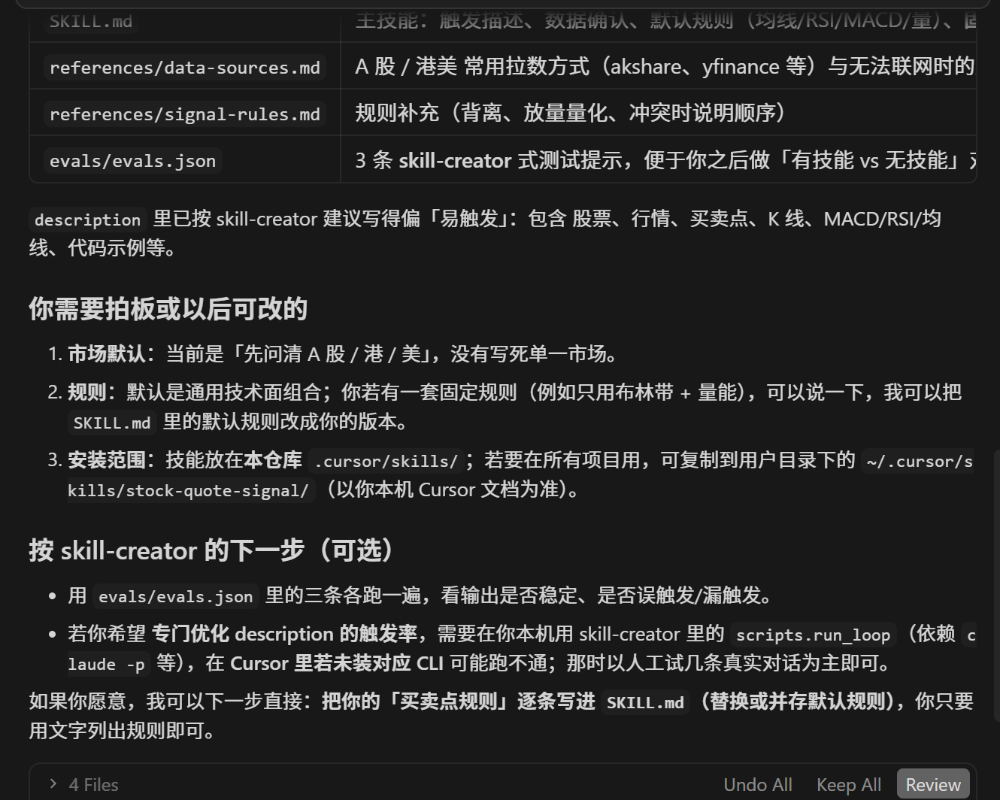
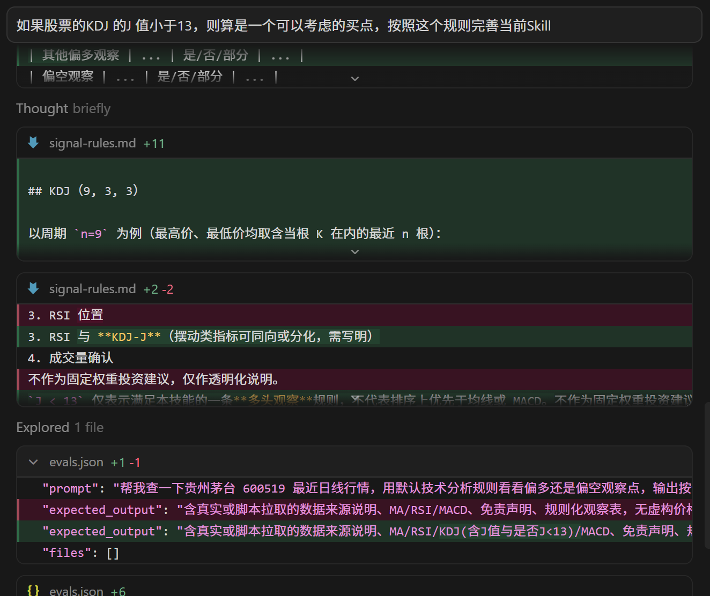
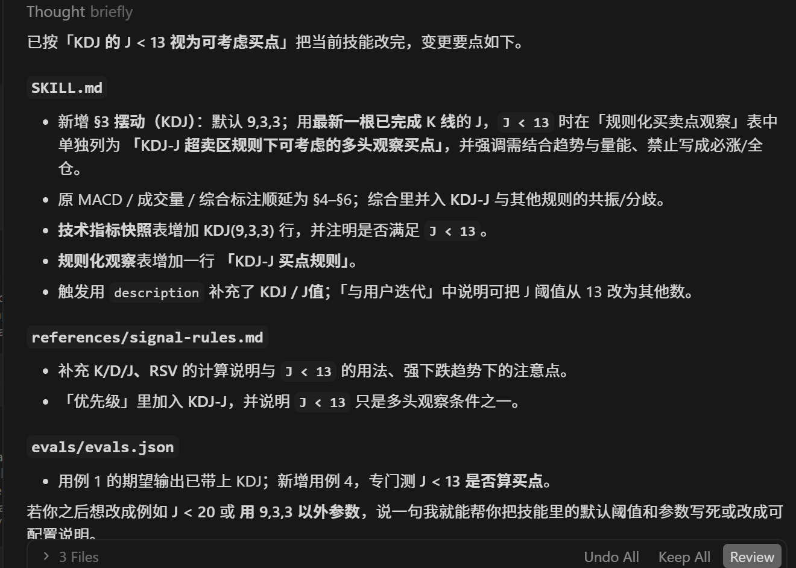
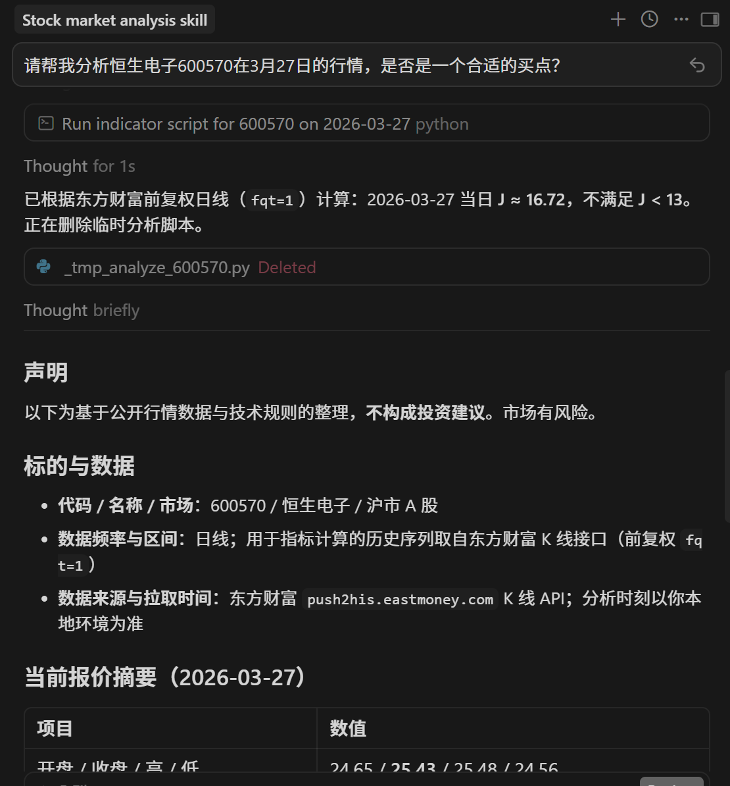

>[https://github.com/anthropics/skills/tree/main/skills/skill-creator](https://github.com/anthropics/skills/tree/main/skills/skill-creator)

可以使用自带的【create-skill】，也可以使用anthropics 的【skill-creator】

比如使用【skill-creator】 去从0 编写一个Skill，展示整个流程，了解Skill 创建的思路和可能遇到的坑

## Skill 介绍

一个Skill 的目录结构一般如下所示

```
skill-name/
├── SKILL.md        # 核心说明（必须）
├── scripts/        # 可执行脚本
├── references/     # 文档或知识
├── assets/         # 附加资源
```

智能体读取SKILL.md 的指导，调用scripts/ 中的脚本，参考references/ 中的文字

如果任务属于以下类型，使用脚本（在 scripts/ 中实现）：

* 文件格式处理：docx/pdf/Excel 转换、图片压缩、二进制操作
* 外部 API 调用：需要鉴权的第三方服务、复杂 API 工作流
* 复杂数据计算：数学统计、算法实现、大规模数据处理
* 系统级操作：批量文件操作、进程管理、网络爬虫

其中最重要的是SKILL.md 其内容模板一般如下：

```
---
name: skill-name              # 必需：Skill 名称（小写字母+连字符）
description: Skill的核心能力与触发场景描述    # 必需：100-150 字符
dependency:                   # 可选：依赖管理
  python:                     # Python 依赖包
    - package-name==version
    - requests==2.28.0
    - pandas>=1.5.0
    - another-package>=1.2.0
  system:                     # 系统级命令，前置需要执行的命令行命令
    - mkdir -p some-path
    - chmod +x scripts/*.sh
---

# Skill 标题

## 任务目标
- 本 Skill 用于：一句话场景
- 能力包含：核心能力要点
- 触发条件：典型用户表达或上下文信号

## 前置准备
- 依赖说明：scripts 脚本所需的依赖包及版本
- 非标准文件/文件夹准备：需要前置创建的文件或文件夹

## 操作步骤
- 标准流程：
  1. 步骤 1：输入/准备
     - 如果涉及脚本执行，说明：调用 `scripts/<script-name>.py` 处理...
     - 如果由智能体处理，说明：根据参考文档中的指导...
  2. 步骤 2：执行/处理
  3. 步骤 3：输出/校验
- 可选分支：
  - 当 条件 A：执行 分支 A
  - 当 条件 B：执行 分支 B

## 资源索引
- 必要脚本：见 [scripts/<script-name>.py](scripts/<script-name>.py)
- 领域参考：见 [references/<topic>.md](references/<topic>.md)
- 输出资产：见 [assets/<template-dir>/](assets/<template-dir>/)

## 注意事项
- 仅在需要时读取参考，保持上下文简洁
- 当操作脆弱或需强一致性时，优先调用脚本执行
- 充分利用智能体的语言理解和生成能力

## 使用示例（可选）
根据实际功能提供 2-3 个典型使用场景
```

构建一个优质的 Skill 需要遵循清晰的规范和最佳实践。通过合理选择实现方式、精心设计目录结构、严格遵循质量门槛，你可以创造出真正有价值的智能体扩展包

## skill-creator 流程

skill-creator 的工作流程如下所示

```
想清楚需求
    ↓
起草 SKILL.md
    ↓
设计测试用例
    ↓
运行测试（有 Skill vs 没有 Skill，对比效果）
    ↓
评估结果（看报告 + 打分）
    ↓
根据反馈修改 SKILL.md
    ↓
重复，直到满意
    ↓
打包成 .skill 文件
```

## skill-creator 案例

比如：我想做一个Skill，用于获取指定股票代码的行情信息，然后按照一定的规则来分析买卖点，使用skill-creator





继续完善Skill：如果股票的KDJ 的J 值小于13，则算是一个可以考虑的买点，按照这个规则完善当前Skill





本案例纯粹是一个展示skill-creator 的案例，所以继续完善这个测试Skill 就不继续了

接下来测试一下这个Skill 的效果：请帮我分析恒生电子600570在3月27日的行情，是否是一个合适的买点？



## 参考材料

* [拆解 Anthropic 的 skill-creator：AI Agent 的技能工厂是怎么运转的](https://zhuanlan.zhihu.com/p/2010428945124831373)
* [Claude Code 插件 Skill-Creator 使用说明](https://blog.csdn.net/u014333212/article/details/157023838)
* [skill-creator 使用](https://www.runoob.com/claude-code/skill-creator-usage.html)
* [Skill 构建指南：从零打造 AI 智能体扩展包](https://blog.csdn.net/weixin_39939819/article/details/157777024)
