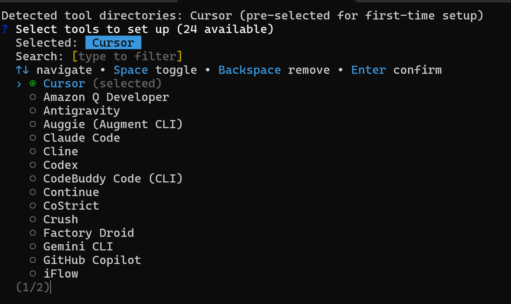
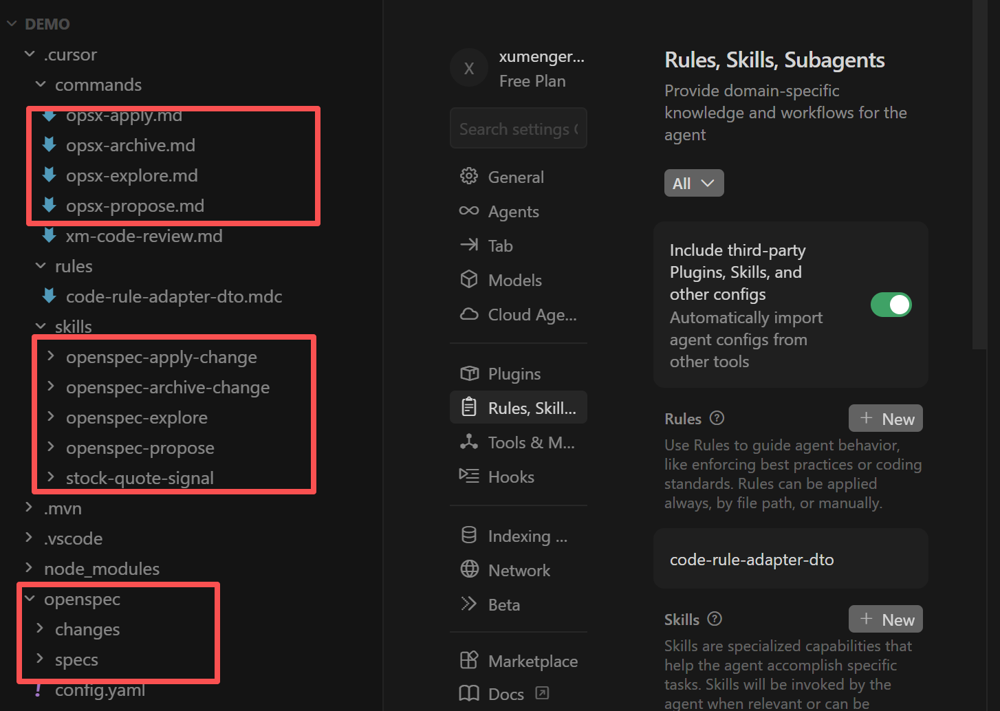

开发者用自然语言去描述需求，AI 自动生成代码，但是存在很多问题，比如

1. 代码的质量是否可信，尤其是资金类应用？
2. 如何保证需求描述的足够清晰、没有遗漏？
3. 如果是在存量的代码基础上修改，AI 如何理解存量代码？
4. 存量代码缺少最新的文档，文档与代码脱节严重

## 安装open-spec Skill

到项目目录下执行

```shell
npm install -g @fission-ai/openspec@latest
openspec init
```

然后选择对应的工具为cursor



到项目工程下面可以看到新增了这些内容



```
your-project/
├── .claude/                              # Claude Code 集成目录
│   ├── commands/
│   │   └── opsx/                         # OpenSpec 斜杠命令
│   │       ├── apply.md                  # /opsx:apply 命令定义
│   │       ├── archive.md                # /opsx:archive 命令定义
│   │       ├── explore.md                # /opsx:explore 命令定义
│   │       └── propose.md                # /opsx:propose 命令定义
│   └── skills/
│       ├── openspec-apply-change/        # apply 工作流的行为指导技能
│       ├── openspec-archive-change/      # archive 工作流的行为指导技能
│       ├── openspec-explore/             # explore 工作流的行为指导技能
│       └── openspec-propose/             # propose 工作流的行为指导技能
└── openspec/                             # OpenSpec 核心规范目录
    ├── changes/                          # 进行中的变更（每个变更一个子目录）
    │   └── archive/                      # 已归档的历史变更记录
    ├── specs/                            # 系统行为规范（事实来源，初始为空）
    └── config.yaml                       # OpenSpec 项目配置
```

OpenSpec 通过在项目中引入一个openspec/ 目录，将每次特性开发或变更组织为包含提案、规范、设计、任务清单的结构化文件夹。配合AI助手的斜杠命令，开发者可以在几秒内启动一次规范化的变更流程，而不是直接让AI开始写代码

接下继续以博客项目为例，原来已经有了博客、评论的功能，现在使用OpenSpec 来辅助开发管理员功能

1. 管理所有的博客
2. 管理所有的评论
3. 管理所有的用户

## 探索需求


## 技术栈、架构、API契约


## 可并行、可追踪的任务列表


## 代码生成、测试案例


## 参考材料

* [SDD规范驱动开发：AI时代的软件工程新范式](https://johng.cn/ai/sdd-spec-driven-development)
* [OpenSpec：轻量级AI工程规范管理框架](https://johng.cn/ai/openspec-ai-engineering-spec-framework)
