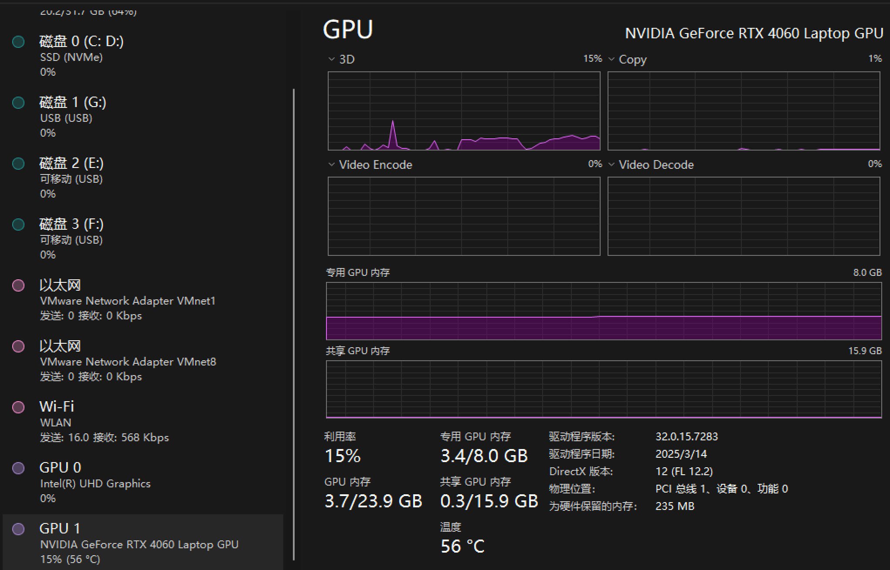
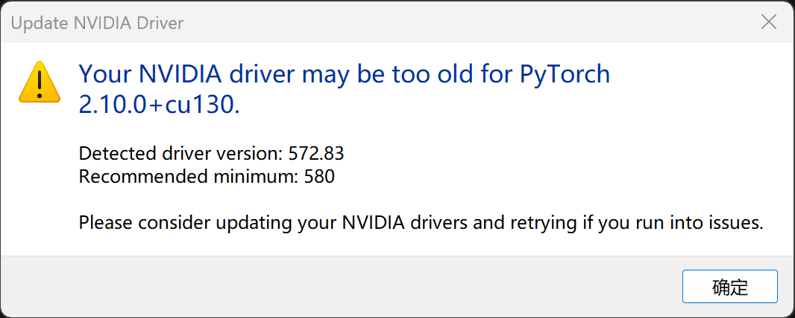
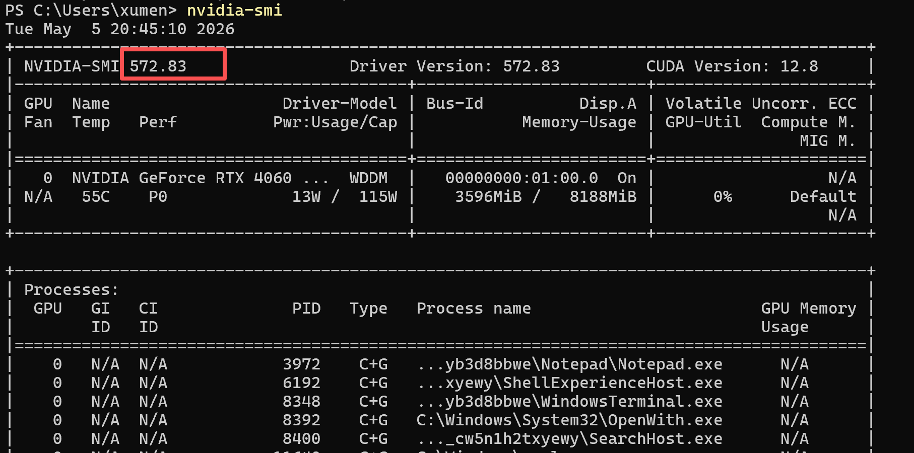
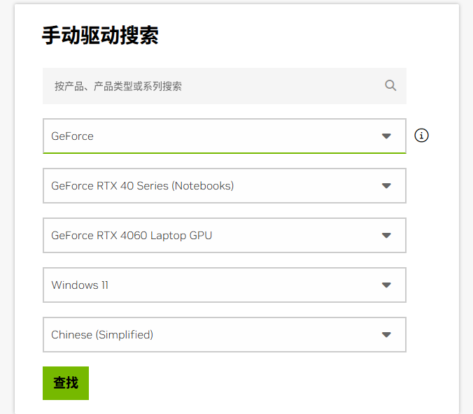
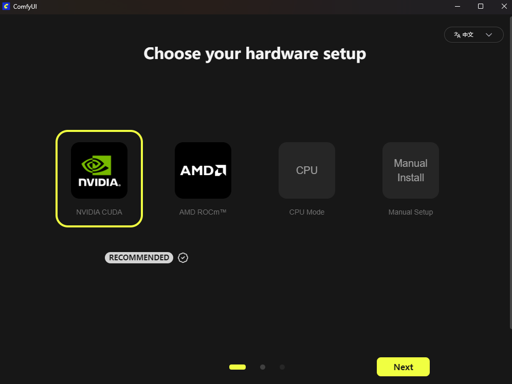
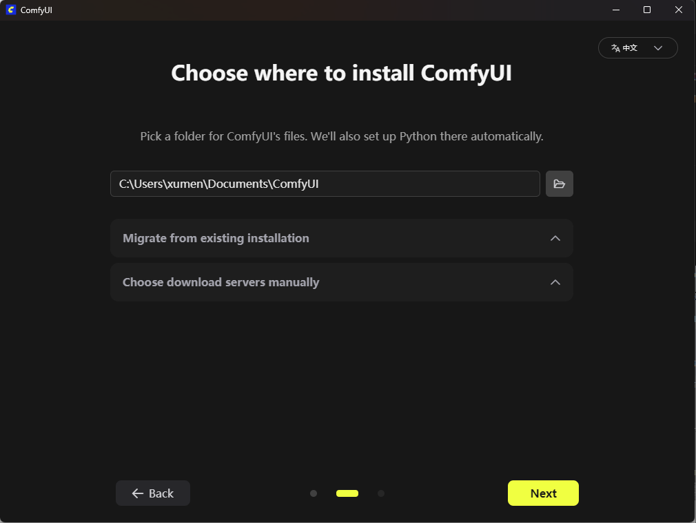
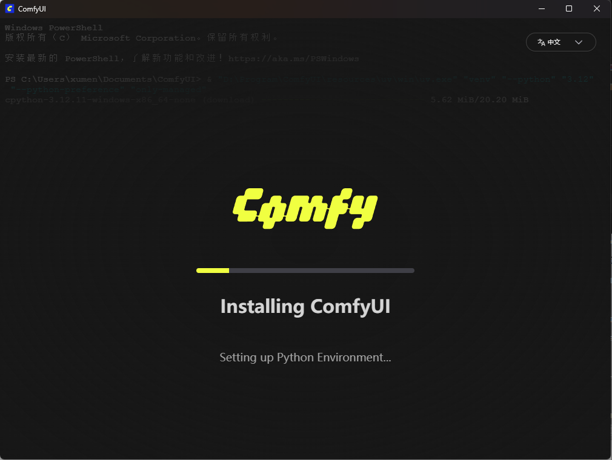
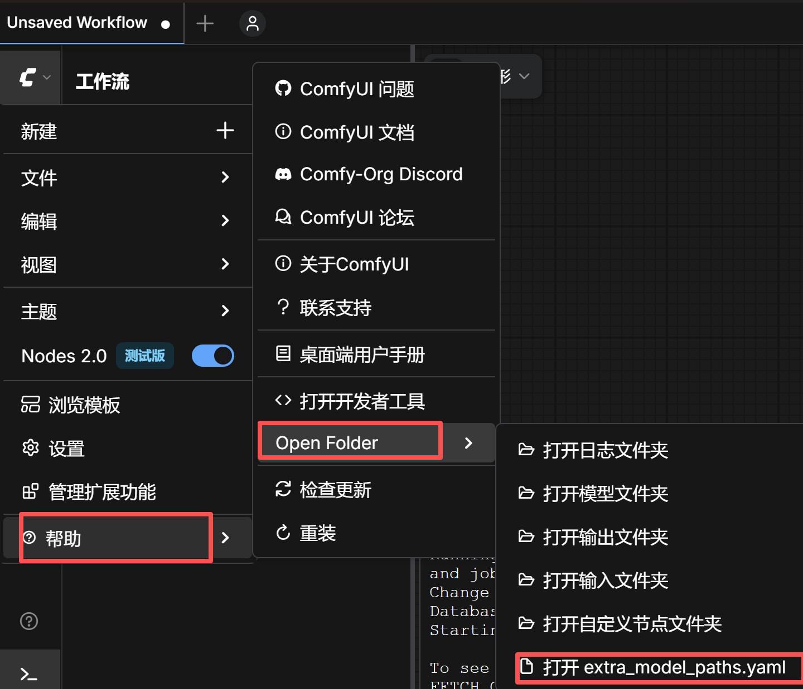

>[https://github.com/Comfy-Org/ComfyUI](https://github.com/Comfy-Org/ComfyUI)

机器的配置如下



## 部署方式一

[https://github.com/Comfy-Org/ComfyUI/releases/latest/download/ComfyUI_windows_portable_nvidia.7z](https://github.com/Comfy-Org/ComfyUI/releases/latest/download/ComfyUI_windows_portable_nvidia.7z) 点击这个下载链接进行下载

下载到本地后，双击【run_nvidia_gpu.bat】运行

但是这种方式下载很慢

## 部署方式二

[https://www.comfy.org/download](https://www.comfy.org/download)下载安装包



```
Your NVIDIA driver may be too old for Pytorch2.10.10 + cu130
Detected driver version: 572.83
Recommended minimum: 580
```





[https://www.nvidia.cn/Download/index.aspx?lang=cn](https://www.nvidia.cn/Download/index.aspx?lang=cn)，选你的显卡型号、系统（Win10/11 64 位），下载 ≥ 580 的正式版（比如 581.94 或更新）







## 下载大模型

打开extra_mode_paths.yaml



默认内容是

```
# ComfyUI extra_model_paths.yaml for win32
comfyui_desktop:
  is_default: "true"
  custom_nodes: custom_nodes/
  download_model_base: models
  base_path: C:\Users\xumen\Documents\ComfyUI
desktop_extensions:
  custom_nodes: D:\Program\ComfyUI\resources\ComfyUI\custom_nodes
```

因为大模型一般很大，默认放在C盘会不太合适，所以可以在这里设置其他的目录作为大模型的目录

```
# ComfyUI extra_model_paths.yaml for win32
comfyui_desktop:
  is_default: "true"
  custom_nodes: custom_nodes/
  download_model_base: G:\AI\ComfyUI\models
  base_path: C:\Users\xumen\Documents\ComfyUI
desktop_extensions:
  custom_nodes: D:\Program\ComfyUI\resources\ComfyUI\custom_nodes
```

## 安装ComfyUI-Manager

```shell
cd C:\Users\xumen\Documents\ComfyUI\custom_nodes
git clone https://github.com/ltdrdata/ComfyUI-Manager.git
```

重启ComfyUI

