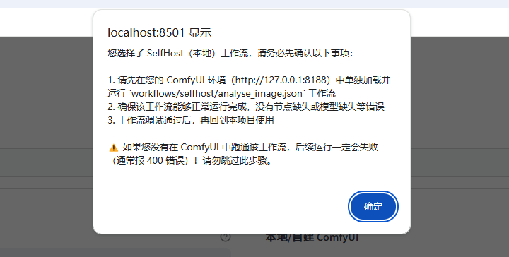
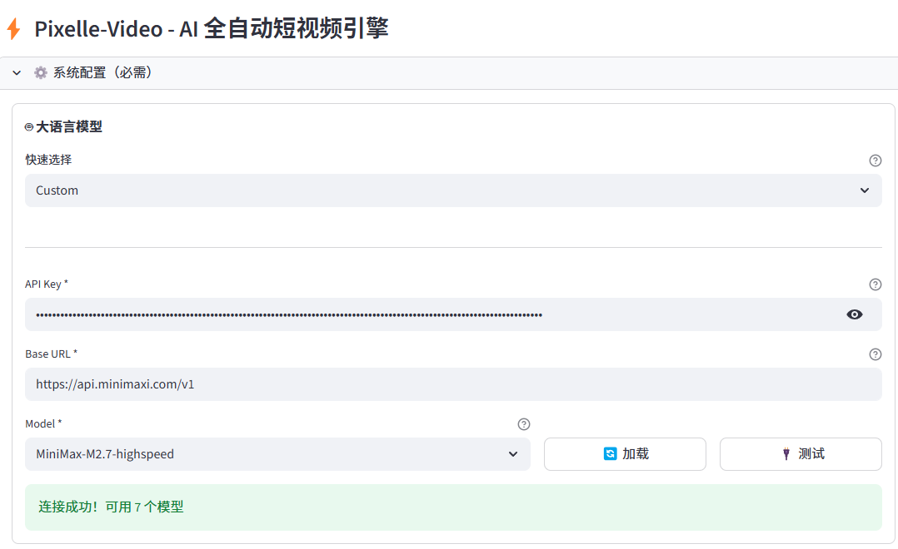
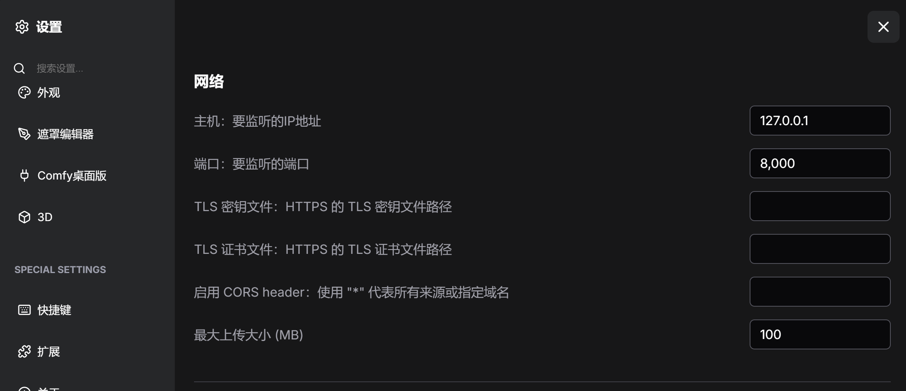
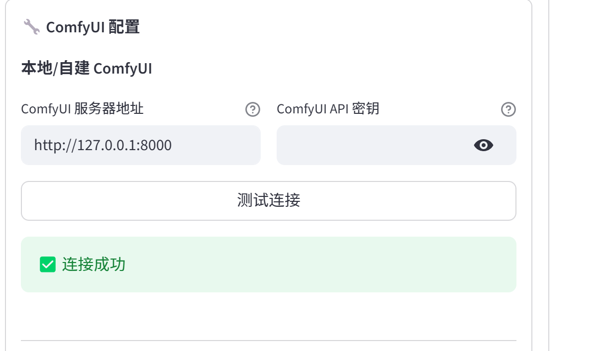
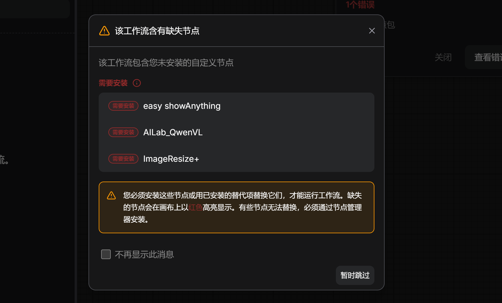
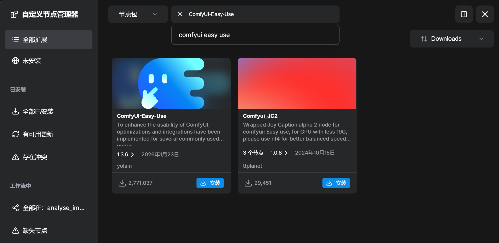
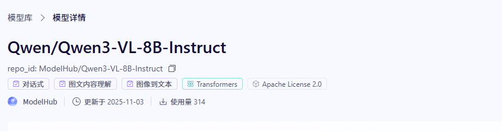
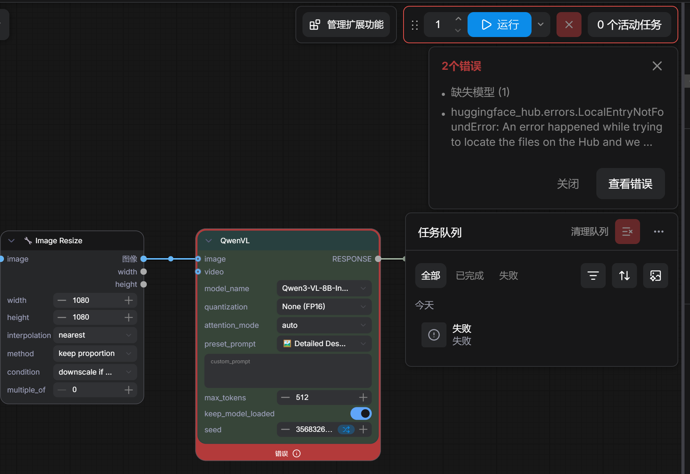
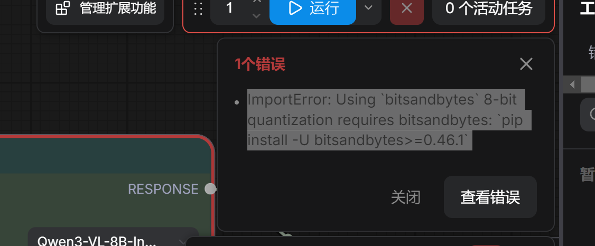
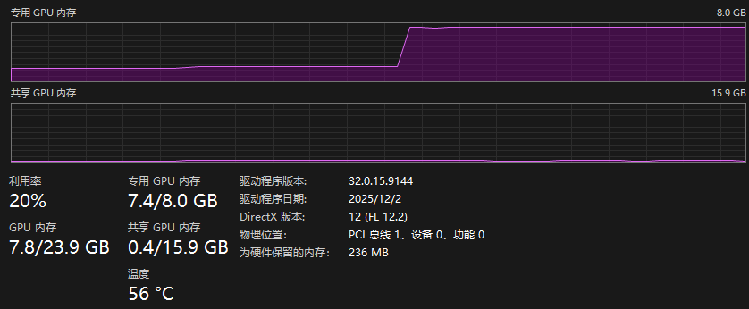

>[https://github.com/AIDC-AI/Pixelle-Video](https://github.com/AIDC-AI/Pixelle-Video)

只需输入一个 主题，Pixelle-Video 就能自动完成：

* ✍️ 撰写视频文案
* 🎨 生成 AI 配图/视频
* 🗣️ 合成语音解说
* 🎵 添加背景音乐
* 🎬 一键合成视频

零门槛，零剪辑经验，让视频创作成为一句话的事！

[下载 Windows 一键整合包](https://github.com/AIDC-AI/Pixelle-Video/releases/tag/v0.1.15)

1. 下载最新的 Windows 一键整合包并解压
2. 双击运行 start.bat 启动 Web 界面
3. 浏览器会自动打开 [http://localhost:8501](http://localhost:8501)
4. 在「⚙️ 系统配置」中配置 LLM API 和图像生成服务
5. 开始生成视频！

> 提示: 整合包已包含所有依赖，无需手动安装任何环境。首次使用只需配置 API 密钥即可。



## 环境配置

大语言模型选择minimax

>[https://platform.minimaxi.com/docs/guides/text-generation](https://platform.minimaxi.com/docs/guides/text-generation)



ComfyUI 配置为本地环境





## 测试 workflows/selfhost/analyse_image.json


[https://github.com/AIDC-AI/Pixelle-Video/blob/main/workflows/selfhost/analyse_image.json](https://github.com/AIDC-AI/Pixelle-Video/blob/main/workflows/selfhost/analyse_image.json)，找到对应的工作流

```json

{
  "5": {
    "inputs": {
      "image": "IMG_20250829_201936.jpg"
    },
    "class_type": "LoadImage",
    "_meta": {
      "title": "$image.image"
    }
  },
  "6": {
    "inputs": {
      "text": "A small, fluffy ginger kitten with large, wide green eyes sits upright on a glossy white tiled floor, its paws planted firmly as it stares intently forward, exuding an air of innocent curiosity; beside it rests a colorful striped cat tunnel in hues of red, blue, purple, and green, while soft indoor light reflects off the polished surface around it, illuminating the scene with gentle warmth and creating subtle highlights on the kitten’s fur and whiskers — capturing a quiet moment of stillness within a cozy home setting.",
      "anything": [
        "7",
        0
      ]
    },
    "class_type": "easy showAnything",
    "_meta": {
      "title": "Show Any"
    }
  },
  "7": {
    "inputs": {
      "model_name": "Qwen3-VL-8B-Instruct",
      "quantization": "None (FP16)",
      "attention_mode": "auto",
      "preset_prompt": "🖼️ Detailed Description",
      "custom_prompt": "",
      "max_tokens": 512,
      "keep_model_loaded": true,
      "seed": 3731918183,
      "image": [
        "8",
        0
      ]
    },
    "class_type": "AILab_QwenVL",
    "_meta": {
      "title": "QwenVL"
    }
  },
  "8": {
    "inputs": {
      "width": 1080,
      "height": 1080,
      "interpolation": "nearest",
      "method": "keep proportion",
      "condition": "downscale if bigger",
      "multiple_of": 0,
      "image": [
        "5",
        0
      ]
    },
    "class_type": "ImageResize+",
    "_meta": {
      "title": "🔧 Image Resize"
    }
  }
}
```

Ctrl - O 导入该json 工作流文件，报错如下



* easy showAnything：搜索：ComfyUI-Easy-Use（作者 yolain）
* AILab_QwenVL：搜索：ComfyUI-QwenVL（作者 1038lab）
* ImageResize+：搜索：ComfyUI Essentials（作者 cubiq）



全部装完，重启 ComfyUI + 强制刷新浏览器（Ctrl+F5），再导入工作流，红框就没了

## 下载需要的模型

```shell
cd G:\AI\ComfyUI\models
pip install modelscope

# 下载模型到指定本地文件夹
modelscope download --model Qwen/Qwen3-VL-8B-Instruct --local_dir ./Qwen3-VL-8B-Instruct
```



试运行报错：缺少模型



暂时的解决方案，还是将模型拷贝到：C:\Users\xumen\Documents\ComfyUI\models\LLM\Qwen-VL

## 试运行analyse_image

继续报错



ImportError: Using `bitsandbytes` 8-bit quantization requires bitsandbytes: `pip install -U bitsandbytes>=0.46.1`

```shell
cd C:\Users\xumen\Documents\ComfyUI\
.venv\Scripts\activate

## 要进入到虚拟环境下，指定pip，否则安装到了全局的Python环境下！！！！！
cd .\.venv\Scripts
.\pip3.exe install bitsandbytes>=0.46.1 -i https://pypi.tuna.tsinghua.edu.cn/simple
```

手动安装完成后，然后重启ComfyUI

运行的时候，独立显卡的显存不足，出现报错或者非常慢，所以本地部署这个工作流不是很可行


