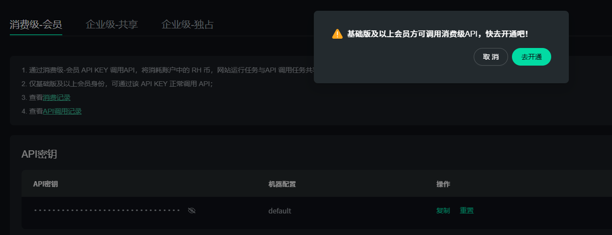
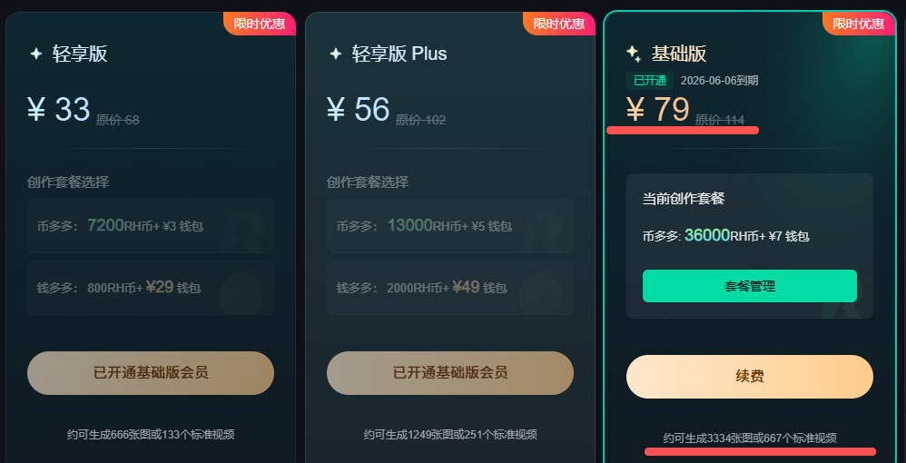
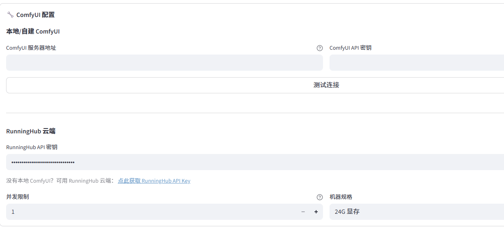
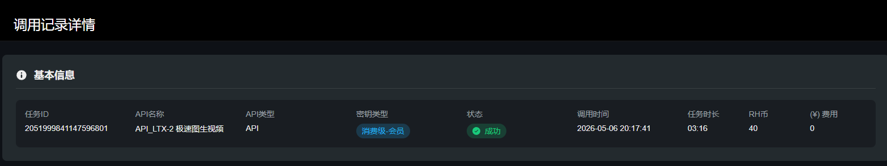

打开[API控制台](https://www.runninghub.cn/enterprise-api/consumerApi)

购买一个月的基础版进行测试

在Pixelle-Video 配置API KEY

可以在Pixelle-Video 选择图生视频

可以在RunningHub 的后台查看该任务：[https://www.runninghub.cn/call-api/call-record](https://www.runninghub.cn/call-api/call-record)

但是生成的视频很模糊！！
