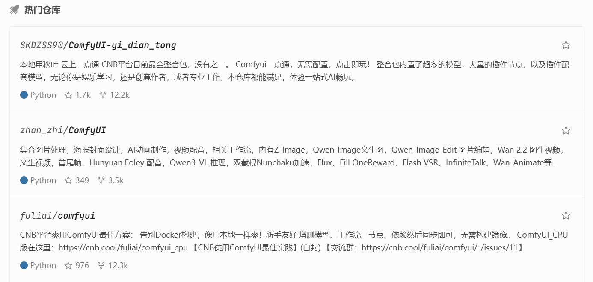
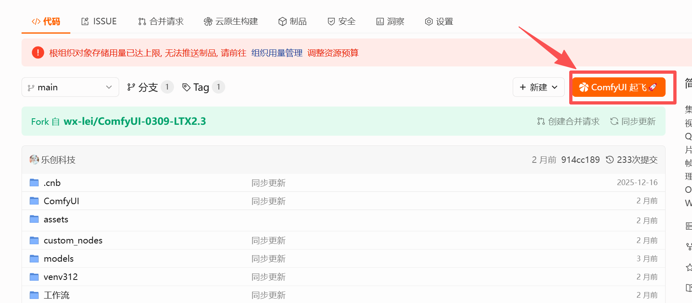
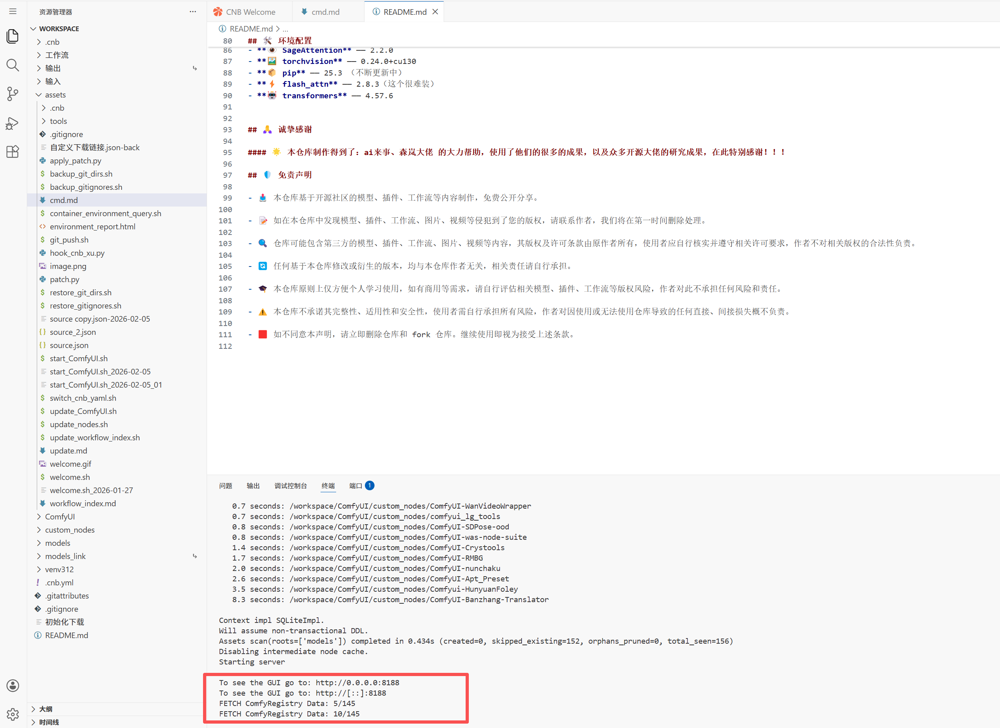
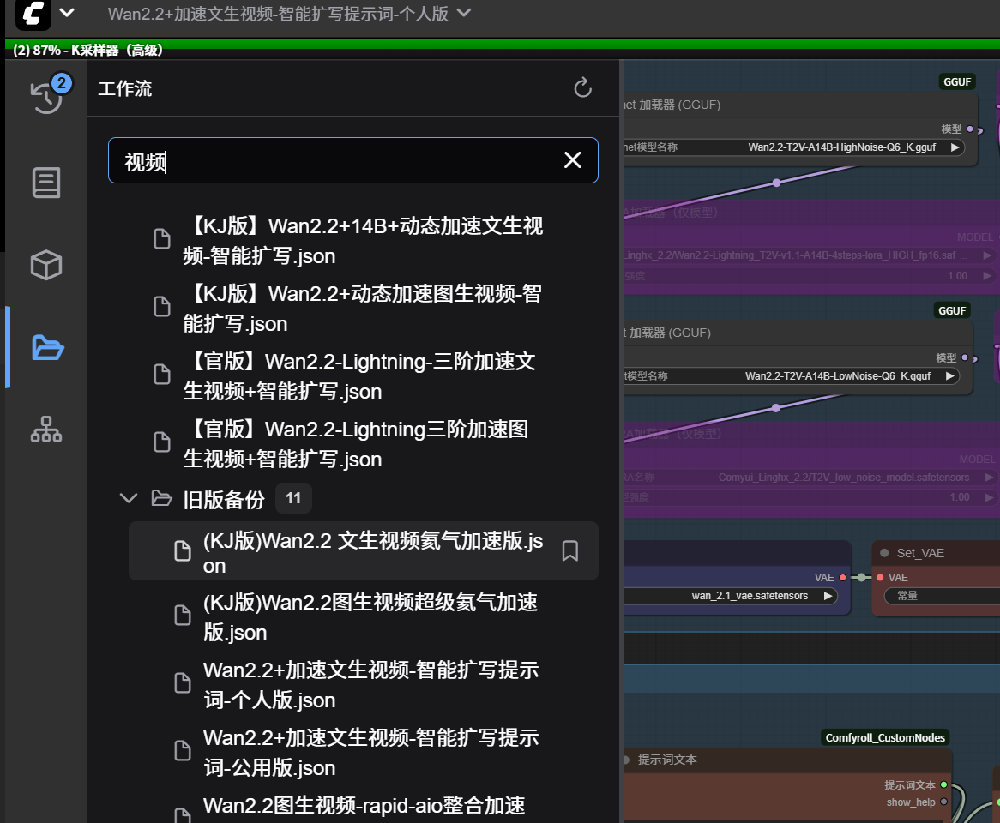

>[https://cnb.cool/](https://cnb.cool/)

可以看到有很多热门的仓库

## 测试ComfyUI



比如我fork 的是[https://cnb.cool/zhan_zhi/ComfyUI](https://cnb.cool/zhan_zhi/ComfyUI)

比如fork 了某一个仓库之后，可以点击这个按钮启动ComfyUI



等待一段时间后，启动成功



然后可以访问ComfyUI


## 视频制作

[https://cnb.cool/fuliai/WanVideo_wan2.2/-/tree/main](https://cnb.cool/fuliai/WanVideo_wan2.2/-/tree/main)

可以使用这些工作流



比如：(KJ版)Wan2.2图生视频超级氦气加速版.json

上传图片


指定提示词：

```
虎将军跳起来，大刀劈砍地面
```

生成1个5s（帧率24）的视频，大概耗时：72s


