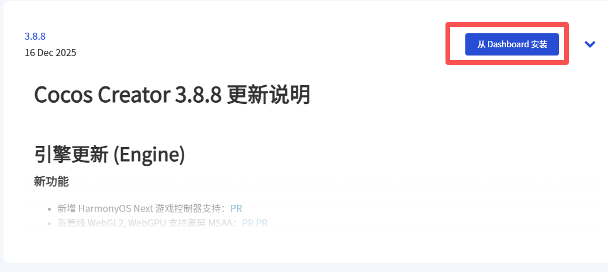
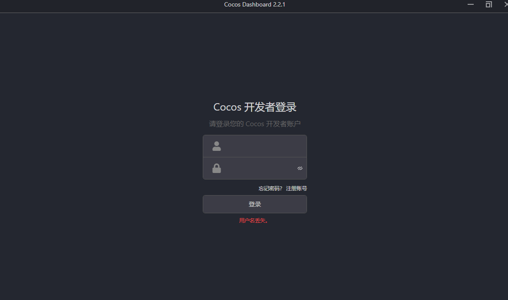
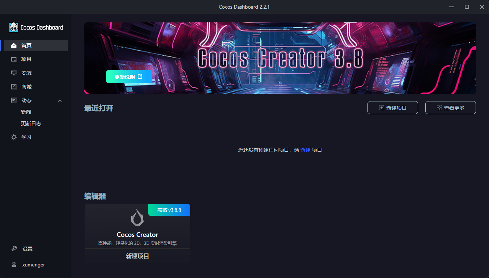
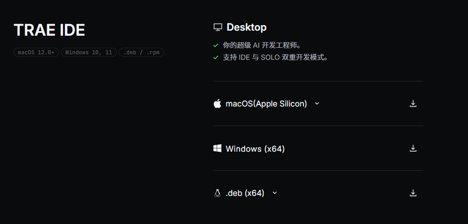
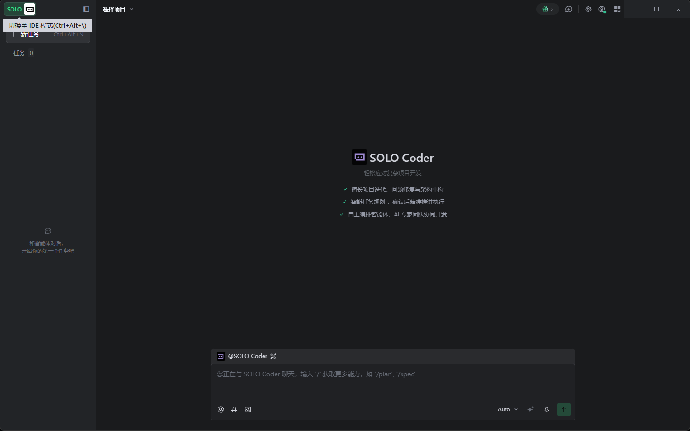
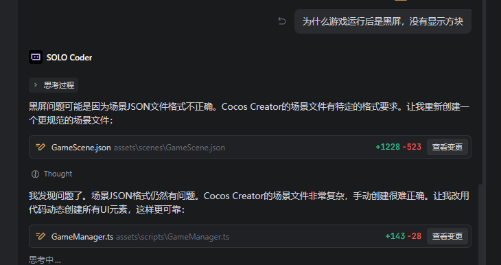
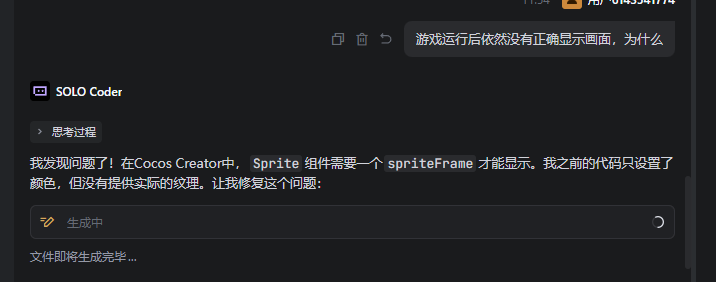
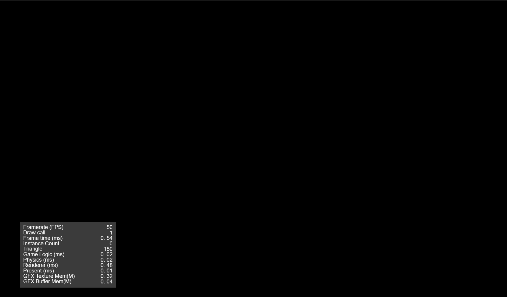

## 下载并安装CocosCreator 

>[https://www.cocos.com/creator-download](https://www.cocos.com/creator-download)

从Dashboard 安装



然后注册账号



然后安装某个版本的CocosCreator 编辑器，安装成功后在首页展示



## 下载并安装Trae

>[https://www.trae.cn/ide/download](https://www.trae.cn/ide/download)



安装成功后，运行效果如下



## 使用Trae 开发游戏

写入下面的提示词，直接看一下生成效果

```
当前项目是一个CocosCreator3项目
生成一个点击解谜游戏
游戏的逻辑如下
1. 游戏界面是一个4乘4的共16个方块
2. 方块默认为蓝色
3. 游戏随机选中4个方块变成红色
4. 然后所有方块变回蓝色
5. 然后让玩家点击，只有选中了上面变红的4个方块，才算过关
6. 下一关继续循环以上逻辑
```

```
为什么游戏运行后是黑屏，没有显示方块
```



```
游戏运行后依然没有正确显示画面，为什么
```



还是报错：直接把报错信息给到Trae，让Trace 去修复

```
[Assets] Importer exec failed: D:\Xumenger\游戏制作\PlayBoy\example\Test\assets\scenes\GameScene.json
```

打开后还是黑屏，继续优化

```
游戏运行后先显示【游戏开始】按钮
用户点击按钮，再进入游戏
```

```
[Scene] {hidden(::SceneExecutorImportExceptionHandler::)} Error: SyntaxError: D:ProgramCocosDashboardile:D:Xumenger%E6%B8%B8%E6%88%8F%E5%88%B6%E4%BD%9CPlayBoyexampleTestassetsscriptsGameManager.ts: Identifier 'titleLabel' has already been declared. (230:14)
```

然后在CocosCreator 上运行效果如下，还是黑屏



## 结论

AI 生成的Scene 场景文件，通常是没有办法用的，还是需要自己去设计场景布局

玩法构思也是需要游戏开发者自己去设计
