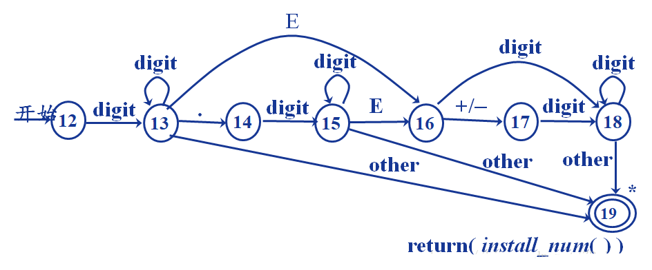

>本文主要通过分析Lua 源码来理解编译原理、虚拟机与指令集、垃圾回收等等的知识，会持续补充完善

>[https://github.com/lua/lua/tree/v5.4.0](https://github.com/lua/lua/tree/v5.4.0)

>[https://github.com/antlr/grammars-v4](https://github.com/antlr/grammars-v4)

>[编译原理 — 中科大](https://www.bilibili.com/video/BV17W41187gL)

## 文章目录

* [编译器前端架构](#001)
* [Lexer 词法分析器](#002)
* [Parser 语法分析器](#003)
* [中间代码生成](#004)
* [ANTLR 定义的Lua 文法](#005)

## <span id="001">编译器前端架构</span>

比如下面是一种没有优化的编译器结构（来自[《编译原理 — 中科大》](https://www.bilibili.com/video/BV17W41187gL)）


这个是一种更复杂的编译器结构


比如针对下面的C 程序（注：参考自[《1106c语言语法树》](https://www.cnblogs.com/queenjuan/p/4943388.html)）

```c
#include <stdio.h>

main()
{
    int i, j. temp;
    int a[10];

    for (i=0; i<10; i++)
        scanf("%d", &a[i]);

    for (j=0; j<=9; j++)
    {
        for (i=0; i<10-j; i++)
            if (a[i] > a[i+1])
            {
                temp = a[i];
                a[i] = a[i+1];
                a[i+1] = temp;
            }
    }

    for (i=1; i<11; i++)
        printf("%5d", a[i]);

    printf("\n");
}
```

解析得到其语法树如下


本文主要通过[Lua 5.4 的源码](https://github.com/lua/lua/tree/v5.4.0)来配合理解编译原理，所以先介绍一下Lua 5.4 中各个源文件的作用

虚拟机核心相关源文件

文件名               | 作用 
------------------- | ----------------------------------------------------
lapi.c              | C语言接口，对外接口前缀是lua\_
lcode.c             | 源码生成器，对外接口前缀是luaK\_
ldebug.c            | 调试库，对外接口前缀是luaK\_
ldo.c               | 函数调用及栈管理，对外接口前缀是luaK\_
ldump.c             | 序列化预编译的Lua 字节码
lfunc.c             | 提供操作函数原型及闭包的辅助函数，对外接口前缀是luaF\_
lgc.c               | GC垃圾回收，对外接口前缀是luaC\_
llex.c              | 词法分析，对外接口前缀是luaX\_
lmem.c              | 内存管理，对外接口前缀是luaM\_
lobject.c           | 对象管理，对外接口前缀是luaO\_
lopcodes.c          | 字节码操作，对外接口前缀是luaP\_
lparser.c           | 语法分析，对外接口前缀是luaY\_
lstate.c            | 全局状态机，对外接口前缀是luaE\_
lstring.c           | 字符串操作，对外接口前缀是luaS\_
ltable.c            | 表操作，对外接口前缀是luaH\_
lundump.c           | 加载预编译字节码，对外接口前缀是luaU\_
ltm.c               | tag方法，对外接口前缀是luaT\_
lzio.c              | 缓存流接口，对外接口前缀是luaZ\_

内嵌库相关源文件

文件名               | 作用 
------------------- | ----------------------------------------------------
lauxlic.c           | 库编写时需要用到的辅助函数库&nbsp;&nbsp;&nbsp;&nbsp;&nbsp;&nbsp;&nbsp;&nbsp;&nbsp;&nbsp;&nbsp;&nbsp;&nbsp;&nbsp;&nbsp;&nbsp;&nbsp;&nbsp;&nbsp;&nbsp;&nbsp;&nbsp;&nbsp;&nbsp;&nbsp;&nbsp;&nbsp;&nbsp;&nbsp;&nbsp;&nbsp;&nbsp;&nbsp;&nbsp;
lbaselib.c          | 基础库
ldblib.c            | 调试库
liolib.c            | IO库
lmathlib.c          | 数学库
loslib.c            | OS库
ltablib.c           | 表操作库
lstrlib.c           | 字符串操作库
loadlib.c           | 动态扩展加载器
linit.c             | 负责内嵌库的初始化

解析器、字节码解释器相关源文件

文件名               | 作用 
------------------- | ----------------------------------------------------
lua.c               | 解释器&nbsp;&nbsp;&nbsp;&nbsp;&nbsp;&nbsp;&nbsp;&nbsp;&nbsp;&nbsp;&nbsp;&nbsp;&nbsp;&nbsp;&nbsp;&nbsp;&nbsp;&nbsp;&nbsp;&nbsp;&nbsp;&nbsp;&nbsp;&nbsp;&nbsp;&nbsp;&nbsp;&nbsp;&nbsp;&nbsp;&nbsp;&nbsp;&nbsp;&nbsp;&nbsp;&nbsp;&nbsp;&nbsp;&nbsp;&nbsp;&nbsp;&nbsp;&nbsp;&nbsp;&nbsp;&nbsp;&nbsp;&nbsp;&nbsp;&nbsp;&nbsp;&nbsp;&nbsp;&nbsp;&nbsp;&nbsp;&nbsp;&nbsp;&nbsp;&nbsp;&nbsp;&nbsp;&nbsp;&nbsp;&nbsp;&nbsp;
luac.c              | 字节码编译器

## <span id="002">Lexer 词法分析器</span>

比如解析表达式`auto x = y + 1` 为

```
[
  {type : 'keyword', value : 'auto'},
  {type : 'id', value : 'x'},
  {type : 'op', value : '='},
  {type : 'id', value : 'y'},
  {type : 'op', value : '+'},
  {type : 'number', value : 1},
]
```

语法分析器中使用的技术主要是**自动机技术**处理状态（包括在TCP 协议等很多技术领域，都大量应用了状态的概念），以下参考[《编译原理学习笔记之词法分析中的状态机与自动机》](https://blog.csdn.net/ZP_icenow/article/details/82661407)

比如解析比较符号


比如解析标识符：`id ->letter (letter | digit )*`


比如解析无符号数（不考虑十进制外的其他计数法等）：`num ->digit+ (.digit+)? (E (+ | -)? digit+)?`



Lua 5.4 的词法分析器（llex.c）的代码如下

```c
/*
** $Id: llex.c $
** Lexical Analyzer
** See Copyright Notice in lua.h
*/

#define llex_c
#define LUA_CORE

#include "lprefix.h"


#include <locale.h>
#include <string.h>

#include "lua.h"

#include "lctype.h"
#include "ldebug.h"
#include "ldo.h"
#include "lgc.h"
#include "llex.h"
#include "lobject.h"
#include "lparser.h"
#include "lstate.h"
#include "lstring.h"
#include "ltable.h"
#include "lzio.h"


#define next(ls)    (ls->current = zgetc(ls->z))


#define currIsNewline(ls)   (ls->current == '\n' || ls->current == '\r')


/* ORDER RESERVED */
static const char *const luaX_tokens [] = {
    "and", "break", "do", "else", "elseif",
    "end", "false", "for", "function", "goto", "if",
    "in", "local", "nil", "not", "or", "repeat",
    "return", "then", "true", "until", "while",
    "//", "..", "...", "==", ">=", "<=", "~=",
    "<<", ">>", "::", "<eof>",
    "<number>", "<integer>", "<name>", "<string>"
};


#define save_and_next(ls) (save(ls, ls->current), next(ls))


static l_noret lexerror (LexState *ls, const char *msg, int token);


static void save (LexState *ls, int c) {
  Mbuffer *b = ls->buff;
  if (luaZ_bufflen(b) + 1 > luaZ_sizebuffer(b)) {
    size_t newsize;
    if (luaZ_sizebuffer(b) >= MAX_SIZE/2)
      lexerror(ls, "lexical element too long", 0);
    newsize = luaZ_sizebuffer(b) * 2;
    luaZ_resizebuffer(ls->L, b, newsize);
  }
  b->buffer[luaZ_bufflen(b)++] = cast_char(c);
}


void luaX_init (lua_State *L) {
  int i;
  TString *e = luaS_newliteral(L, LUA_ENV);  /* create env name */
  luaC_fix(L, obj2gco(e));  /* never collect this name */
  for (i=0; i<NUM_RESERVED; i++) {
    TString *ts = luaS_new(L, luaX_tokens[i]);
    luaC_fix(L, obj2gco(ts));  /* reserved words are never collected */
    ts->extra = cast_byte(i+1);  /* reserved word */
  }
}


const char *luaX_token2str (LexState *ls, int token) {
  if (token < FIRST_RESERVED) {  /* single-byte symbols? */
    lua_assert(token == cast_uchar(token));
    if (lisprint(token))
      return luaO_pushfstring(ls->L, "'%c'", token);
    else  /* control character */
      return luaO_pushfstring(ls->L, "'<\\%d>'", token);
  }
  else {
    const char *s = luaX_tokens[token - FIRST_RESERVED];
    if (token < TK_EOS)  /* fixed format (symbols and reserved words)? */
      return luaO_pushfstring(ls->L, "'%s'", s);
    else  /* names, strings, and numerals */
      return s;
  }
}


static const char *txtToken (LexState *ls, int token) {
  switch (token) {
    case TK_NAME: case TK_STRING:
    case TK_FLT: case TK_INT:
      save(ls, '\0');
      return luaO_pushfstring(ls->L, "'%s'", luaZ_buffer(ls->buff));
    default:
      return luaX_token2str(ls, token);
  }
}


static l_noret lexerror (LexState *ls, const char *msg, int token) {
  msg = luaG_addinfo(ls->L, msg, ls->source, ls->linenumber);
  if (token)
    luaO_pushfstring(ls->L, "%s near %s", msg, txtToken(ls, token));
  luaD_throw(ls->L, LUA_ERRSYNTAX);
}


l_noret luaX_syntaxerror (LexState *ls, const char *msg) {
  lexerror(ls, msg, ls->t.token);
}


/*
** creates a new string and anchors it in scanner's table so that
** it will not be collected until the end of the compilation
** (by that time it should be anchored somewhere)
*/
TString *luaX_newstring (LexState *ls, const char *str, size_t l) {
  lua_State *L = ls->L;
  TValue *o;  /* entry for 'str' */
  TString *ts = luaS_newlstr(L, str, l);  /* create new string */
  setsvalue2s(L, L->top++, ts);  /* temporarily anchor it in stack */
  o = luaH_set(L, ls->h, s2v(L->top - 1));
  if (isempty(o)) {  /* not in use yet? */
    /* boolean value does not need GC barrier;
       table is not a metatable, so it does not need to invalidate cache */
    setbtvalue(o);  /* t[string] = true */
    luaC_checkGC(L);
  }
  else {  /* string already present */
    ts = keystrval(nodefromval(o));  /* re-use value previously stored */
  }
  L->top--;  /* remove string from stack */
  return ts;
}


/*
** increment line number and skips newline sequence (any of
** \n, \r, \n\r, or \r\n)
*/
static void inclinenumber (LexState *ls) {
  int old = ls->current;
  lua_assert(currIsNewline(ls));
  next(ls);  /* skip '\n' or '\r' */
  if (currIsNewline(ls) && ls->current != old)
    next(ls);  /* skip '\n\r' or '\r\n' */
  if (++ls->linenumber >= MAX_INT)
    lexerror(ls, "chunk has too many lines", 0);
}


void luaX_setinput (lua_State *L, LexState *ls, ZIO *z, TString *source,
                    int firstchar) {
  ls->t.token = 0;
  ls->L = L;
  ls->current = firstchar;
  ls->lookahead.token = TK_EOS;  /* no look-ahead token */
  ls->z = z;
  ls->fs = NULL;
  ls->linenumber = 1;
  ls->lastline = 1;
  ls->source = source;
  ls->envn = luaS_newliteral(L, LUA_ENV);  /* get env name */
  luaZ_resizebuffer(ls->L, ls->buff, LUA_MINBUFFER);  /* initialize buffer */
}


/*
** =======================================================
** LEXICAL ANALYZER
** =======================================================
*/


static int check_next1 (LexState *ls, int c) {
  if (ls->current == c) {
    next(ls);
    return 1;
  }
  else return 0;
}


/*
** Check whether current char is in set 'set' (with two chars) and
** saves it
*/
static int check_next2 (LexState *ls, const char *set) {
  lua_assert(set[2] == '\0');
  if (ls->current == set[0] || ls->current == set[1]) {
    save_and_next(ls);
    return 1;
  }
  else return 0;
}


/* LUA_NUMBER */
/*
** This function is quite liberal in what it accepts, as 'luaO_str2num'
** will reject ill-formed numerals. Roughly, it accepts the following
** pattern:
**
**   %d(%x|%.|([Ee][+-]?))* | 0[Xx](%x|%.|([Pp][+-]?))*
**
** The only tricky part is to accept [+-] only after a valid exponent
** mark, to avoid reading '3-4' or '0xe+1' as a single number.
**
** The caller might have already read an initial dot.
*/
static int read_numeral (LexState *ls, SemInfo *seminfo) {
  TValue obj;
  const char *expo = "Ee";
  int first = ls->current;
  lua_assert(lisdigit(ls->current));
  save_and_next(ls);
  if (first == '0' && check_next2(ls, "xX"))  /* hexadecimal? */
    expo = "Pp";
  for (;;) {
    if (check_next2(ls, expo))  /* exponent mark? */
      check_next2(ls, "-+");  /* optional exponent sign */
    else if (lisxdigit(ls->current) || ls->current == '.')  /* '%x|%.' */
      save_and_next(ls);
    else break;
  }
  if (lislalpha(ls->current))  /* is numeral touching a letter? */
    save_and_next(ls);  /* force an error */
  save(ls, '\0');
  if (luaO_str2num(luaZ_buffer(ls->buff), &obj) == 0)  /* format error? */
    lexerror(ls, "malformed number", TK_FLT);
  if (ttisinteger(&obj)) {
    seminfo->i = ivalue(&obj);
    return TK_INT;
  }
  else {
    lua_assert(ttisfloat(&obj));
    seminfo->r = fltvalue(&obj);
    return TK_FLT;
  }
}


/*
** reads a sequence '[=*[' or ']=*]', leaving the last bracket.
** If sequence is well formed, return its number of '='s + 2; otherwise,
** return 1 if there is no '='s or 0 otherwise (an unfinished '[==...').
*/
static size_t skip_sep (LexState *ls) {
  size_t count = 0;
  int s = ls->current;
  lua_assert(s == '[' || s == ']');
  save_and_next(ls);
  while (ls->current == '=') {
    save_and_next(ls);
    count++;
  }
  return (ls->current == s) ? count + 2
         : (count == 0) ? 1
         : 0;
}


static void read_long_string (LexState *ls, SemInfo *seminfo, size_t sep) {
  int line = ls->linenumber;  /* initial line (for error message) */
  save_and_next(ls);  /* skip 2nd '[' */
  if (currIsNewline(ls))  /* string starts with a newline? */
    inclinenumber(ls);  /* skip it */
  for (;;) {
    switch (ls->current) {
      case EOZ: {  /* error */
        const char *what = (seminfo ? "string" : "comment");
        const char *msg = luaO_pushfstring(ls->L,
                     "unfinished long %s (starting at line %d)", what, line);
        lexerror(ls, msg, TK_EOS);
        break;  /* to avoid warnings */
      }
      case ']': {
        if (skip_sep(ls) == sep) {
          save_and_next(ls);  /* skip 2nd ']' */
          goto endloop;
        }
        break;
      }
      case '\n': case '\r': {
        save(ls, '\n');
        inclinenumber(ls);
        if (!seminfo) luaZ_resetbuffer(ls->buff);  /* avoid wasting space */
        break;
      }
      default: {
        if (seminfo) save_and_next(ls);
        else next(ls);
      }
    }
  } endloop:
  if (seminfo)
    seminfo->ts = luaX_newstring(ls, luaZ_buffer(ls->buff) + sep,
                                     luaZ_bufflen(ls->buff) - 2 * sep);
}


static void esccheck (LexState *ls, int c, const char *msg) {
  if (!c) {
    if (ls->current != EOZ)
      save_and_next(ls);  /* add current to buffer for error message */
    lexerror(ls, msg, TK_STRING);
  }
}


static int gethexa (LexState *ls) {
  save_and_next(ls);
  esccheck (ls, lisxdigit(ls->current), "hexadecimal digit expected");
  return luaO_hexavalue(ls->current);
}


static int readhexaesc (LexState *ls) {
  int r = gethexa(ls);
  r = (r << 4) + gethexa(ls);
  luaZ_buffremove(ls->buff, 2);  /* remove saved chars from buffer */
  return r;
}


static unsigned long readutf8esc (LexState *ls) {
  unsigned long r;
  int i = 4;  /* chars to be removed: '\', 'u', '{', and first digit */
  save_and_next(ls);  /* skip 'u' */
  esccheck(ls, ls->current == '{', "missing '{'");
  r = gethexa(ls);  /* must have at least one digit */
  while (cast_void(save_and_next(ls)), lisxdigit(ls->current)) {
    i++;
    esccheck(ls, r <= (0x7FFFFFFFu >> 4), "UTF-8 value too large");
    r = (r << 4) + luaO_hexavalue(ls->current);
  }
  esccheck(ls, ls->current == '}', "missing '}'");
  next(ls);  /* skip '}' */
  luaZ_buffremove(ls->buff, i);  /* remove saved chars from buffer */
  return r;
}


static void utf8esc (LexState *ls) {
  char buff[UTF8BUFFSZ];
  int n = luaO_utf8esc(buff, readutf8esc(ls));
  for (; n > 0; n--)  /* add 'buff' to string */
    save(ls, buff[UTF8BUFFSZ - n]);
}


static int readdecesc (LexState *ls) {
  int i;
  int r = 0;  /* result accumulator */
  for (i = 0; i < 3 && lisdigit(ls->current); i++) {  /* read up to 3 digits */
    r = 10*r + ls->current - '0';
    save_and_next(ls);
  }
  esccheck(ls, r <= UCHAR_MAX, "decimal escape too large");
  luaZ_buffremove(ls->buff, i);  /* remove read digits from buffer */
  return r;
}


static void read_string (LexState *ls, int del, SemInfo *seminfo) {
  save_and_next(ls);  /* keep delimiter (for error messages) */
  while (ls->current != del) {
    switch (ls->current) {
      case EOZ:
        lexerror(ls, "unfinished string", TK_EOS);
        break;  /* to avoid warnings */
      case '\n':
      case '\r':
        lexerror(ls, "unfinished string", TK_STRING);
        break;  /* to avoid warnings */
      case '\\': {  /* escape sequences */
        int c;  /* final character to be saved */
        save_and_next(ls);  /* keep '\\' for error messages */
        switch (ls->current) {
          case 'a': c = '\a'; goto read_save;
          case 'b': c = '\b'; goto read_save;
          case 'f': c = '\f'; goto read_save;
          case 'n': c = '\n'; goto read_save;
          case 'r': c = '\r'; goto read_save;
          case 't': c = '\t'; goto read_save;
          case 'v': c = '\v'; goto read_save;
          case 'x': c = readhexaesc(ls); goto read_save;
          case 'u': utf8esc(ls);  goto no_save;
          case '\n': case '\r':
            inclinenumber(ls); c = '\n'; goto only_save;
          case '\\': case '\"': case '\'':
            c = ls->current; goto read_save;
          case EOZ: goto no_save;  /* will raise an error next loop */
          case 'z': {  /* zap following span of spaces */
            luaZ_buffremove(ls->buff, 1);  /* remove '\\' */
            next(ls);  /* skip the 'z' */
            while (lisspace(ls->current)) {
              if (currIsNewline(ls)) inclinenumber(ls);
              else next(ls);
            }
            goto no_save;
          }
          default: {
            esccheck(ls, lisdigit(ls->current), "invalid escape sequence");
            c = readdecesc(ls);  /* digital escape '\ddd' */
            goto only_save;
          }
        }
       read_save:
         next(ls);
         /* go through */
       only_save:
         luaZ_buffremove(ls->buff, 1);  /* remove '\\' */
         save(ls, c);
         /* go through */
       no_save: break;
      }
      default:
        save_and_next(ls);
    }
  }
  save_and_next(ls);  /* skip delimiter */
  seminfo->ts = luaX_newstring(ls, luaZ_buffer(ls->buff) + 1,
                                   luaZ_bufflen(ls->buff) - 2);
}


static int llex (LexState *ls, SemInfo *seminfo) {
  luaZ_resetbuffer(ls->buff);
  for (;;) {
    switch (ls->current) {
      case '\n': case '\r': {  /* line breaks */
        inclinenumber(ls);
        break;
      }
      case ' ': case '\f': case '\t': case '\v': {  /* spaces */
        next(ls);
        break;
      }
      case '-': {  /* '-' or '--' (comment) */
        next(ls);
        if (ls->current != '-') return '-';
        /* else is a comment */
        next(ls);
        if (ls->current == '[') {  /* long comment? */
          size_t sep = skip_sep(ls);
          luaZ_resetbuffer(ls->buff);  /* 'skip_sep' may dirty the buffer */
          if (sep >= 2) {
            read_long_string(ls, NULL, sep);  /* skip long comment */
            luaZ_resetbuffer(ls->buff);  /* previous call may dirty the buff. */
            break;
          }
        }
        /* else short comment */
        while (!currIsNewline(ls) && ls->current != EOZ)
          next(ls);  /* skip until end of line (or end of file) */
        break;
      }
      case '[': {  /* long string or simply '[' */
        size_t sep = skip_sep(ls);
        if (sep >= 2) {
          read_long_string(ls, seminfo, sep);
          return TK_STRING;
        }
        else if (sep == 0)  /* '[=...' missing second bracket? */
          lexerror(ls, "invalid long string delimiter", TK_STRING);
        return '[';
      }
      case '=': {
        next(ls);
        if (check_next1(ls, '=')) return TK_EQ;
        else return '=';
      }
      case '<': {
        next(ls);
        if (check_next1(ls, '=')) return TK_LE;
        else if (check_next1(ls, '<')) return TK_SHL;
        else return '<';
      }
      case '>': {
        next(ls);
        if (check_next1(ls, '=')) return TK_GE;
        else if (check_next1(ls, '>')) return TK_SHR;
        else return '>';
      }
      case '/': {
        next(ls);
        if (check_next1(ls, '/')) return TK_IDIV;
        else return '/';
      }
      case '~': {
        next(ls);
        if (check_next1(ls, '=')) return TK_NE;
        else return '~';
      }
      case ':': {
        next(ls);
        if (check_next1(ls, ':')) return TK_DBCOLON;
        else return ':';
      }
      case '"': case '\'': {  /* short literal strings */
        read_string(ls, ls->current, seminfo);
        return TK_STRING;
      }
      case '.': {  /* '.', '..', '...', or number */
        save_and_next(ls);
        if (check_next1(ls, '.')) {
          if (check_next1(ls, '.'))
            return TK_DOTS;   /* '...' */
          else return TK_CONCAT;   /* '..' */
        }
        else if (!lisdigit(ls->current)) return '.';
        else return read_numeral(ls, seminfo);
      }
      case '0': case '1': case '2': case '3': case '4':
      case '5': case '6': case '7': case '8': case '9': {
        return read_numeral(ls, seminfo);
      }
      case EOZ: {
        return TK_EOS;
      }
      default: {
        if (lislalpha(ls->current)) {  /* identifier or reserved word? */
          TString *ts;
          do {
            save_and_next(ls);
          } while (lislalnum(ls->current));
          ts = luaX_newstring(ls, luaZ_buffer(ls->buff),
                                  luaZ_bufflen(ls->buff));
          seminfo->ts = ts;
          if (isreserved(ts))  /* reserved word? */
            return ts->extra - 1 + FIRST_RESERVED;
          else {
            return TK_NAME;
          }
        }
        else {  /* single-char tokens (+ - / ...) */
          int c = ls->current;
          next(ls);
          return c;
        }
      }
    }
  }
}


void luaX_next (LexState *ls) {
  ls->lastline = ls->linenumber;
  if (ls->lookahead.token != TK_EOS) {  /* is there a look-ahead token? */
    ls->t = ls->lookahead;  /* use this one */
    ls->lookahead.token = TK_EOS;  /* and discharge it */
  }
  else
    ls->t.token = llex(ls, &ls->t.seminfo);  /* read next token */
}


int luaX_lookahead (LexState *ls) {
  lua_assert(ls->lookahead.token == TK_EOS);
  ls->lookahead.token = llex(ls, &ls->lookahead.seminfo);
  return ls->lookahead.token;
}
```

## <span id="003">Parser 语法分析器</span>

上面对于“源码”进行了词法分析之后，得到token 流（记号流），token 流作为词法分析的输出，输入给语法分析器，语法分析器处理token 流得到抽象语法树。语法分析器主要使用的理论是**形式语言**

>形式语言的一个特性是，给定一个这个语言的字符串，一定存在一个函数，可以将其映射为一个抽象语法树，而且这种映射是不需要理解这个语言本身的含义的！不像自然语言，形式语言不能有歧义！其实这又引申出另一个领域，自然语言处理，这里就不涉及了，因为又涉及到机器学习、人工智能的领域！

>树数据结构在计算机科学中极其重要，比如二叉树、平衡二叉树、二叉查找树、堆、红黑树、B树、B+树、抽象语法树（AST）、动态规划背后也是树的思想……

一般我们用BNF（巴科斯范式）、ABNF（扩展巴科斯范式）等定义一个语言的语法，比如[使用ABNF 定义JSON 的语法](http://www.ecma-international.org/publications/files/ECMA-ST/ECMA-404.pdf)

```
// null/false/true 值
JSON-text = ws value ws
ws = *(%x20 / %x09 / %x0A / %x0D)
value = null / false / true
null = "null"
false = "false"
true = "true"


// 数值
number = ["-"] int [frac] [exp]
int = "0" / digit1-9 *digit
frac = "." 1*digit
exp = ("e" / "E") ["-" / "+"] 1*digit


// 字符串
string = quotation-mark *char quotation-mark
char = unescaped /
   escape (
      %x22 /                ; "  quotation mark   U+0022
      %x5C /                ; \  reverse solidus  U+005C
      %x2F /                ; /  solidus          U+002F
      %x62 /                ; b  backspace        U+0008
      %x66 /                ; f  form feed        U+000C
      %x6E /                ; n  line feed        U+000A
      %x72 /                ; r  carriage return  U+000D
      %x74 /                ; t  tab              U+0009
      %x75 4HEXDIG )        ; uXXXX               U+XXXX
escape = %x5C               ; \
quotation-mark = %x22       ; "
unescaped = %x20-21 / %x23-5B / %x5D-10FFFF


// 数组
array = %x5B ws [ value *( ws %x2C ws value) ] ws %x5D


// 对象
member = string ws %3A ws value
object = %x7B ws [ member *( ws %x2C ws member ) ] ws %x7D
```

Lua 5.4 的语法分析器（lparser.c）的实现如下

```c
/*
** $Id: lparser.c $
** Lua Parser
** See Copyright Notice in lua.h
*/

#define lparser_c
#define LUA_CORE

#include "lprefix.h"


#include <limits.h>
#include <string.h>

#include "lua.h"

#include "lcode.h"
#include "ldebug.h"
#include "ldo.h"
#include "lfunc.h"
#include "llex.h"
#include "lmem.h"
#include "lobject.h"
#include "lopcodes.h"
#include "lparser.h"
#include "lstate.h"
#include "lstring.h"
#include "ltable.h"


/* maximum number of local variables per function (must be smaller
   than 250, due to the bytecode format) */
#define MAXVARS     200


#define hasmultret(k)       ((k) == VCALL || (k) == VVARARG)


/* because all strings are unified by the scanner, the parser
   can use pointer equality for string equality */
#define eqstr(a,b)  ((a) == (b))


/*
** nodes for block list (list of active blocks)
*/
typedef struct BlockCnt {
  struct BlockCnt *previous;  /* chain */
  int firstlabel;  /* index of first label in this block */
  int firstgoto;  /* index of first pending goto in this block */
  lu_byte nactvar;  /* # active locals outside the block */
  lu_byte upval;  /* true if some variable in the block is an upvalue */
  lu_byte isloop;  /* true if 'block' is a loop */
  lu_byte insidetbc;  /* true if inside the scope of a to-be-closed var. */
} BlockCnt;


/*
** prototypes for recursive non-terminal functions
*/
static void statement (LexState *ls);
static void expr (LexState *ls, expdesc *v);


static l_noret error_expected (LexState *ls, int token) {
  luaX_syntaxerror(ls,
      luaO_pushfstring(ls->L, "%s expected", luaX_token2str(ls, token)));
}


static l_noret errorlimit (FuncState *fs, int limit, const char *what) {
  lua_State *L = fs->ls->L;
  const char *msg;
  int line = fs->f->linedefined;
  const char *where = (line == 0)
                      ? "main function"
                      : luaO_pushfstring(L, "function at line %d", line);
  msg = luaO_pushfstring(L, "too many %s (limit is %d) in %s",
                             what, limit, where);
  luaX_syntaxerror(fs->ls, msg);
}


static void checklimit (FuncState *fs, int v, int l, const char *what) {
  if (v > l) errorlimit(fs, l, what);
}


/*
** Test whether next token is 'c'; if so, skip it.
*/
static int testnext (LexState *ls, int c) {
  if (ls->t.token == c) {
    luaX_next(ls);
    return 1;
  }
  else return 0;
}


/*
** Check that next token is 'c'.
*/
static void check (LexState *ls, int c) {
  if (ls->t.token != c)
    error_expected(ls, c);
}


/*
** Check that next token is 'c' and skip it.
*/
static void checknext (LexState *ls, int c) {
  check(ls, c);
  luaX_next(ls);
}


#define check_condition(ls,c,msg)   { if (!(c)) luaX_syntaxerror(ls, msg); }


/*
** Check that next token is 'what' and skip it. In case of error,
** raise an error that the expected 'what' should match a 'who'
** in line 'where' (if that is not the current line).
*/
static void check_match (LexState *ls, int what, int who, int where) {
  if (unlikely(!testnext(ls, what))) {
    if (where == ls->linenumber)  /* all in the same line? */
      error_expected(ls, what);  /* do not need a complex message */
    else {
      luaX_syntaxerror(ls, luaO_pushfstring(ls->L,
             "%s expected (to close %s at line %d)",
              luaX_token2str(ls, what), luaX_token2str(ls, who), where));
    }
  }
}


static TString *str_checkname (LexState *ls) {
  TString *ts;
  check(ls, TK_NAME);
  ts = ls->t.seminfo.ts;
  luaX_next(ls);
  return ts;
}


static void init_exp (expdesc *e, expkind k, int i) {
  e->f = e->t = NO_JUMP;
  e->k = k;
  e->u.info = i;
}


static void codestring (expdesc *e, TString *s) {
  e->f = e->t = NO_JUMP;
  e->k = VKSTR;
  e->u.strval = s;
}


static void codename (LexState *ls, expdesc *e) {
  codestring(e, str_checkname(ls));
}


/*
** Register a new local variable in the active 'Proto' (for debug
** information).
*/
static int registerlocalvar (LexState *ls, FuncState *fs, TString *varname) {
  Proto *f = fs->f;
  int oldsize = f->sizelocvars;
  luaM_growvector(ls->L, f->locvars, fs->ndebugvars, f->sizelocvars,
                  LocVar, SHRT_MAX, "local variables");
  while (oldsize < f->sizelocvars)
    f->locvars[oldsize++].varname = NULL;
  f->locvars[fs->ndebugvars].varname = varname;
  f->locvars[fs->ndebugvars].startpc = fs->pc;
  luaC_objbarrier(ls->L, f, varname);
  return fs->ndebugvars++;
}


/*
** Create a new local variable with the given 'name'. Return its index
** in the function.
*/
static int new_localvar (LexState *ls, TString *name) {
  lua_State *L = ls->L;
  FuncState *fs = ls->fs;
  Dyndata *dyd = ls->dyd;
  Vardesc *var;
  checklimit(fs, dyd->actvar.n + 1 - fs->firstlocal,
                 MAXVARS, "local variables");
  luaM_growvector(L, dyd->actvar.arr, dyd->actvar.n + 1,
                  dyd->actvar.size, Vardesc, USHRT_MAX, "local variables");
  var = &dyd->actvar.arr[dyd->actvar.n++];
  var->vd.kind = VDKREG;  /* default */
  var->vd.name = name;
  return dyd->actvar.n - 1 - fs->firstlocal;
}

#define new_localvarliteral(ls,v) \
    new_localvar(ls,  \
      luaX_newstring(ls, "" v, (sizeof(v)/sizeof(char)) - 1));


/*
** Return the "variable description" (Vardesc) of a given variable.
** (Unless noted otherwise, all variables are referred to by their
** compiler indices.)
*/
static Vardesc *getlocalvardesc (FuncState *fs, int vidx) {
  return &fs->ls->dyd->actvar.arr[fs->firstlocal + vidx];
}


/*
** Convert 'nvar', a compiler index level, to it corresponding
** stack index level. For that, search for the highest variable
** below that level that is in the stack and uses its stack
** index ('sidx').
*/
static int stacklevel (FuncState *fs, int nvar) {
  while (nvar-- > 0) {
    Vardesc *vd = getlocalvardesc(fs, nvar);  /* get variable */
    if (vd->vd.kind != RDKCTC)  /* is in the stack? */
      return vd->vd.sidx + 1;
  }
  return 0;  /* no variables in the stack */
}


/*
** Return the number of variables in the stack for function 'fs'
*/
int luaY_nvarstack (FuncState *fs) {
  return stacklevel(fs, fs->nactvar);
}


/*
** Get the debug-information entry for current variable 'vidx'.
*/
static LocVar *localdebuginfo (FuncState *fs, int vidx) {
  Vardesc *vd = getlocalvardesc(fs,  vidx);
  if (vd->vd.kind == RDKCTC)
    return NULL;  /* no debug info. for constants */
  else {
    int idx = vd->vd.pidx;
    lua_assert(idx < fs->ndebugvars);
    return &fs->f->locvars[idx];
  }
}


/*
** Create an expression representing variable 'vidx'
*/
static void init_var (FuncState *fs, expdesc *e, int vidx) {
  e->f = e->t = NO_JUMP;
  e->k = VLOCAL;
  e->u.var.vidx = vidx;
  e->u.var.sidx = getlocalvardesc(fs, vidx)->vd.sidx;
}


/*
** Raises an error if variable described by 'e' is read only
*/
static void check_readonly (LexState *ls, expdesc *e) {
  FuncState *fs = ls->fs;
  TString *varname = NULL;  /* to be set if variable is const */
  switch (e->k) {
    case VCONST: {
      varname = ls->dyd->actvar.arr[e->u.info].vd.name;
      break;
    }
    case VLOCAL: {
      Vardesc *vardesc = getlocalvardesc(fs, e->u.var.vidx);
      if (vardesc->vd.kind != VDKREG)  /* not a regular variable? */
        varname = vardesc->vd.name;
      break;
    }
    case VUPVAL: {
      Upvaldesc *up = &fs->f->upvalues[e->u.info];
      if (up->kind != VDKREG)
        varname = up->name;
      break;
    }
    default:
      return;  /* other cases cannot be read-only */
  }
  if (varname) {
    const char *msg = luaO_pushfstring(ls->L,
       "attempt to assign to const variable '%s'", getstr(varname));
    luaK_semerror(ls, msg);  /* error */
  }
}


/*
** Start the scope for the last 'nvars' created variables.
*/
static void adjustlocalvars (LexState *ls, int nvars) {
  FuncState *fs = ls->fs;
  int stklevel = luaY_nvarstack(fs);
  int i;
  for (i = 0; i < nvars; i++) {
    int vidx = fs->nactvar++;
    Vardesc *var = getlocalvardesc(fs, vidx);
    var->vd.sidx = stklevel++;
    var->vd.pidx = registerlocalvar(ls, fs, var->vd.name);
  }
}


/*
** Close the scope for all variables up to level 'tolevel'.
** (debug info.)
*/
static void removevars (FuncState *fs, int tolevel) {
  fs->ls->dyd->actvar.n -= (fs->nactvar - tolevel);
  while (fs->nactvar > tolevel) {
    LocVar *var = localdebuginfo(fs, --fs->nactvar);
    if (var)  /* does it have debug information? */
      var->endpc = fs->pc;
  }
}


/*
** Search the upvalues of the function 'fs' for one
** with the given 'name'.
*/
static int searchupvalue (FuncState *fs, TString *name) {
  int i;
  Upvaldesc *up = fs->f->upvalues;
  for (i = 0; i < fs->nups; i++) {
    if (eqstr(up[i].name, name)) return i;
  }
  return -1;  /* not found */
}


static Upvaldesc *allocupvalue (FuncState *fs) {
  Proto *f = fs->f;
  int oldsize = f->sizeupvalues;
  checklimit(fs, fs->nups + 1, MAXUPVAL, "upvalues");
  luaM_growvector(fs->ls->L, f->upvalues, fs->nups, f->sizeupvalues,
                  Upvaldesc, MAXUPVAL, "upvalues");
  while (oldsize < f->sizeupvalues)
    f->upvalues[oldsize++].name = NULL;
  return &f->upvalues[fs->nups++];
}


static int newupvalue (FuncState *fs, TString *name, expdesc *v) {
  Upvaldesc *up = allocupvalue(fs);
  FuncState *prev = fs->prev;
  if (v->k == VLOCAL) {
    up->instack = 1;
    up->idx = v->u.var.sidx;
    up->kind = getlocalvardesc(prev, v->u.var.vidx)->vd.kind;
    lua_assert(eqstr(name, getlocalvardesc(prev, v->u.var.vidx)->vd.name));
  }
  else {
    up->instack = 0;
    up->idx = cast_byte(v->u.info);
    up->kind = prev->f->upvalues[v->u.info].kind;
    lua_assert(eqstr(name, prev->f->upvalues[v->u.info].name));
  }
  up->name = name;
  luaC_objbarrier(fs->ls->L, fs->f, name);
  return fs->nups - 1;
}


/*
** Look for an active local variable with the name 'n' in the
** function 'fs'. If found, initialize 'var' with it and return
** its expression kind; otherwise return -1.
*/
static int searchvar (FuncState *fs, TString *n, expdesc *var) {
  int i;
  for (i = cast_int(fs->nactvar) - 1; i >= 0; i--) {
    Vardesc *vd = getlocalvardesc(fs, i);
    if (eqstr(n, vd->vd.name)) {  /* found? */
      if (vd->vd.kind == RDKCTC)  /* compile-time constant? */
        init_exp(var, VCONST, fs->firstlocal + i);
      else  /* real variable */
        init_var(fs, var, i);
      return var->k;
    }
  }
  return -1;  /* not found */
}


/*
** Mark block where variable at given level was defined
** (to emit close instructions later).
*/
static void markupval (FuncState *fs, int level) {
  BlockCnt *bl = fs->bl;
  while (bl->nactvar > level)
    bl = bl->previous;
  bl->upval = 1;
  fs->needclose = 1;
}


/*
** Find a variable with the given name 'n'. If it is an upvalue, add
** this upvalue into all intermediate functions. If it is a global, set
** 'var' as 'void' as a flag.
*/
static void singlevaraux (FuncState *fs, TString *n, expdesc *var, int base) {
  if (fs == NULL)  /* no more levels? */
    init_exp(var, VVOID, 0);  /* default is global */
  else {
    int v = searchvar(fs, n, var);  /* look up locals at current level */
    if (v >= 0) {  /* found? */
      if (v == VLOCAL && !base)
        markupval(fs, var->u.var.vidx);  /* local will be used as an upval */
    }
    else {  /* not found as local at current level; try upvalues */
      int idx = searchupvalue(fs, n);  /* try existing upvalues */
      if (idx < 0) {  /* not found? */
        singlevaraux(fs->prev, n, var, 0);  /* try upper levels */
        if (var->k == VLOCAL || var->k == VUPVAL)  /* local or upvalue? */
          idx  = newupvalue(fs, n, var);  /* will be a new upvalue */
        else  /* it is a global or a constant */
          return;  /* don't need to do anything at this level */
      }
      init_exp(var, VUPVAL, idx);  /* new or old upvalue */
    }
  }
}


/*
** Find a variable with the given name 'n', handling global variables
** too.
*/
static void singlevar (LexState *ls, expdesc *var) {
  TString *varname = str_checkname(ls);
  FuncState *fs = ls->fs;
  singlevaraux(fs, varname, var, 1);
  if (var->k == VVOID) {  /* global name? */
    expdesc key;
    singlevaraux(fs, ls->envn, var, 1);  /* get environment variable */
    lua_assert(var->k != VVOID);  /* this one must exist */
    codestring(&key, varname);  /* key is variable name */
    luaK_indexed(fs, var, &key);  /* env[varname] */
  }
}


/*
** Adjust the number of results from an expression list 'e' with 'nexps'
** expressions to 'nvars' values.
*/
static void adjust_assign (LexState *ls, int nvars, int nexps, expdesc *e) {
  FuncState *fs = ls->fs;
  int needed = nvars - nexps;  /* extra values needed */
  if (hasmultret(e->k)) {  /* last expression has multiple returns? */
    int extra = needed + 1;  /* discount last expression itself */
    if (extra < 0)
      extra = 0;
    luaK_setreturns(fs, e, extra);  /* last exp. provides the difference */
  }
  else {
    if (e->k != VVOID)  /* at least one expression? */
      luaK_exp2nextreg(fs, e);  /* close last expression */
    if (needed > 0)  /* missing values? */
      luaK_nil(fs, fs->freereg, needed);  /* complete with nils */
  }
  if (needed > 0)
    luaK_reserveregs(fs, needed);  /* registers for extra values */
  else  /* adding 'needed' is actually a subtraction */
    fs->freereg += needed;  /* remove extra values */
}


/*
** Macros to limit the maximum recursion depth while parsing
*/
#define enterlevel(ls)  luaE_enterCcall((ls)->L)

#define leavelevel(ls)  luaE_exitCcall((ls)->L)


/*
** Generates an error that a goto jumps into the scope of some
** local variable.
*/
static l_noret jumpscopeerror (LexState *ls, Labeldesc *gt) {
  const char *varname = getstr(getlocalvardesc(ls->fs, gt->nactvar)->vd.name);
  const char *msg = "<goto %s> at line %d jumps into the scope of local '%s'";
  msg = luaO_pushfstring(ls->L, msg, getstr(gt->name), gt->line, varname);
  luaK_semerror(ls, msg);  /* raise the error */
}


/*
** Solves the goto at index 'g' to given 'label' and removes it
** from the list of pending goto's.
** If it jumps into the scope of some variable, raises an error.
*/
static void solvegoto (LexState *ls, int g, Labeldesc *label) {
  int i;
  Labellist *gl = &ls->dyd->gt;  /* list of goto's */
  Labeldesc *gt = &gl->arr[g];  /* goto to be resolved */
  lua_assert(eqstr(gt->name, label->name));
  if (unlikely(gt->nactvar < label->nactvar))  /* enter some scope? */
    jumpscopeerror(ls, gt);
  luaK_patchlist(ls->fs, gt->pc, label->pc);
  for (i = g; i < gl->n - 1; i++)  /* remove goto from pending list */
    gl->arr[i] = gl->arr[i + 1];
  gl->n--;
}


/*
** Search for an active label with the given name.
*/
static Labeldesc *findlabel (LexState *ls, TString *name) {
  int i;
  Dyndata *dyd = ls->dyd;
  /* check labels in current function for a match */
  for (i = ls->fs->firstlabel; i < dyd->label.n; i++) {
    Labeldesc *lb = &dyd->label.arr[i];
    if (eqstr(lb->name, name))  /* correct label? */
      return lb;
  }
  return NULL;  /* label not found */
}


/*
** Adds a new label/goto in the corresponding list.
*/
static int newlabelentry (LexState *ls, Labellist *l, TString *name,
                          int line, int pc) {
  int n = l->n;
  luaM_growvector(ls->L, l->arr, n, l->size,
                  Labeldesc, SHRT_MAX, "labels/gotos");
  l->arr[n].name = name;
  l->arr[n].line = line;
  l->arr[n].nactvar = ls->fs->nactvar;
  l->arr[n].close = 0;
  l->arr[n].pc = pc;
  l->n = n + 1;
  return n;
}


static int newgotoentry (LexState *ls, TString *name, int line, int pc) {
  return newlabelentry(ls, &ls->dyd->gt, name, line, pc);
}


/*
** Solves forward jumps. Check whether new label 'lb' matches any
** pending gotos in current block and solves them. Return true
** if any of the goto's need to close upvalues.
*/
static int solvegotos (LexState *ls, Labeldesc *lb) {
  Labellist *gl = &ls->dyd->gt;
  int i = ls->fs->bl->firstgoto;
  int needsclose = 0;
  while (i < gl->n) {
    if (eqstr(gl->arr[i].name, lb->name)) {
      needsclose |= gl->arr[i].close;
      solvegoto(ls, i, lb);  /* will remove 'i' from the list */
    }
    else
      i++;
  }
  return needsclose;
}


/*
** Create a new label with the given 'name' at the given 'line'.
** 'last' tells whether label is the last non-op statement in its
** block. Solves all pending goto's to this new label and adds
** a close instruction if necessary.
** Returns true iff it added a close instruction.
*/
static int createlabel (LexState *ls, TString *name, int line,
                        int last) {
  FuncState *fs = ls->fs;
  Labellist *ll = &ls->dyd->label;
  int l = newlabelentry(ls, ll, name, line, luaK_getlabel(fs));
  if (last) {  /* label is last no-op statement in the block? */
    /* assume that locals are already out of scope */
    ll->arr[l].nactvar = fs->bl->nactvar;
  }
  if (solvegotos(ls, &ll->arr[l])) {  /* need close? */
    luaK_codeABC(fs, OP_CLOSE, luaY_nvarstack(fs), 0, 0);
    return 1;
  }
  return 0;
}


/*
** Adjust pending gotos to outer level of a block.
*/
static void movegotosout (FuncState *fs, BlockCnt *bl) {
  int i;
  Labellist *gl = &fs->ls->dyd->gt;
  /* correct pending gotos to current block */
  for (i = bl->firstgoto; i < gl->n; i++) {  /* for each pending goto */
    Labeldesc *gt = &gl->arr[i];
    /* leaving a variable scope? */
    if (stacklevel(fs, gt->nactvar) > stacklevel(fs, bl->nactvar))
      gt->close |= bl->upval;  /* jump may need a close */
    gt->nactvar = bl->nactvar;  /* update goto level */
  }
}


static void enterblock (FuncState *fs, BlockCnt *bl, lu_byte isloop) {
  bl->isloop = isloop;
  bl->nactvar = fs->nactvar;
  bl->firstlabel = fs->ls->dyd->label.n;
  bl->firstgoto = fs->ls->dyd->gt.n;
  bl->upval = 0;
  bl->insidetbc = (fs->bl != NULL && fs->bl->insidetbc);
  bl->previous = fs->bl;
  fs->bl = bl;
  lua_assert(fs->freereg == luaY_nvarstack(fs));
}


/*
** generates an error for an undefined 'goto'.
*/
static l_noret undefgoto (LexState *ls, Labeldesc *gt) {
  const char *msg;
  if (eqstr(gt->name, luaS_newliteral(ls->L, "break"))) {
    msg = "break outside loop at line %d";
    msg = luaO_pushfstring(ls->L, msg, gt->line);
  }
  else {
    msg = "no visible label '%s' for <goto> at line %d";
    msg = luaO_pushfstring(ls->L, msg, getstr(gt->name), gt->line);
  }
  luaK_semerror(ls, msg);
}


static void leaveblock (FuncState *fs) {
  BlockCnt *bl = fs->bl;
  LexState *ls = fs->ls;
  int hasclose = 0;
  int stklevel = stacklevel(fs, bl->nactvar);  /* level outside the block */
  if (bl->isloop)  /* fix pending breaks? */
    hasclose = createlabel(ls, luaS_newliteral(ls->L, "break"), 0, 0);
  if (!hasclose && bl->previous && bl->upval)
    luaK_codeABC(fs, OP_CLOSE, stklevel, 0, 0);
  fs->bl = bl->previous;
  removevars(fs, bl->nactvar);
  lua_assert(bl->nactvar == fs->nactvar);
  fs->freereg = stklevel;  /* free registers */
  ls->dyd->label.n = bl->firstlabel;  /* remove local labels */
  if (bl->previous)  /* inner block? */
    movegotosout(fs, bl);  /* update pending gotos to outer block */
  else {
    if (bl->firstgoto < ls->dyd->gt.n)  /* pending gotos in outer block? */
      undefgoto(ls, &ls->dyd->gt.arr[bl->firstgoto]);  /* error */
  }
}


/*
** adds a new prototype into list of prototypes
*/
static Proto *addprototype (LexState *ls) {
  Proto *clp;
  lua_State *L = ls->L;
  FuncState *fs = ls->fs;
  Proto *f = fs->f;  /* prototype of current function */
  if (fs->np >= f->sizep) {
    int oldsize = f->sizep;
    luaM_growvector(L, f->p, fs->np, f->sizep, Proto *, MAXARG_Bx, "functions");
    while (oldsize < f->sizep)
      f->p[oldsize++] = NULL;
  }
  f->p[fs->np++] = clp = luaF_newproto(L);
  luaC_objbarrier(L, f, clp);
  return clp;
}


/*
** codes instruction to create new closure in parent function.
** The OP_CLOSURE instruction uses the last available register,
** so that, if it invokes the GC, the GC knows which registers
** are in use at that time.
*/
static void codeclosure (LexState *ls, expdesc *v) {
  FuncState *fs = ls->fs->prev;
  init_exp(v, VRELOC, luaK_codeABx(fs, OP_CLOSURE, 0, fs->np - 1));
  luaK_exp2nextreg(fs, v);  /* fix it at the last register */
}


static void open_func (LexState *ls, FuncState *fs, BlockCnt *bl) {
  Proto *f = fs->f;
  fs->prev = ls->fs;  /* linked list of funcstates */
  fs->ls = ls;
  ls->fs = fs;
  fs->pc = 0;
  fs->previousline = f->linedefined;
  fs->iwthabs = 0;
  fs->lasttarget = 0;
  fs->freereg = 0;
  fs->nk = 0;
  fs->nabslineinfo = 0;
  fs->np = 0;
  fs->nups = 0;
  fs->ndebugvars = 0;
  fs->nactvar = 0;
  fs->needclose = 0;
  fs->firstlocal = ls->dyd->actvar.n;
  fs->firstlabel = ls->dyd->label.n;
  fs->bl = NULL;
  f->source = ls->source;
  luaC_objbarrier(ls->L, f, f->source);
  f->maxstacksize = 2;  /* registers 0/1 are always valid */
  enterblock(fs, bl, 0);
}


static void close_func (LexState *ls) {
  lua_State *L = ls->L;
  FuncState *fs = ls->fs;
  Proto *f = fs->f;
  luaK_ret(fs, luaY_nvarstack(fs), 0);  /* final return */
  leaveblock(fs);
  lua_assert(fs->bl == NULL);
  luaK_finish(fs);
  luaM_shrinkvector(L, f->code, f->sizecode, fs->pc, Instruction);
  luaM_shrinkvector(L, f->lineinfo, f->sizelineinfo, fs->pc, ls_byte);
  luaM_shrinkvector(L, f->abslineinfo, f->sizeabslineinfo,
                       fs->nabslineinfo, AbsLineInfo);
  luaM_shrinkvector(L, f->k, f->sizek, fs->nk, TValue);
  luaM_shrinkvector(L, f->p, f->sizep, fs->np, Proto *);
  luaM_shrinkvector(L, f->locvars, f->sizelocvars, fs->ndebugvars, LocVar);
  luaM_shrinkvector(L, f->upvalues, f->sizeupvalues, fs->nups, Upvaldesc);
  ls->fs = fs->prev;
  luaC_checkGC(L);
}


/*============================================================*/
/* GRAMMAR RULES */
/*============================================================*/


/*
** check whether current token is in the follow set of a block.
** 'until' closes syntactical blocks, but do not close scope,
** so it is handled in separate.
*/
static int block_follow (LexState *ls, int withuntil) {
  switch (ls->t.token) {
    case TK_ELSE: case TK_ELSEIF:
    case TK_END: case TK_EOS:
      return 1;
    case TK_UNTIL: return withuntil;
    default: return 0;
  }
}


static void statlist (LexState *ls) {
  /* statlist -> { stat [';'] } */
  while (!block_follow(ls, 1)) {
    if (ls->t.token == TK_RETURN) {
      statement(ls);
      return;  /* 'return' must be last statement */
    }
    statement(ls);
  }
}


static void fieldsel (LexState *ls, expdesc *v) {
  /* fieldsel -> ['.' | ':'] NAME */
  FuncState *fs = ls->fs;
  expdesc key;
  luaK_exp2anyregup(fs, v);
  luaX_next(ls);  /* skip the dot or colon */
  codename(ls, &key);
  luaK_indexed(fs, v, &key);
}


static void yindex (LexState *ls, expdesc *v) {
  /* index -> '[' expr ']' */
  luaX_next(ls);  /* skip the '[' */
  expr(ls, v);
  luaK_exp2val(ls->fs, v);
  checknext(ls, ']');
}


/*
** {======================================================================
** Rules for Constructors
** =======================================================================
*/


typedef struct ConsControl {
  expdesc v;  /* last list item read */
  expdesc *t;  /* table descriptor */
  int nh;  /* total number of 'record' elements */
  int na;  /* number of array elements already stored */
  int tostore;  /* number of array elements pending to be stored */
} ConsControl;


static void recfield (LexState *ls, ConsControl *cc) {
  /* recfield -> (NAME | '['exp']') = exp */
  FuncState *fs = ls->fs;
  int reg = ls->fs->freereg;
  expdesc tab, key, val;
  if (ls->t.token == TK_NAME) {
    checklimit(fs, cc->nh, MAX_INT, "items in a constructor");
    codename(ls, &key);
  }
  else  /* ls->t.token == '[' */
    yindex(ls, &key);
  cc->nh++;
  checknext(ls, '=');
  tab = *cc->t;
  luaK_indexed(fs, &tab, &key);
  expr(ls, &val);
  luaK_storevar(fs, &tab, &val);
  fs->freereg = reg;  /* free registers */
}


static void closelistfield (FuncState *fs, ConsControl *cc) {
  if (cc->v.k == VVOID) return;  /* there is no list item */
  luaK_exp2nextreg(fs, &cc->v);
  cc->v.k = VVOID;
  if (cc->tostore == LFIELDS_PER_FLUSH) {
    luaK_setlist(fs, cc->t->u.info, cc->na, cc->tostore);  /* flush */
    cc->na += cc->tostore;
    cc->tostore = 0;  /* no more items pending */
  }
}


static void lastlistfield (FuncState *fs, ConsControl *cc) {
  if (cc->tostore == 0) return;
  if (hasmultret(cc->v.k)) {
    luaK_setmultret(fs, &cc->v);
    luaK_setlist(fs, cc->t->u.info, cc->na, LUA_MULTRET);
    cc->na--;  /* do not count last expression (unknown number of elements) */
  }
  else {
    if (cc->v.k != VVOID)
      luaK_exp2nextreg(fs, &cc->v);
    luaK_setlist(fs, cc->t->u.info, cc->na, cc->tostore);
  }
  cc->na += cc->tostore;
}


static void listfield (LexState *ls, ConsControl *cc) {
  /* listfield -> exp */
  expr(ls, &cc->v);
  cc->tostore++;
}


static void field (LexState *ls, ConsControl *cc) {
  /* field -> listfield | recfield */
  switch(ls->t.token) {
    case TK_NAME: {  /* may be 'listfield' or 'recfield' */
      if (luaX_lookahead(ls) != '=')  /* expression? */
        listfield(ls, cc);
      else
        recfield(ls, cc);
      break;
    }
    case '[': {
      recfield(ls, cc);
      break;
    }
    default: {
      listfield(ls, cc);
      break;
    }
  }
}


static void constructor (LexState *ls, expdesc *t) {
  /* constructor -> '{' [ field { sep field } [sep] ] '}'
     sep -> ',' | ';' */
  FuncState *fs = ls->fs;
  int line = ls->linenumber;
  int pc = luaK_codeABC(fs, OP_NEWTABLE, 0, 0, 0);
  ConsControl cc;
  luaK_code(fs, 0);  /* space for extra arg. */
  cc.na = cc.nh = cc.tostore = 0;
  cc.t = t;
  init_exp(t, VNONRELOC, fs->freereg);  /* table will be at stack top */
  luaK_reserveregs(fs, 1);
  init_exp(&cc.v, VVOID, 0);  /* no value (yet) */
  checknext(ls, '{');
  do {
    lua_assert(cc.v.k == VVOID || cc.tostore > 0);
    if (ls->t.token == '}') break;
    closelistfield(fs, &cc);
    field(ls, &cc);
  } while (testnext(ls, ',') || testnext(ls, ';'));
  check_match(ls, '}', '{', line);
  lastlistfield(fs, &cc);
  luaK_settablesize(fs, pc, t->u.info, cc.na, cc.nh);
}

/* }====================================================================== */


static void setvararg (FuncState *fs, int nparams) {
  fs->f->is_vararg = 1;
  luaK_codeABC(fs, OP_VARARGPREP, nparams, 0, 0);
}


static void parlist (LexState *ls) {
  /* parlist -> [ param { ',' param } ] */
  FuncState *fs = ls->fs;
  Proto *f = fs->f;
  int nparams = 0;
  int isvararg = 0;
  if (ls->t.token != ')') {  /* is 'parlist' not empty? */
    do {
      switch (ls->t.token) {
        case TK_NAME: {  /* param -> NAME */
          new_localvar(ls, str_checkname(ls));
          nparams++;
          break;
        }
        case TK_DOTS: {  /* param -> '...' */
          luaX_next(ls);
          isvararg = 1;
          break;
        }
        default: luaX_syntaxerror(ls, "<name> or '...' expected");
      }
    } while (!isvararg && testnext(ls, ','));
  }
  adjustlocalvars(ls, nparams);
  f->numparams = cast_byte(fs->nactvar);
  if (isvararg)
    setvararg(fs, f->numparams);  /* declared vararg */
  luaK_reserveregs(fs, fs->nactvar);  /* reserve registers for parameters */
}


static void body (LexState *ls, expdesc *e, int ismethod, int line) {
  /* body ->  '(' parlist ')' block END */
  FuncState new_fs;
  BlockCnt bl;
  new_fs.f = addprototype(ls);
  new_fs.f->linedefined = line;
  open_func(ls, &new_fs, &bl);
  checknext(ls, '(');
  if (ismethod) {
    new_localvarliteral(ls, "self");  /* create 'self' parameter */
    adjustlocalvars(ls, 1);
  }
  parlist(ls);
  checknext(ls, ')');
  statlist(ls);
  new_fs.f->lastlinedefined = ls->linenumber;
  check_match(ls, TK_END, TK_FUNCTION, line);
  codeclosure(ls, e);
  close_func(ls);
}


static int explist (LexState *ls, expdesc *v) {
  /* explist -> expr { ',' expr } */
  int n = 1;  /* at least one expression */
  expr(ls, v);
  while (testnext(ls, ',')) {
    luaK_exp2nextreg(ls->fs, v);
    expr(ls, v);
    n++;
  }
  return n;
}


static void funcargs (LexState *ls, expdesc *f, int line) {
  FuncState *fs = ls->fs;
  expdesc args;
  int base, nparams;
  switch (ls->t.token) {
    case '(': {  /* funcargs -> '(' [ explist ] ')' */
      luaX_next(ls);
      if (ls->t.token == ')')  /* arg list is empty? */
        args.k = VVOID;
      else {
        explist(ls, &args);
        if (hasmultret(args.k))
          luaK_setmultret(fs, &args);
      }
      check_match(ls, ')', '(', line);
      break;
    }
    case '{': {  /* funcargs -> constructor */
      constructor(ls, &args);
      break;
    }
    case TK_STRING: {  /* funcargs -> STRING */
      codestring(&args, ls->t.seminfo.ts);
      luaX_next(ls);  /* must use 'seminfo' before 'next' */
      break;
    }
    default: {
      luaX_syntaxerror(ls, "function arguments expected");
    }
  }
  lua_assert(f->k == VNONRELOC);
  base = f->u.info;  /* base register for call */
  if (hasmultret(args.k))
    nparams = LUA_MULTRET;  /* open call */
  else {
    if (args.k != VVOID)
      luaK_exp2nextreg(fs, &args);  /* close last argument */
    nparams = fs->freereg - (base+1);
  }
  init_exp(f, VCALL, luaK_codeABC(fs, OP_CALL, base, nparams+1, 2));
  luaK_fixline(fs, line);
  fs->freereg = base+1;  /* call remove function and arguments and leaves
                            (unless changed) one result */
}


/*
** {======================================================================
** Expression parsing
** =======================================================================
*/


static void primaryexp (LexState *ls, expdesc *v) {
  /* primaryexp -> NAME | '(' expr ')' */
  switch (ls->t.token) {
    case '(': {
      int line = ls->linenumber;
      luaX_next(ls);
      expr(ls, v);
      check_match(ls, ')', '(', line);
      luaK_dischargevars(ls->fs, v);
      return;
    }
    case TK_NAME: {
      singlevar(ls, v);
      return;
    }
    default: {
      luaX_syntaxerror(ls, "unexpected symbol");
    }
  }
}


static void suffixedexp (LexState *ls, expdesc *v) {
  /* suffixedexp ->
       primaryexp { '.' NAME | '[' exp ']' | ':' NAME funcargs | funcargs } */
  FuncState *fs = ls->fs;
  int line = ls->linenumber;
  primaryexp(ls, v);
  for (;;) {
    switch (ls->t.token) {
      case '.': {  /* fieldsel */
        fieldsel(ls, v);
        break;
      }
      case '[': {  /* '[' exp ']' */
        expdesc key;
        luaK_exp2anyregup(fs, v);
        yindex(ls, &key);
        luaK_indexed(fs, v, &key);
        break;
      }
      case ':': {  /* ':' NAME funcargs */
        expdesc key;
        luaX_next(ls);
        codename(ls, &key);
        luaK_self(fs, v, &key);
        funcargs(ls, v, line);
        break;
      }
      case '(': case TK_STRING: case '{': {  /* funcargs */
        luaK_exp2nextreg(fs, v);
        funcargs(ls, v, line);
        break;
      }
      default: return;
    }
  }
}


static void simpleexp (LexState *ls, expdesc *v) {
  /* simpleexp -> FLT | INT | STRING | NIL | TRUE | FALSE | ... |
                  constructor | FUNCTION body | suffixedexp */
  switch (ls->t.token) {
    case TK_FLT: {
      init_exp(v, VKFLT, 0);
      v->u.nval = ls->t.seminfo.r;
      break;
    }
    case TK_INT: {
      init_exp(v, VKINT, 0);
      v->u.ival = ls->t.seminfo.i;
      break;
    }
    case TK_STRING: {
      codestring(v, ls->t.seminfo.ts);
      break;
    }
    case TK_NIL: {
      init_exp(v, VNIL, 0);
      break;
    }
    case TK_TRUE: {
      init_exp(v, VTRUE, 0);
      break;
    }
    case TK_FALSE: {
      init_exp(v, VFALSE, 0);
      break;
    }
    case TK_DOTS: {  /* vararg */
      FuncState *fs = ls->fs;
      check_condition(ls, fs->f->is_vararg,
                      "cannot use '...' outside a vararg function");
      init_exp(v, VVARARG, luaK_codeABC(fs, OP_VARARG, 0, 0, 1));
      break;
    }
    case '{': {  /* constructor */
      constructor(ls, v);
      return;
    }
    case TK_FUNCTION: {
      luaX_next(ls);
      body(ls, v, 0, ls->linenumber);
      return;
    }
    default: {
      suffixedexp(ls, v);
      return;
    }
  }
  luaX_next(ls);
}


static UnOpr getunopr (int op) {
  switch (op) {
    case TK_NOT: return OPR_NOT;
    case '-': return OPR_MINUS;
    case '~': return OPR_BNOT;
    case '#': return OPR_LEN;
    default: return OPR_NOUNOPR;
  }
}


static BinOpr getbinopr (int op) {
  switch (op) {
    case '+': return OPR_ADD;
    case '-': return OPR_SUB;
    case '*': return OPR_MUL;
    case '%': return OPR_MOD;
    case '^': return OPR_POW;
    case '/': return OPR_DIV;
    case TK_IDIV: return OPR_IDIV;
    case '&': return OPR_BAND;
    case '|': return OPR_BOR;
    case '~': return OPR_BXOR;
    case TK_SHL: return OPR_SHL;
    case TK_SHR: return OPR_SHR;
    case TK_CONCAT: return OPR_CONCAT;
    case TK_NE: return OPR_NE;
    case TK_EQ: return OPR_EQ;
    case '<': return OPR_LT;
    case TK_LE: return OPR_LE;
    case '>': return OPR_GT;
    case TK_GE: return OPR_GE;
    case TK_AND: return OPR_AND;
    case TK_OR: return OPR_OR;
    default: return OPR_NOBINOPR;
  }
}


/*
** Priority table for binary operators.
*/
static const struct {
  lu_byte left;  /* left priority for each binary operator */
  lu_byte right; /* right priority */
} priority[] = {  /* ORDER OPR */
   {10, 10}, {10, 10},           /* '+' '-' */
   {11, 11}, {11, 11},           /* '*' '%' */
   {14, 13},                  /* '^' (right associative) */
   {11, 11}, {11, 11},           /* '/' '//' */
   {6, 6}, {4, 4}, {5, 5},   /* '&' '|' '~' */
   {7, 7}, {7, 7},           /* '<<' '>>' */
   {9, 8},                   /* '..' (right associative) */
   {3, 3}, {3, 3}, {3, 3},   /* ==, <, <= */
   {3, 3}, {3, 3}, {3, 3},   /* ~=, >, >= */
   {2, 2}, {1, 1}            /* and, or */
};

#define UNARY_PRIORITY  12  /* priority for unary operators */


/*
** subexpr -> (simpleexp | unop subexpr) { binop subexpr }
** where 'binop' is any binary operator with a priority higher than 'limit'
*/
static BinOpr subexpr (LexState *ls, expdesc *v, int limit) {
  BinOpr op;
  UnOpr uop;
  enterlevel(ls);
  uop = getunopr(ls->t.token);
  if (uop != OPR_NOUNOPR) {  /* prefix (unary) operator? */
    int line = ls->linenumber;
    luaX_next(ls);  /* skip operator */
    subexpr(ls, v, UNARY_PRIORITY);
    luaK_prefix(ls->fs, uop, v, line);
  }
  else simpleexp(ls, v);
  /* expand while operators have priorities higher than 'limit' */
  op = getbinopr(ls->t.token);
  while (op != OPR_NOBINOPR && priority[op].left > limit) {
    expdesc v2;
    BinOpr nextop;
    int line = ls->linenumber;
    luaX_next(ls);  /* skip operator */
    luaK_infix(ls->fs, op, v);
    /* read sub-expression with higher priority */
    nextop = subexpr(ls, &v2, priority[op].right);
    luaK_posfix(ls->fs, op, v, &v2, line);
    op = nextop;
  }
  leavelevel(ls);
  return op;  /* return first untreated operator */
}


static void expr (LexState *ls, expdesc *v) {
  subexpr(ls, v, 0);
}

/* }==================================================================== */


/*
** {======================================================================
** Rules for Statements
** =======================================================================
*/


static void block (LexState *ls) {
  /* block -> statlist */
  FuncState *fs = ls->fs;
  BlockCnt bl;
  enterblock(fs, &bl, 0);
  statlist(ls);
  leaveblock(fs);
}


/*
** structure to chain all variables in the left-hand side of an
** assignment
*/
struct LHS_assign {
  struct LHS_assign *prev;
  expdesc v;  /* variable (global, local, upvalue, or indexed) */
};


/*
** check whether, in an assignment to an upvalue/local variable, the
** upvalue/local variable is begin used in a previous assignment to a
** table. If so, save original upvalue/local value in a safe place and
** use this safe copy in the previous assignment.
*/
static void check_conflict (LexState *ls, struct LHS_assign *lh, expdesc *v) {
  FuncState *fs = ls->fs;
  int extra = fs->freereg;  /* eventual position to save local variable */
  int conflict = 0;
  for (; lh; lh = lh->prev) {  /* check all previous assignments */
    if (vkisindexed(lh->v.k)) {  /* assignment to table field? */
      if (lh->v.k == VINDEXUP) {  /* is table an upvalue? */
        if (v->k == VUPVAL && lh->v.u.ind.t == v->u.info) {
          conflict = 1;  /* table is the upvalue being assigned now */
          lh->v.k = VINDEXSTR;
          lh->v.u.ind.t = extra;  /* assignment will use safe copy */
        }
      }
      else {  /* table is a register */
        if (v->k == VLOCAL && lh->v.u.ind.t == v->u.var.sidx) {
          conflict = 1;  /* table is the local being assigned now */
          lh->v.u.ind.t = extra;  /* assignment will use safe copy */
        }
        /* is index the local being assigned? */
        if (lh->v.k == VINDEXED && v->k == VLOCAL &&
            lh->v.u.ind.idx == v->u.var.sidx) {
          conflict = 1;
          lh->v.u.ind.idx = extra;  /* previous assignment will use safe copy */
        }
      }
    }
  }
  if (conflict) {
    /* copy upvalue/local value to a temporary (in position 'extra') */
    if (v->k == VLOCAL)
      luaK_codeABC(fs, OP_MOVE, extra, v->u.var.sidx, 0);
    else
      luaK_codeABC(fs, OP_GETUPVAL, extra, v->u.info, 0);
    luaK_reserveregs(fs, 1);
  }
}

/*
** Parse and compile a multiple assignment. The first "variable"
** (a 'suffixedexp') was already read by the caller.
**
** assignment -> suffixedexp restassign
** restassign -> ',' suffixedexp restassign | '=' explist
*/
static void restassign (LexState *ls, struct LHS_assign *lh, int nvars) {
  expdesc e;
  check_condition(ls, vkisvar(lh->v.k), "syntax error");
  check_readonly(ls, &lh->v);
  if (testnext(ls, ',')) {  /* restassign -> ',' suffixedexp restassign */
    struct LHS_assign nv;
    nv.prev = lh;
    suffixedexp(ls, &nv.v);
    if (!vkisindexed(nv.v.k))
      check_conflict(ls, lh, &nv.v);
    enterlevel(ls);  /* control recursion depth */
    restassign(ls, &nv, nvars+1);
    leavelevel(ls);
  }
  else {  /* restassign -> '=' explist */
    int nexps;
    checknext(ls, '=');
    nexps = explist(ls, &e);
    if (nexps != nvars)
      adjust_assign(ls, nvars, nexps, &e);
    else {
      luaK_setoneret(ls->fs, &e);  /* close last expression */
      luaK_storevar(ls->fs, &lh->v, &e);
      return;  /* avoid default */
    }
  }
  init_exp(&e, VNONRELOC, ls->fs->freereg-1);  /* default assignment */
  luaK_storevar(ls->fs, &lh->v, &e);
}


static int cond (LexState *ls) {
  /* cond -> exp */
  expdesc v;
  expr(ls, &v);  /* read condition */
  if (v.k == VNIL) v.k = VFALSE;  /* 'falses' are all equal here */
  luaK_goiftrue(ls->fs, &v);
  return v.f;
}


static void gotostat (LexState *ls) {
  FuncState *fs = ls->fs;
  int line = ls->linenumber;
  TString *name = str_checkname(ls);  /* label's name */
  Labeldesc *lb = findlabel(ls, name);
  if (lb == NULL)  /* no label? */
    /* forward jump; will be resolved when the label is declared */
    newgotoentry(ls, name, line, luaK_jump(fs));
  else {  /* found a label */
    /* backward jump; will be resolved here */
    int lblevel = stacklevel(fs, lb->nactvar);  /* label level */
    if (luaY_nvarstack(fs) > lblevel)  /* leaving the scope of a variable? */
      luaK_codeABC(fs, OP_CLOSE, lblevel, 0, 0);
    /* create jump and link it to the label */
    luaK_patchlist(fs, luaK_jump(fs), lb->pc);
  }
}


/*
** Break statement. Semantically equivalent to "goto break".
*/
static void breakstat (LexState *ls) {
  int line = ls->linenumber;
  luaX_next(ls);  /* skip break */
  newgotoentry(ls, luaS_newliteral(ls->L, "break"), line, luaK_jump(ls->fs));
}


/*
** Check whether there is already a label with the given 'name'.
*/
static void checkrepeated (LexState *ls, TString *name) {
  Labeldesc *lb = findlabel(ls, name);
  if (unlikely(lb != NULL)) {  /* already defined? */
    const char *msg = "label '%s' already defined on line %d";
    msg = luaO_pushfstring(ls->L, msg, getstr(name), lb->line);
    luaK_semerror(ls, msg);  /* error */
  }
}


static void labelstat (LexState *ls, TString *name, int line) {
  /* label -> '::' NAME '::' */
  checknext(ls, TK_DBCOLON);  /* skip double colon */
  while (ls->t.token == ';' || ls->t.token == TK_DBCOLON)
    statement(ls);  /* skip other no-op statements */
  checkrepeated(ls, name);  /* check for repeated labels */
  createlabel(ls, name, line, block_follow(ls, 0));
}


static void whilestat (LexState *ls, int line) {
  /* whilestat -> WHILE cond DO block END */
  FuncState *fs = ls->fs;
  int whileinit;
  int condexit;
  BlockCnt bl;
  luaX_next(ls);  /* skip WHILE */
  whileinit = luaK_getlabel(fs);
  condexit = cond(ls);
  enterblock(fs, &bl, 1);
  checknext(ls, TK_DO);
  block(ls);
  luaK_jumpto(fs, whileinit);
  check_match(ls, TK_END, TK_WHILE, line);
  leaveblock(fs);
  luaK_patchtohere(fs, condexit);  /* false conditions finish the loop */
}


static void repeatstat (LexState *ls, int line) {
  /* repeatstat -> REPEAT block UNTIL cond */
  int condexit;
  FuncState *fs = ls->fs;
  int repeat_init = luaK_getlabel(fs);
  BlockCnt bl1, bl2;
  enterblock(fs, &bl1, 1);  /* loop block */
  enterblock(fs, &bl2, 0);  /* scope block */
  luaX_next(ls);  /* skip REPEAT */
  statlist(ls);
  check_match(ls, TK_UNTIL, TK_REPEAT, line);
  condexit = cond(ls);  /* read condition (inside scope block) */
  leaveblock(fs);  /* finish scope */
  if (bl2.upval) {  /* upvalues? */
    int exit = luaK_jump(fs);  /* normal exit must jump over fix */
    luaK_patchtohere(fs, condexit);  /* repetition must close upvalues */
    luaK_codeABC(fs, OP_CLOSE, stacklevel(fs, bl2.nactvar), 0, 0);
    condexit = luaK_jump(fs);  /* repeat after closing upvalues */
    luaK_patchtohere(fs, exit);  /* normal exit comes to here */
  }
  luaK_patchlist(fs, condexit, repeat_init);  /* close the loop */
  leaveblock(fs);  /* finish loop */
}


/*
** Read an expression and generate code to put its results in next
** stack slot.
**
*/
static void exp1 (LexState *ls) {
  expdesc e;
  expr(ls, &e);
  luaK_exp2nextreg(ls->fs, &e);
  lua_assert(e.k == VNONRELOC);
}


/*
** Fix for instruction at position 'pc' to jump to 'dest'.
** (Jump addresses are relative in Lua). 'back' true means
** a back jump.
*/
static void fixforjump (FuncState *fs, int pc, int dest, int back) {
  Instruction *jmp = &fs->f->code[pc];
  int offset = dest - (pc + 1);
  if (back)
    offset = -offset;
  if (unlikely(offset > MAXARG_Bx))
    luaX_syntaxerror(fs->ls, "control structure too long");
  SETARG_Bx(*jmp, offset);
}


/*
** Generate code for a 'for' loop.
*/
static void forbody (LexState *ls, int base, int line, int nvars, int isgen) {
  /* forbody -> DO block */
  static const OpCode forprep[2] = {OP_FORPREP, OP_TFORPREP};
  static const OpCode forloop[2] = {OP_FORLOOP, OP_TFORLOOP};
  BlockCnt bl;
  FuncState *fs = ls->fs;
  int prep, endfor;
  checknext(ls, TK_DO);
  prep = luaK_codeABx(fs, forprep[isgen], base, 0);
  enterblock(fs, &bl, 0);  /* scope for declared variables */
  adjustlocalvars(ls, nvars);
  luaK_reserveregs(fs, nvars);
  block(ls);
  leaveblock(fs);  /* end of scope for declared variables */
  fixforjump(fs, prep, luaK_getlabel(fs), 0);
  if (isgen) {  /* generic for? */
    luaK_codeABC(fs, OP_TFORCALL, base, 0, nvars);
    luaK_fixline(fs, line);
  }
  endfor = luaK_codeABx(fs, forloop[isgen], base, 0);
  fixforjump(fs, endfor, prep + 1, 1);
  luaK_fixline(fs, line);
}


static void fornum (LexState *ls, TString *varname, int line) {
  /* fornum -> NAME = exp,exp[,exp] forbody */
  FuncState *fs = ls->fs;
  int base = fs->freereg;
  new_localvarliteral(ls, "(for state)");
  new_localvarliteral(ls, "(for state)");
  new_localvarliteral(ls, "(for state)");
  new_localvar(ls, varname);
  checknext(ls, '=');
  exp1(ls);  /* initial value */
  checknext(ls, ',');
  exp1(ls);  /* limit */
  if (testnext(ls, ','))
    exp1(ls);  /* optional step */
  else {  /* default step = 1 */
    luaK_int(fs, fs->freereg, 1);
    luaK_reserveregs(fs, 1);
  }
  adjustlocalvars(ls, 3);  /* control variables */
  forbody(ls, base, line, 1, 0);
}


static void forlist (LexState *ls, TString *indexname) {
  /* forlist -> NAME {,NAME} IN explist forbody */
  FuncState *fs = ls->fs;
  expdesc e;
  int nvars = 5;  /* gen, state, control, toclose, 'indexname' */
  int line;
  int base = fs->freereg;
  /* create control variables */
  new_localvarliteral(ls, "(for state)");
  new_localvarliteral(ls, "(for state)");
  new_localvarliteral(ls, "(for state)");
  new_localvarliteral(ls, "(for state)");
  /* create declared variables */
  new_localvar(ls, indexname);
  while (testnext(ls, ',')) {
    new_localvar(ls, str_checkname(ls));
    nvars++;
  }
  checknext(ls, TK_IN);
  line = ls->linenumber;
  adjust_assign(ls, 4, explist(ls, &e), &e);
  adjustlocalvars(ls, 4);  /* control variables */
  markupval(fs, fs->nactvar);  /* last control var. must be closed */
  luaK_checkstack(fs, 3);  /* extra space to call generator */
  forbody(ls, base, line, nvars - 4, 1);
}


static void forstat (LexState *ls, int line) {
  /* forstat -> FOR (fornum | forlist) END */
  FuncState *fs = ls->fs;
  TString *varname;
  BlockCnt bl;
  enterblock(fs, &bl, 1);  /* scope for loop and control variables */
  luaX_next(ls);  /* skip 'for' */
  varname = str_checkname(ls);  /* first variable name */
  switch (ls->t.token) {
    case '=': fornum(ls, varname, line); break;
    case ',': case TK_IN: forlist(ls, varname); break;
    default: luaX_syntaxerror(ls, "'=' or 'in' expected");
  }
  check_match(ls, TK_END, TK_FOR, line);
  leaveblock(fs);  /* loop scope ('break' jumps to this point) */
}


/*
** Check whether next instruction is a single jump (a 'break', a 'goto'
** to a forward label, or a 'goto' to a backward label with no variable
** to close). If so, set the name of the 'label' it is jumping to
** ("break" for a 'break') or to where it is jumping to ('target') and
** return true. If not a single jump, leave input unchanged, to be
** handled as a regular statement.
*/
static int issinglejump (LexState *ls, TString **label, int *target) {
  if (testnext(ls, TK_BREAK)) {  /* a break? */
    *label = luaS_newliteral(ls->L, "break");
    return 1;
  }
  else if (ls->t.token != TK_GOTO || luaX_lookahead(ls) != TK_NAME)
    return 0;  /* not a valid goto */
  else {
    TString *lname = ls->lookahead.seminfo.ts;  /* label's id */
    Labeldesc *lb = findlabel(ls, lname);
    if (lb) {  /* a backward jump? */
      /* does it need to close variables? */
      if (luaY_nvarstack(ls->fs) > stacklevel(ls->fs, lb->nactvar))
        return 0;  /* not a single jump; cannot optimize */
      *target = lb->pc;
    }
    else  /* jump forward */
      *label = lname;
    luaX_next(ls);  /* skip goto */
    luaX_next(ls);  /* skip name */
    return 1;
  }
}


static void test_then_block (LexState *ls, int *escapelist) {
  /* test_then_block -> [IF | ELSEIF] cond THEN block */
  BlockCnt bl;
  int line;
  FuncState *fs = ls->fs;
  TString *jlb = NULL;
  int target = NO_JUMP;
  expdesc v;
  int jf;  /* instruction to skip 'then' code (if condition is false) */
  luaX_next(ls);  /* skip IF or ELSEIF */
  expr(ls, &v);  /* read condition */
  checknext(ls, TK_THEN);
  line = ls->linenumber;
  if (issinglejump(ls, &jlb, &target)) {  /* 'if x then goto' ? */
    luaK_goiffalse(ls->fs, &v);  /* will jump to label if condition is true */
    enterblock(fs, &bl, 0);  /* must enter block before 'goto' */
    if (jlb != NULL)  /* forward jump? */
      newgotoentry(ls, jlb, line, v.t);  /* will be resolved later */
    else  /* backward jump */
      luaK_patchlist(fs, v.t, target);  /* jump directly to 'target' */
    while (testnext(ls, ';')) {}  /* skip semicolons */
    if (block_follow(ls, 0)) {  /* jump is the entire block? */
      leaveblock(fs);
      return;  /* and that is it */
    }
    else  /* must skip over 'then' part if condition is false */
      jf = luaK_jump(fs);
  }
  else {  /* regular case (not a jump) */
    luaK_goiftrue(ls->fs, &v);  /* skip over block if condition is false */
    enterblock(fs, &bl, 0);
    jf = v.f;
  }
  statlist(ls);  /* 'then' part */
  leaveblock(fs);
  if (ls->t.token == TK_ELSE ||
      ls->t.token == TK_ELSEIF)  /* followed by 'else'/'elseif'? */
    luaK_concat(fs, escapelist, luaK_jump(fs));  /* must jump over it */
  luaK_patchtohere(fs, jf);
}


static void ifstat (LexState *ls, int line) {
  /* ifstat -> IF cond THEN block {ELSEIF cond THEN block} [ELSE block] END */
  FuncState *fs = ls->fs;
  int escapelist = NO_JUMP;  /* exit list for finished parts */
  test_then_block(ls, &escapelist);  /* IF cond THEN block */
  while (ls->t.token == TK_ELSEIF)
    test_then_block(ls, &escapelist);  /* ELSEIF cond THEN block */
  if (testnext(ls, TK_ELSE))
    block(ls);  /* 'else' part */
  check_match(ls, TK_END, TK_IF, line);
  luaK_patchtohere(fs, escapelist);  /* patch escape list to 'if' end */
}


static void localfunc (LexState *ls) {
  expdesc b;
  FuncState *fs = ls->fs;
  int fvar = fs->nactvar;  /* function's variable index */
  new_localvar(ls, str_checkname(ls));  /* new local variable */
  adjustlocalvars(ls, 1);  /* enter its scope */
  body(ls, &b, 0, ls->linenumber);  /* function created in next register */
  /* debug information will only see the variable after this point! */
  localdebuginfo(fs, fvar)->startpc = fs->pc;
}


static int getlocalattribute (LexState *ls) {
  /* ATTRIB -> ['<' Name '>'] */
  if (testnext(ls, '<')) {
    const char *attr = getstr(str_checkname(ls));
    checknext(ls, '>');
    if (strcmp(attr, "const") == 0)
      return RDKCONST;  /* read-only variable */
    else if (strcmp(attr, "close") == 0)
      return RDKTOCLOSE;  /* to-be-closed variable */
    else
      luaK_semerror(ls,
        luaO_pushfstring(ls->L, "unknown attribute '%s'", attr));
  }
  return VDKREG;  /* regular variable */
}


static void checktoclose (LexState *ls, int level) {
  if (level != -1) {  /* is there a to-be-closed variable? */
    FuncState *fs = ls->fs;
    markupval(fs, level + 1);
    fs->bl->insidetbc = 1;  /* in the scope of a to-be-closed variable */
    luaK_codeABC(fs, OP_TBC, stacklevel(fs, level), 0, 0);
  }
}


static void localstat (LexState *ls) {
  /* stat -> LOCAL ATTRIB NAME {',' ATTRIB NAME} ['=' explist] */
  FuncState *fs = ls->fs;
  int toclose = -1;  /* index of to-be-closed variable (if any) */
  Vardesc *var;  /* last variable */
  int vidx, kind;  /* index and kind of last variable */
  int nvars = 0;
  int nexps;
  expdesc e;
  do {
    vidx = new_localvar(ls, str_checkname(ls));
    kind = getlocalattribute(ls);
    getlocalvardesc(fs, vidx)->vd.kind = kind;
    if (kind == RDKTOCLOSE) {  /* to-be-closed? */
      if (toclose != -1)  /* one already present? */
        luaK_semerror(ls, "multiple to-be-closed variables in local list");
      toclose = fs->nactvar + nvars;
    }
    nvars++;
  } while (testnext(ls, ','));
  if (testnext(ls, '='))
    nexps = explist(ls, &e);
  else {
    e.k = VVOID;
    nexps = 0;
  }
  var = getlocalvardesc(fs, vidx);  /* get last variable */
  if (nvars == nexps &&  /* no adjustments? */
      var->vd.kind == RDKCONST &&  /* last variable is const? */
      luaK_exp2const(fs, &e, &var->k)) {  /* compile-time constant? */
    var->vd.kind = RDKCTC;  /* variable is a compile-time constant */
    adjustlocalvars(ls, nvars - 1);  /* exclude last variable */
    fs->nactvar++;  /* but count it */
  }
  else {
    adjust_assign(ls, nvars, nexps, &e);
    adjustlocalvars(ls, nvars);
  }
  checktoclose(ls, toclose);
}


static int funcname (LexState *ls, expdesc *v) {
  /* funcname -> NAME {fieldsel} [':' NAME] */
  int ismethod = 0;
  singlevar(ls, v);
  while (ls->t.token == '.')
    fieldsel(ls, v);
  if (ls->t.token == ':') {
    ismethod = 1;
    fieldsel(ls, v);
  }
  return ismethod;
}


static void funcstat (LexState *ls, int line) {
  /* funcstat -> FUNCTION funcname body */
  int ismethod;
  expdesc v, b;
  luaX_next(ls);  /* skip FUNCTION */
  ismethod = funcname(ls, &v);
  body(ls, &b, ismethod, line);
  luaK_storevar(ls->fs, &v, &b);
  luaK_fixline(ls->fs, line);  /* definition "happens" in the first line */
}


static void exprstat (LexState *ls) {
  /* stat -> func | assignment */
  FuncState *fs = ls->fs;
  struct LHS_assign v;
  suffixedexp(ls, &v.v);
  if (ls->t.token == '=' || ls->t.token == ',') { /* stat -> assignment ? */
    v.prev = NULL;
    restassign(ls, &v, 1);
  }
  else {  /* stat -> func */
    Instruction *inst;
    check_condition(ls, v.v.k == VCALL, "syntax error");
    inst = &getinstruction(fs, &v.v);
    SETARG_C(*inst, 1);  /* call statement uses no results */
  }
}


static void retstat (LexState *ls) {
  /* stat -> RETURN [explist] [';'] */
  FuncState *fs = ls->fs;
  expdesc e;
  int nret;  /* number of values being returned */
  int first = luaY_nvarstack(fs);  /* first slot to be returned */
  if (block_follow(ls, 1) || ls->t.token == ';')
    nret = 0;  /* return no values */
  else {
    nret = explist(ls, &e);  /* optional return values */
    if (hasmultret(e.k)) {
      luaK_setmultret(fs, &e);
      if (e.k == VCALL && nret == 1 && !fs->bl->insidetbc) {  /* tail call? */
        SET_OPCODE(getinstruction(fs,&e), OP_TAILCALL);
        lua_assert(GETARG_A(getinstruction(fs,&e)) == luaY_nvarstack(fs));
      }
      nret = LUA_MULTRET;  /* return all values */
    }
    else {
      if (nret == 1)  /* only one single value? */
        first = luaK_exp2anyreg(fs, &e);  /* can use original slot */
      else {  /* values must go to the top of the stack */
        luaK_exp2nextreg(fs, &e);
        lua_assert(nret == fs->freereg - first);
      }
    }
  }
  luaK_ret(fs, first, nret);
  testnext(ls, ';');  /* skip optional semicolon */
}


static void statement (LexState *ls) {
  int line = ls->linenumber;  /* may be needed for error messages */
  enterlevel(ls);
  switch (ls->t.token) {
    case ';': {  /* stat -> ';' (empty statement) */
      luaX_next(ls);  /* skip ';' */
      break;
    }
    case TK_IF: {  /* stat -> ifstat */
      ifstat(ls, line);
      break;
    }
    case TK_WHILE: {  /* stat -> whilestat */
      whilestat(ls, line);
      break;
    }
    case TK_DO: {  /* stat -> DO block END */
      luaX_next(ls);  /* skip DO */
      block(ls);
      check_match(ls, TK_END, TK_DO, line);
      break;
    }
    case TK_FOR: {  /* stat -> forstat */
      forstat(ls, line);
      break;
    }
    case TK_REPEAT: {  /* stat -> repeatstat */
      repeatstat(ls, line);
      break;
    }
    case TK_FUNCTION: {  /* stat -> funcstat */
      funcstat(ls, line);
      break;
    }
    case TK_LOCAL: {  /* stat -> localstat */
      luaX_next(ls);  /* skip LOCAL */
      if (testnext(ls, TK_FUNCTION))  /* local function? */
        localfunc(ls);
      else
        localstat(ls);
      break;
    }
    case TK_DBCOLON: {  /* stat -> label */
      luaX_next(ls);  /* skip double colon */
      labelstat(ls, str_checkname(ls), line);
      break;
    }
    case TK_RETURN: {  /* stat -> retstat */
      luaX_next(ls);  /* skip RETURN */
      retstat(ls);
      break;
    }
    case TK_BREAK: {  /* stat -> breakstat */
      breakstat(ls);
      break;
    }
    case TK_GOTO: {  /* stat -> 'goto' NAME */
      luaX_next(ls);  /* skip 'goto' */
      gotostat(ls);
      break;
    }
    default: {  /* stat -> func | assignment */
      exprstat(ls);
      break;
    }
  }
  lua_assert(ls->fs->f->maxstacksize >= ls->fs->freereg &&
             ls->fs->freereg >= luaY_nvarstack(ls->fs));
  ls->fs->freereg = luaY_nvarstack(ls->fs);  /* free registers */
  leavelevel(ls);
}

/* }====================================================================== */


/*
** compiles the main function, which is a regular vararg function with an
** upvalue named LUA_ENV
*/
static void mainfunc (LexState *ls, FuncState *fs) {
  BlockCnt bl;
  Upvaldesc *env;
  open_func(ls, fs, &bl);
  setvararg(fs, 0);  /* main function is always declared vararg */
  env = allocupvalue(fs);  /* ...set environment upvalue */
  env->instack = 1;
  env->idx = 0;
  env->kind = VDKREG;
  env->name = ls->envn;
  luaC_objbarrier(ls->L, fs->f, env->name);
  luaX_next(ls);  /* read first token */
  statlist(ls);  /* parse main body */
  check(ls, TK_EOS);
  close_func(ls);
}


LClosure *luaY_parser (lua_State *L, ZIO *z, Mbuffer *buff,
                       Dyndata *dyd, const char *name, int firstchar) {
  LexState lexstate;
  FuncState funcstate;
  LClosure *cl = luaF_newLclosure(L, 1);  /* create main closure */
  setclLvalue2s(L, L->top, cl);  /* anchor it (to avoid being collected) */
  luaD_inctop(L);
  lexstate.h = luaH_new(L);  /* create table for scanner */
  sethvalue2s(L, L->top, lexstate.h);  /* anchor it */
  luaD_inctop(L);
  funcstate.f = cl->p = luaF_newproto(L);
  luaC_objbarrier(L, cl, cl->p);
  funcstate.f->source = luaS_new(L, name);  /* create and anchor TString */
  luaC_objbarrier(L, funcstate.f, funcstate.f->source);
  lexstate.buff = buff;
  lexstate.dyd = dyd;
  dyd->actvar.n = dyd->gt.n = dyd->label.n = 0;
  luaX_setinput(L, &lexstate, z, funcstate.f->source, firstchar);
  mainfunc(&lexstate, &funcstate);
  lua_assert(!funcstate.prev && funcstate.nups == 1 && !lexstate.fs);
  /* all scopes should be correctly finished */
  lua_assert(dyd->actvar.n == 0 && dyd->gt.n == 0 && dyd->label.n == 0);
  L->top--;  /* remove scanner's table */
  return cl;  /* closure is on the stack, too */
}
```

## <span id="004">中间代码生成</span>

Lua 代码时通过翻译成Lua 虚拟机能识别的字节码运行的。在Lua 5.4 中，lopcodes.h 定义了Lua 的字节码指令

```c
/*
** $Id: lopcodes.h $
** Opcodes for Lua virtual machine
** See Copyright Notice in lua.h
*/

#ifndef lopcodes_h
#define lopcodes_h

#include "llimits.h"


/*===========================================================================
  We assume that instructions are unsigned 32-bit integers.
  All instructions have an opcode in the first 7 bits.
  Instructions can have the following formats:
        3 3 2 2 2 2 2 2 2 2 2 2 1 1 1 1 1 1 1 1 1 1 0 0 0 0 0 0 0 0 0 0
        1 0 9 8 7 6 5 4 3 2 1 0 9 8 7 6 5 4 3 2 1 0 9 8 7 6 5 4 3 2 1 0
iABC          C(8)     |      B(8)     |k|     A(8)      |   Op(7)     |
iABx                Bx(17)               |     A(8)      |   Op(7)     |
iAsBx              sBx (signed)(17)      |     A(8)      |   Op(7)     |
iAx                           Ax(25)                     |   Op(7)     |
isJ                           sJ(25)                     |   Op(7)     |
  A signed argument is represented in excess K: the represented value is
  the written unsigned value minus K, where K is half the maximum for the
  corresponding unsigned argument.
===========================================================================*/


enum OpMode {iABC, iABx, iAsBx, iAx, isJ};  /* basic instruction formats */


/*
** size and position of opcode arguments.
*/
#define SIZE_C      8
#define SIZE_B      8
#define SIZE_Bx     (SIZE_C + SIZE_B + 1)
#define SIZE_A      8
#define SIZE_Ax     (SIZE_Bx + SIZE_A)
#define SIZE_sJ     (SIZE_Bx + SIZE_A)

#define SIZE_OP     7

#define POS_OP      0

#define POS_A       (POS_OP + SIZE_OP)
#define POS_k       (POS_A + SIZE_A)
#define POS_B       (POS_k + 1)
#define POS_C       (POS_B + SIZE_B)

#define POS_Bx      POS_k

#define POS_Ax      POS_A

#define POS_sJ      POS_A


/*
** limits for opcode arguments.
** we use (signed) 'int' to manipulate most arguments,
** so they must fit in ints.
*/

/* Check whether type 'int' has at least 'b' bits ('b' < 32) */
#define L_INTHASBITS(b)     ((UINT_MAX >> ((b) - 1)) >= 1)


#if L_INTHASBITS(SIZE_Bx)
#define MAXARG_Bx   ((1<<SIZE_Bx)-1)
#else
#define MAXARG_Bx   MAX_INT
#endif

#define OFFSET_sBx  (MAXARG_Bx>>1)         /* 'sBx' is signed */


#if L_INTHASBITS(SIZE_Ax)
#define MAXARG_Ax   ((1<<SIZE_Ax)-1)
#else
#define MAXARG_Ax   MAX_INT
#endif

#if L_INTHASBITS(SIZE_sJ)
#define MAXARG_sJ   ((1 << SIZE_sJ) - 1)
#else
#define MAXARG_sJ   MAX_INT
#endif

#define OFFSET_sJ   (MAXARG_sJ >> 1)


#define MAXARG_A    ((1<<SIZE_A)-1)
#define MAXARG_B    ((1<<SIZE_B)-1)
#define MAXARG_C    ((1<<SIZE_C)-1)
#define OFFSET_sC   (MAXARG_C >> 1)

#define int2sC(i)   ((i) + OFFSET_sC)
#define sC2int(i)   ((i) - OFFSET_sC)


/* creates a mask with 'n' 1 bits at position 'p' */
#define MASK1(n,p)  ((~((~(Instruction)0)<<(n)))<<(p))

/* creates a mask with 'n' 0 bits at position 'p' */
#define MASK0(n,p)  (~MASK1(n,p))

/*
** the following macros help to manipulate instructions
*/

#define GET_OPCODE(i)   (cast(OpCode, ((i)>>POS_OP) & MASK1(SIZE_OP,0)))
#define SET_OPCODE(i,o) ((i) = (((i)&MASK0(SIZE_OP,POS_OP)) | \
        ((cast(Instruction, o)<<POS_OP)&MASK1(SIZE_OP,POS_OP))))

#define checkopm(i,m)   (getOpMode(GET_OPCODE(i)) == m)


#define getarg(i,pos,size)  (cast_int(((i)>>(pos)) & MASK1(size,0)))
#define setarg(i,v,pos,size)    ((i) = (((i)&MASK0(size,pos)) | \
                ((cast(Instruction, v)<<pos)&MASK1(size,pos))))

#define GETARG_A(i) getarg(i, POS_A, SIZE_A)
#define SETARG_A(i,v)   setarg(i, v, POS_A, SIZE_A)

#define GETARG_B(i) check_exp(checkopm(i, iABC), getarg(i, POS_B, SIZE_B))
#define GETARG_sB(i)    sC2int(GETARG_B(i))
#define SETARG_B(i,v)   setarg(i, v, POS_B, SIZE_B)

#define GETARG_C(i) check_exp(checkopm(i, iABC), getarg(i, POS_C, SIZE_C))
#define GETARG_sC(i)    sC2int(GETARG_C(i))
#define SETARG_C(i,v)   setarg(i, v, POS_C, SIZE_C)

#define TESTARG_k(i)    check_exp(checkopm(i, iABC), (cast_int(((i) & (1u << POS_k)))))
#define GETARG_k(i) check_exp(checkopm(i, iABC), getarg(i, POS_k, 1))
#define SETARG_k(i,v)   setarg(i, v, POS_k, 1)

#define GETARG_Bx(i)    check_exp(checkopm(i, iABx), getarg(i, POS_Bx, SIZE_Bx))
#define SETARG_Bx(i,v)  setarg(i, v, POS_Bx, SIZE_Bx)

#define GETARG_Ax(i)    check_exp(checkopm(i, iAx), getarg(i, POS_Ax, SIZE_Ax))
#define SETARG_Ax(i,v)  setarg(i, v, POS_Ax, SIZE_Ax)

#define GETARG_sBx(i)  \
    check_exp(checkopm(i, iAsBx), getarg(i, POS_Bx, SIZE_Bx) - OFFSET_sBx)
#define SETARG_sBx(i,b) SETARG_Bx((i),cast_uint((b)+OFFSET_sBx))

#define GETARG_sJ(i)  \
    check_exp(checkopm(i, isJ), getarg(i, POS_sJ, SIZE_sJ) - OFFSET_sJ)
#define SETARG_sJ(i,j) \
    setarg(i, cast_uint((j)+OFFSET_sJ), POS_sJ, SIZE_sJ)


#define CREATE_ABCk(o,a,b,c,k)  ((cast(Instruction, o)<<POS_OP) \
            | (cast(Instruction, a)<<POS_A) \
            | (cast(Instruction, b)<<POS_B) \
            | (cast(Instruction, c)<<POS_C) \
            | (cast(Instruction, k)<<POS_k))

#define CREATE_ABx(o,a,bc)  ((cast(Instruction, o)<<POS_OP) \
            | (cast(Instruction, a)<<POS_A) \
            | (cast(Instruction, bc)<<POS_Bx))

#define CREATE_Ax(o,a)      ((cast(Instruction, o)<<POS_OP) \
            | (cast(Instruction, a)<<POS_Ax))

#define CREATE_sJ(o,j,k)    ((cast(Instruction, o) << POS_OP) \
            | (cast(Instruction, j) << POS_sJ) \
            | (cast(Instruction, k) << POS_k))


#if !defined(MAXINDEXRK)  /* (for debugging only) */
#define MAXINDEXRK  MAXARG_B
#endif


/*
** invalid register that fits in 8 bits
*/
#define NO_REG      MAXARG_A


/*
** R[x] - register
** K[x] - constant (in constant table)
** RK(x) == if k(i) then K[x] else R[x]
*/


/*
** grep "ORDER OP" if you change these enums
*/

typedef enum {
/*----------------------------------------------------------------------
  name      args    description
------------------------------------------------------------------------*/
OP_MOVE,/*  A B R[A] := R[B]                    */
OP_LOADI,/* A sBx   R[A] := sBx                 */
OP_LOADF,/* A sBx   R[A] := (lua_Number)sBx             */
OP_LOADK,/* A Bx    R[A] := K[Bx]                   */
OP_LOADKX,/*    A   R[A] := K[extra arg]                */
OP_LOADFALSE,/* A   R[A] := false                   */
OP_LFALSESKIP,/*A   R[A] := false; pc++             */
OP_LOADTRUE,/*  A   R[A] := true                    */
OP_LOADNIL,/*   A B R[A], R[A+1], ..., R[A+B] := nil        */
OP_GETUPVAL,/*  A B R[A] := UpValue[B]              */
OP_SETUPVAL,/*  A B UpValue[B] := R[A]              */

OP_GETTABUP,/*  A B C   R[A] := UpValue[B][K[C]:string]         */
OP_GETTABLE,/*  A B C   R[A] := R[B][R[C]]              */
OP_GETI,/*  A B C   R[A] := R[B][C]                 */
OP_GETFIELD,/*  A B C   R[A] := R[B][K[C]:string]           */

OP_SETTABUP,/*  A B C   UpValue[A][K[B]:string] := RK(C)        */
OP_SETTABLE,/*  A B C   R[A][R[B]] := RK(C)             */
OP_SETI,/*  A B C   R[A][B] := RK(C)                */
OP_SETFIELD,/*  A B C   R[A][K[B]:string] := RK(C)          */

OP_NEWTABLE,/*  A B C k R[A] := {}                  */

OP_SELF,/*  A B C   R[A+1] := R[B]; R[A] := R[B][RK(C):string]  */

OP_ADDI,/*  A B sC  R[A] := R[B] + sC               */

OP_ADDK,/*  A B C   R[A] := R[B] + K[C]             */
OP_SUBK,/*  A B C   R[A] := R[B] - K[C]             */
OP_MULK,/*  A B C   R[A] := R[B] * K[C]             */
OP_MODK,/*  A B C   R[A] := R[B] % K[C]             */
OP_POWK,/*  A B C   R[A] := R[B] ^ K[C]             */
OP_DIVK,/*  A B C   R[A] := R[B] / K[C]             */
OP_IDIVK,/* A B C   R[A] := R[B] // K[C]                */

OP_BANDK,/* A B C   R[A] := R[B] & K[C]:integer         */
OP_BORK,/*  A B C   R[A] := R[B] | K[C]:integer         */
OP_BXORK,/* A B C   R[A] := R[B] ~ K[C]:integer         */

OP_SHRI,/*  A B sC  R[A] := R[B] >> sC              */
OP_SHLI,/*  A B sC  R[A] := sC << R[B]              */

OP_ADD,/*   A B C   R[A] := R[B] + R[C]             */
OP_SUB,/*   A B C   R[A] := R[B] - R[C]             */
OP_MUL,/*   A B C   R[A] := R[B] * R[C]             */
OP_MOD,/*   A B C   R[A] := R[B] % R[C]             */
OP_POW,/*   A B C   R[A] := R[B] ^ R[C]             */
OP_DIV,/*   A B C   R[A] := R[B] / R[C]             */
OP_IDIV,/*  A B C   R[A] := R[B] // R[C]                */

OP_BAND,/*  A B C   R[A] := R[B] & R[C]             */
OP_BOR,/*   A B C   R[A] := R[B] | R[C]             */
OP_BXOR,/*  A B C   R[A] := R[B] ~ R[C]             */
OP_SHL,/*   A B C   R[A] := R[B] << R[C]                */
OP_SHR,/*   A B C   R[A] := R[B] >> R[C]                */

OP_MMBIN,/* A B C   call C metamethod over R[A] and R[B]        */
OP_MMBINI,/*    A sB C k    call C metamethod over R[A] and sB  */
OP_MMBINK,/*    A B C k     call C metamethod over R[A] and K[B]    */

OP_UNM,/*   A B R[A] := -R[B]                   */
OP_BNOT,/*  A B R[A] := ~R[B]                   */
OP_NOT,/*   A B R[A] := not R[B]                */
OP_LEN,/*   A B R[A] := length of R[B]              */

OP_CONCAT,/*    A B R[A] := R[A].. ... ..R[A + B - 1]       */

OP_CLOSE,/* A   close all upvalues >= R[A]          */
OP_TBC,/*   A   mark variable A "to be closed"          */
OP_JMP,/*   sJ  pc += sJ                    */
OP_EQ,/*    A B k   if ((R[A] == R[B]) ~= k) then pc++      */
OP_LT,/*    A B k   if ((R[A] <  R[B]) ~= k) then pc++      */
OP_LE,/*    A B k   if ((R[A] <= R[B]) ~= k) then pc++      */

OP_EQK,/*   A B k   if ((R[A] == K[B]) ~= k) then pc++      */
OP_EQI,/*   A sB k  if ((R[A] == sB) ~= k) then pc++        */
OP_LTI,/*   A sB k  if ((R[A] < sB) ~= k) then pc++         */
OP_LEI,/*   A sB k  if ((R[A] <= sB) ~= k) then pc++        */
OP_GTI,/*   A sB k  if ((R[A] > sB) ~= k) then pc++         */
OP_GEI,/*   A sB k  if ((R[A] >= sB) ~= k) then pc++        */

OP_TEST,/*  A k if (not R[A] == k) then pc++            */
OP_TESTSET,/*   A B k   if (not R[B] == k) then pc++ else R[A] := R[B]  */

OP_CALL,/*  A B C   R[A], ... ,R[A+C-2] := R[A](R[A+1], ... ,R[A+B-1]) */
OP_TAILCALL,/*  A B C k return R[A](R[A+1], ... ,R[A+B-1])      */

OP_RETURN,/*    A B C k return R[A], ... ,R[A+B-2]  (see note)  */
OP_RETURN0,/*       return                      */
OP_RETURN1,/*   A   return R[A]                 */

OP_FORLOOP,/*   A Bx    update counters; if loop continues then pc-=Bx; */
OP_FORPREP,/*   A Bx    <check values and prepare counters>;
                        if not to run then pc+=Bx+1;            */

OP_TFORPREP,/*  A Bx    create upvalue for R[A + 3]; pc+=Bx     */
OP_TFORCALL,/*  A C R[A+4], ... ,R[A+3+C] := R[A](R[A+1], R[A+2]);  */
OP_TFORLOOP,/*  A Bx    if R[A+2] ~= nil then { R[A]=R[A+2]; pc -= Bx } */

OP_SETLIST,/*   A B C k R[A][(C-1)*FPF+i] := R[A+i], 1 <= i <= B    */

OP_CLOSURE,/*   A Bx    R[A] := closure(KPROTO[Bx])         */

OP_VARARG,/*    A C R[A], R[A+1], ..., R[A+C-2] = vararg        */

OP_VARARGPREP,/*A   (adjust vararg parameters)          */

OP_EXTRAARG/*   Ax  extra (larger) argument for previous opcode */
} OpCode;


#define NUM_OPCODES ((int)(OP_EXTRAARG) + 1)


/*===========================================================================
  Notes:
  (*) In OP_CALL, if (B == 0) then B = top - A. If (C == 0), then
  'top' is set to last_result+1, so next open instruction (OP_CALL,
  OP_RETURN*, OP_SETLIST) may use 'top'.
  (*) In OP_VARARG, if (C == 0) then use actual number of varargs and
  set top (like in OP_CALL with C == 0).
  (*) In OP_RETURN, if (B == 0) then return up to 'top'.
  (*) In OP_LOADKX and OP_NEWTABLE, the next instruction is always
  OP_EXTRAARG.
  (*) In OP_SETLIST, if (B == 0) then real B = 'top'; if k, then
  real C = EXTRAARG _ C (the bits of EXTRAARG concatenated with the
  bits of C).
  (*) In OP_NEWTABLE, B is log2 of the hash size (which is always a
  power of 2) plus 1, or zero for size zero. If not k, the array size
  is C. Otherwise, the array size is EXTRAARG _ C.
  (*) For comparisons, k specifies what condition the test should accept
  (true or false).
  (*) In OP_MMBINI/OP_MMBINK, k means the arguments were flipped
   (the constant is the first operand).
  (*) All 'skips' (pc++) assume that next instruction is a jump.
  (*) In instructions OP_RETURN/OP_TAILCALL, 'k' specifies that the
  function builds upvalues, which may need to be closed. C > 0 means
  the function is vararg, so that its 'func' must be corrected before
  returning; in this case, (C - 1) is its number of fixed parameters.
  (*) In comparisons with an immediate operand, C signals whether the
  original operand was a float. (It must be corrected in case of
  metamethods.)
===========================================================================*/


/*
** masks for instruction properties. The format is:
** bits 0-2: op mode
** bit 3: instruction set register A
** bit 4: operator is a test (next instruction must be a jump)
** bit 5: instruction uses 'L->top' set by previous instruction (when B == 0)
** bit 6: instruction sets 'L->top' for next instruction (when C == 0)
** bit 7: instruction is an MM instruction (call a metamethod)
*/

LUAI_DDEC(const lu_byte luaP_opmodes[NUM_OPCODES];)

#define getOpMode(m)    (cast(enum OpMode, luaP_opmodes[m] & 7))
#define testAMode(m)    (luaP_opmodes[m] & (1 << 3))
#define testTMode(m)    (luaP_opmodes[m] & (1 << 4))
#define testITMode(m)   (luaP_opmodes[m] & (1 << 5))
#define testOTMode(m)   (luaP_opmodes[m] & (1 << 6))
#define testMMMode(m)   (luaP_opmodes[m] & (1 << 7))

/* "out top" (set top for next instruction) */
#define isOT(i)  \
    ((testOTMode(GET_OPCODE(i)) && GETARG_C(i) == 0) || \
          GET_OPCODE(i) == OP_TAILCALL)

/* "in top" (uses top from previous instruction) */
#define isIT(i)     (testITMode(GET_OPCODE(i)) && GETARG_B(i) == 0)

#define opmode(mm,ot,it,t,a,m)  \
    (((mm) << 7) | ((ot) << 6) | ((it) << 5) | ((t) << 4) | ((a) << 3) | (m))


/* number of list items to accumulate before a SETLIST instruction */
#define LFIELDS_PER_FLUSH   50

#endif
```

## <span id="005">ANTLR 定义的Lua 文法</span>

[ANTLR](https://www.antlr.org/) 语言识别的一个工具 (ANother Tool for Language Recognition) 是一种语言工具，它提供了一个框架，可以通过包含Java、C++ 或C# 动作（action）的语法描述来构造语言识别器，编译器和解释器。计算机语言的解析已经变成了一种非常普遍的工作，在这方面的理论和工具经过近40 年的发展已经相当成熟，使用ANTLR 等识别工具来识别，解析，构造编译器比手工编程更加容易，同时开发的程序也更易于维护

语言识别的工具有很多种，比如大名鼎鼎的Lex 和YACC，Linux 中有他们的开源版本，分别是Flex 和Bison。在Java 社区里，除了ANTLR 外，语言识别工具还有JavaCC 和SableCC 等

和大多数语言识别工具一样，ANTLR 使用上下文无关文法描述语言。最新的ANTLR 是一个基于LL(\*) 的语言识别器。在ANTLR 中通过解析用户自定义的上下文无关文法，自动生成词法分析器 (Lexer)、语法分析器 (Parser) 和树分析器 (Tree Parser)

识别和处理编程语言是ANTLR 的首要任务，编程语言的处理是一项繁重复杂的任务，为了简化处理，一般的编译技术都将语言处理工作分为前端和后端两个部分。其中前端包括词法分析、语法分析、语义分析、中间代码生成等若干步骤，后端包括目标代码生成和代码优化等步骤

ANTLR 致力于解决编译前端的所有工作。使用ANTLR 的语法可以定义目标语言的词法记号和语法规则，ANTLR 自动生成目标语言的词法分析器和语法分析器；此外，如果在语法规则中指定抽象语法树的规则，在生成语法分析器的同时，ANTLR 还能够生成抽象语法树；最终使用树分析器遍历抽象语法树，完成语义分析和中间代码生成。整个工作在ANTLR 强大的支持下，将变得非常轻松和愉快

比如在[https://github.com/antlr/grammars-v4](https://github.com/antlr/grammars-v4) 项目中，使用ANTLR 定义了很多语言的文法，比如[Lua](https://github.com/lua/lua)

```txt
/*
BSD License
Copyright (c) 2013, Kazunori Sakamoto
Copyright (c) 2016, Alexander Alexeev
All rights reserved.
Redistribution and use in source and binary forms, with or without
modification, are permitted provided that the following conditions
are met:
1. Redistributions of source code must retain the above copyright
   notice, this list of conditions and the following disclaimer.
2. Redistributions in binary form must reproduce the above copyright
   notice, this list of conditions and the following disclaimer in the
   documentation and/or other materials provided with the distribution.
3. Neither the NAME of Rainer Schuster nor the NAMEs of its contributors
   may be used to endorse or promote products derived from this software
   without specific prior written permission.
THIS SOFTWARE IS PROVIDED BY THE COPYRIGHT HOLDERS AND CONTRIBUTORS
"AS IS" AND ANY EXPRESS OR IMPLIED WARRANTIES, INCLUDING, BUT NOT
LIMITED TO, THE IMPLIED WARRANTIES OF MERCHANTABILITY AND FITNESS FOR
A PARTICULAR PURPOSE ARE DISCLAIMED. IN NO EVENT SHALL THE COPYRIGHT
HOLDER OR CONTRIBUTORS BE LIABLE FOR ANY DIRECT, INDIRECT, INCIDENTAL,
SPECIAL, EXEMPLARY, OR CONSEQUENTIAL DAMAGES (INCLUDING, BUT NOT
LIMITED TO, PROCUREMENT OF SUBSTITUTE GOODS OR SERVICES; LOSS OF USE,
DATA, OR PROFITS; OR BUSINESS INTERRUPTION) HOWEVER CAUSED AND ON ANY
THEORY OF LIABILITY, WHETHER IN CONTRACT, STRICT LIABILITY, OR TORT
(INCLUDING NEGLIGENCE OR OTHERWISE) ARISING IN ANY WAY OUT OF THE USE
OF THIS SOFTWARE, EVEN IF ADVISED OF THE POSSIBILITY OF SUCH DAMAGE.
This grammar file derived from:
    Lua 5.3 Reference Manual
    http://www.lua.org/manual/5.3/manual.html
    Lua 5.2 Reference Manual
    http://www.lua.org/manual/5.2/manual.html
    Lua 5.1 grammar written by Nicolai Mainiero
    http://www.antlr3.org/grammar/1178608849736/Lua.g
Tested by Kazunori Sakamoto with Test suite for Lua 5.2 (http://www.lua.org/tests/5.2/)
Tested by Alexander Alexeev with Test suite for Lua 5.3 http://www.lua.org/tests/lua-5.3.2-tests.tar.gz
*/

grammar Lua;

chunk
    : block EOF
    ;

block
    : stat* retstat?
    ;

stat
    : ';'
    | varlist '=' explist
    | functioncall
    | label
    | 'break'
    | 'goto' NAME
    | 'do' block 'end'
    | 'while' exp 'do' block 'end'
    | 'repeat' block 'until' exp
    | 'if' exp 'then' block ('elseif' exp 'then' block)* ('else' block)? 'end'
    | 'for' NAME '=' exp ',' exp (',' exp)? 'do' block 'end'
    | 'for' namelist 'in' explist 'do' block 'end'
    | 'function' funcname funcbody
    | 'local' 'function' NAME funcbody
    | 'local' attnamelist ('=' explist)?
    ;

attnamelist
    : NAME attrib (',' NAME attrib)*
    ;

attrib
    : ('<' NAME '>')?
    ;

retstat
    : 'return' explist? ';'?
    ;

label
    : '::' NAME '::'
    ;

funcname
    : NAME ('.' NAME)* (':' NAME)?
    ;

varlist
    : var (',' var)*
    ;

namelist
    : NAME (',' NAME)*
    ;

explist
    : exp (',' exp)*
    ;

exp
    : 'nil' | 'false' | 'true'
    | number
    | string
    | '...'
    | functiondef
    | prefixexp
    | tableconstructor
    | <assoc=right> exp operatorPower exp
    | operatorUnary exp
    | exp operatorMulDivMod exp
    | exp operatorAddSub exp
    | <assoc=right> exp operatorStrcat exp
    | exp operatorComparison exp
    | exp operatorAnd exp
    | exp operatorOr exp
    | exp operatorBitwise exp
    ;

prefixexp
    : varOrExp nameAndArgs*
    ;

functioncall
    : varOrExp nameAndArgs+
    ;

varOrExp
    : var | '(' exp ')'
    ;

var
    : (NAME | '(' exp ')' varSuffix) varSuffix*
    ;

varSuffix
    : nameAndArgs* ('[' exp ']' | '.' NAME)
    ;

nameAndArgs
    : (':' NAME)? args
    ;

/*
var
    : NAME | prefixexp '[' exp ']' | prefixexp '.' NAME
    ;
prefixexp
    : var | functioncall | '(' exp ')'
    ;
functioncall
    : prefixexp args | prefixexp ':' NAME args
    ;
*/

args
    : '(' explist? ')' | tableconstructor | string
    ;

functiondef
    : 'function' funcbody
    ;

funcbody
    : '(' parlist? ')' block 'end'
    ;

parlist
    : namelist (',' '...')? | '...'
    ;

tableconstructor
    : '{' fieldlist? '}'
    ;

fieldlist
    : field (fieldsep field)* fieldsep?
    ;

field
    : '[' exp ']' '=' exp | NAME '=' exp | exp
    ;

fieldsep
    : ',' | ';'
    ;

operatorOr
	: 'or';

operatorAnd
	: 'and';

operatorComparison
	: '<' | '>' | '<=' | '>=' | '~=' | '==';

operatorStrcat
	: '..';

operatorAddSub
	: '+' | '-';

operatorMulDivMod
	: '*' | '/' | '%' | '//';

operatorBitwise
	: '&' | '|' | '~' | '<<' | '>>';

operatorUnary
    : 'not' | '#' | '-' | '~';

operatorPower
    : '^';

number
    : INT | HEX | FLOAT | HEX_FLOAT
    ;

string
    : NORMALSTRING | CHARSTRING | LONGSTRING
    ;

// LEXER

NAME
    : [a-zA-Z_][a-zA-Z_0-9]*
    ;

NORMALSTRING
    : '"' ( EscapeSequence | ~('\\'|'"') )* '"'
    ;

CHARSTRING
    : '\'' ( EscapeSequence | ~('\''|'\\') )* '\''
    ;

LONGSTRING
    : '[' NESTED_STR ']'
    ;

fragment
NESTED_STR
    : '=' NESTED_STR '='
    | '[' .*? ']'
    ;

INT
    : Digit+
    ;

HEX
    : '0' [xX] HexDigit+
    ;

FLOAT
    : Digit+ '.' Digit* ExponentPart?
    | '.' Digit+ ExponentPart?
    | Digit+ ExponentPart
    ;

HEX_FLOAT
    : '0' [xX] HexDigit+ '.' HexDigit* HexExponentPart?
    | '0' [xX] '.' HexDigit+ HexExponentPart?
    | '0' [xX] HexDigit+ HexExponentPart
    ;

fragment
ExponentPart
    : [eE] [+-]? Digit+
    ;

fragment
HexExponentPart
    : [pP] [+-]? Digit+
    ;

fragment
EscapeSequence
    : '\\' [abfnrtvz"'\\]
    | '\\' '\r'? '\n'
    | DecimalEscape
    | HexEscape
    | UtfEscape
    ;
fragment
DecimalEscape
    : '\\' Digit
    | '\\' Digit Digit
    | '\\' [0-2] Digit Digit
    ;
fragment
HexEscape
    : '\\' 'x' HexDigit HexDigit
    ;
fragment
UtfEscape
    : '\\' 'u{' HexDigit+ '}'
    ;
fragment
Digit
    : [0-9]
    ;
fragment
HexDigit
    : [0-9a-fA-F]
    ;
COMMENT
    : '--[' NESTED_STR ']' -> channel(HIDDEN)
    ;
LINE_COMMENT
    : '--'
    (                                               // --
    | '[' '='*                                      // --[==
    | '[' '='* ~('='|'['|'\r'|'\n') ~('\r'|'\n')*   // --[==AA
    | ~('['|'\r'|'\n') ~('\r'|'\n')*                // --AAA
    ) ('\r\n'|'\r'|'\n'|EOF)
    -> channel(HIDDEN)
    ;
WS
    : [ \t\u000C\r\n]+ -> skip
    ;
SHEBANG
    : '#' '!' ~('\n'|'\r')* -> channel(HIDDEN)
    ;
```
