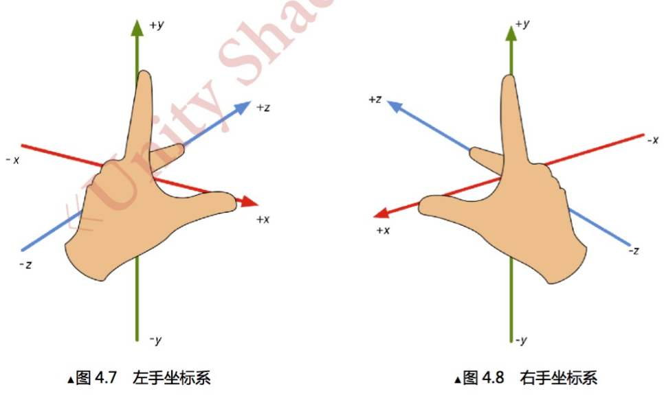
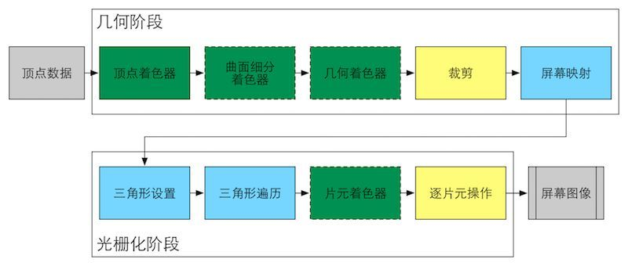
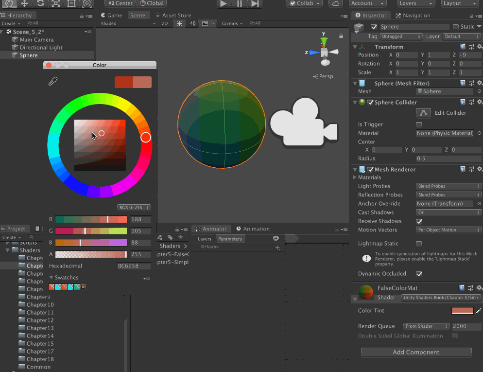
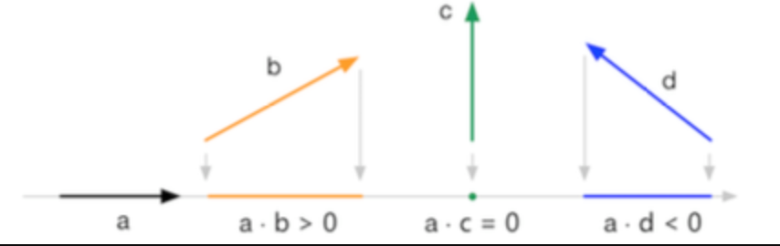
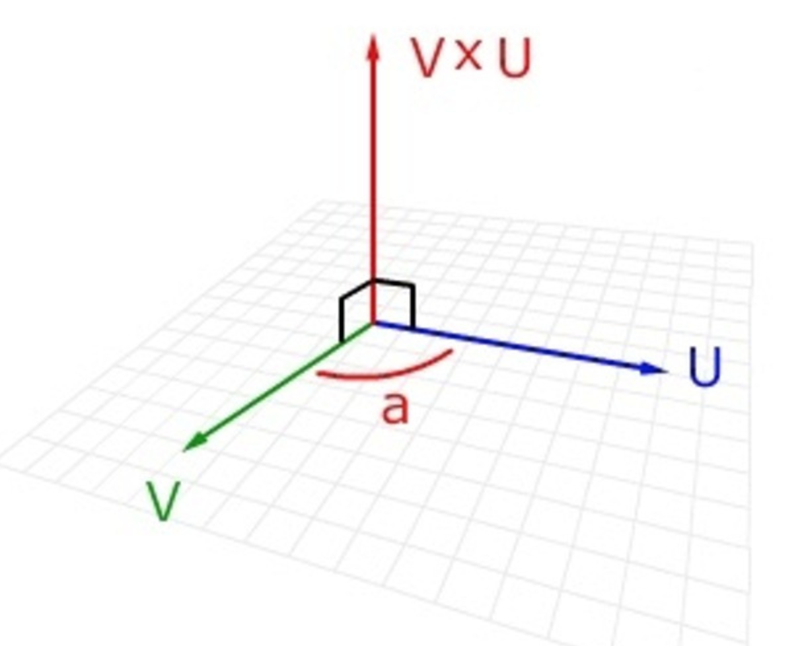
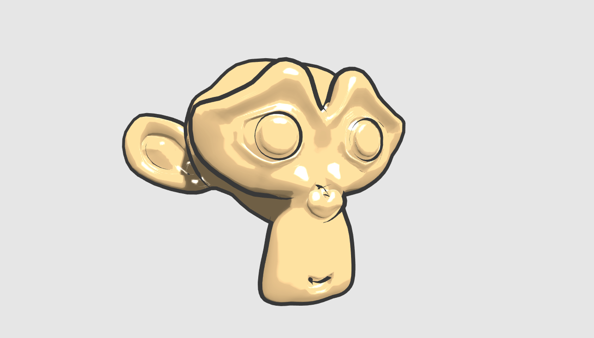

>[第 N-1 手资料](http://www.xumenger.com/docs-20200916/)

>[https://github.com/xumenger/UnityToonShader](https://github.com/xumenger/UnityToonShader)

>[https://github.com/xumenger/Unity_Shaders_Book](https://github.com/xumenger/Unity_Shaders_Book)

>本文内容主要来自《Unity Shader 入门精要》！！

>[https://github.com/xumenger/Awesome-Unity-Shader](https://github.com/xumenger/Awesome-Unity-Shader)

>[https://blog.csdn.net/zhmxy555/category_9264739.html](https://blog.csdn.net/zhmxy555/category_9264739.html)

>Book of Shader：[https://thebookofshaders.com/(英)](https://thebookofshaders.com/)与[https://thebookofshaders.com/?lan=ch(中)](https://thebookofshaders.com/?lan=ch)

>[Shader语法](https://docs.unity3d.com/Manual/SL-ShaderSemantics.html)、[Sampler语法](https://docs.unity3d.com/2018.4/Documentation/Manual/SL-SamplerStates.html)、[Unity Shader 例子](https://docs.unity3d.com/Manual/SL-VertexFragmentShaderExamples.html)

>[GLSL 成像具体过程](https://learnopengl.com/Getting-started/Hello-Triangle)

## 文章目录

* [3D图形学理论基础](#001)
* [Unity Shader 基础结构](#002)
* [Unity Shader 调试](#003)
* [一个简单的Shader](#004)
* [Unity Shader 内置函数/宏/变量](#005)
* [实现卡通效果渲染](#006)
* [基础图形学公式](#007)

## <span id="001">3D图形学理论基础</span>

对于模型空间和世界空间，Unity 使用的是左手坐标。但是对于观察空间来说，Unity 使用的是右手坐标系，通俗来说观察空间就是以摄像机为原点的坐标系



顶点着色器最基本的功能就是把模型的顶点坐标从模型空间转换到齐次裁剪坐标空间中。渲染游戏的过程可以理解成是把一个个顶点经过层层处理最终转化到屏幕上的过程

顶点变换的第一步就是将顶点坐标从模型空间变换到世界空间中去，这个变换通常称为模型变换

顶点变换的第二步就是将顶点坐标从世界空间变换到观察空间（摄像机空间）中去，这个变换通常称为观察变换

顶点坐标接下来要从观察空间转换到裁剪空间（齐次裁剪空间），这个用于转换的矩阵是裁剪矩阵，也叫做投影矩阵。裁剪空间的目标是能够方便地对渲染图元进行裁剪，完全位于这块空间内部的图元将被保留，完全位于这块空间之外的图元将被剔除，而与这块空间边界相交的图元就会被裁剪

经过投影矩阵的变换之后，就可以进行裁剪操作。当完成了所有的裁剪工作后，就需要进行真正的投影了，即需要讲视锥体投影到屏幕空间，经过这一步变换，就会得到真正的像素位置，而不是虚拟的三维坐标。屏幕空间是一个二维坐标

在游戏中，模型的一个顶点往往会携带额外的信息，而顶点法线就是其中一种信息，当变换一个模型的时候，不仅需要变换它的顶点，还需要变换顶点法线，以便于后续处理（比如片元着色器）中计算光照

Unity 中内置的变换矩阵

变量名               | 描述 
------------------- | ---------------------------------------------------- 
UNITY_MATRIX_MVP    |  当前的模型观察投影矩阵，用于将顶点/方向矢量从模型空间变换到裁剪空间
UNITY_MATRIX_MV     |  当前的模型观察矩阵，用于将顶点/方向矢量从模型空间变换到观察空间
UNITY_MATRIX_V      |  当前的观察矩阵，用于将顶点/方向矢量从世界空间变换到观察空间
UNITY_MATRIX_P      |  当前的投影矩阵，用于将顶点/方向矢量从观察空间变换到裁剪空间
UNITY_MATRIX_VP     |  当前的观察投影矩阵，用于将顶点/方向矢量从观察空间变换到裁剪空间
UNITY_MATRIX_T_MV   |  UINTY_MATRIX_MV的转置矩阵，用于将顶点/方向矢量从观察空间变换到模型空间
UNITY_MATRIX_IT_MV  |  UINTY_MATRIX_MV的逆转置矩阵，用于将法线从模型空间变换到观察空间，也用于得到UINTY_MATRIX_MV的逆矩阵
_Object2World       |  当前的模型矩阵，用于将顶点/方向矢量从模型空间变换到世界空间
_World2Object       |  _Object2World的逆矩阵，用于将顶点/方向矢量从世界空间变换到模型空间

最后推荐B 站[up 主Flynnmnn](https://space.bilibili.com/398411802) 的一个视频[《Unity Shader 102 - 3D成像的过程和depth的小应用》](https://www.bilibili.com/video/BV1MD4y1U7B6)

再补充一下渲染流水线的知识。渲染流水线的最终目的在于生成/渲染出一张二维纹理，即在电脑屏幕上看到的效果。它的输入是一个虚拟摄像机、一些光源、一些Shader 以及纹理等



更详细的内容建议阅读《Unity Shader 入门精要》基础篇！

## <span id="002">Unity Shader 基础结构</span>

比如下面是编写Unity Shader 的基本框架！

```shader
Shader "Test/ShaderExample" {

    Properties {
        // 属性
        // Name ("display name", PropertyType) = DefaultValue

        // Numbers and Sliders
        _Int ("Int", Int) = 2
        _Float ("Float", Float) = 1.25
        _Range ("Range", Range(0.0, 5.0)) = 3.0

        // Colors and Vectors
        _Color ("Color", Color) = (1, 1, 1, 1)
        _Vector ("Vector", Vector) = (2, 3, 6, 1)

        // Texture
        _2D ("2D", 2D) = "" {}
        _Cube ("Cube", Cube) = "white" {}
        _3D ("3D", 3D = "black" {}
    }

    SubShader {
        // 显卡A使用的子着色器

        // 标签，可选的
        [Tags]

        // 状态，可选的
        [RenderSetup]

        // 每个Pass 定义了一次完整的渲染流程，但如果Pass 数量过多，会造成渲染性能的下降
        Pass {
            [Name]
            [Tags]
            [RenderSetup]

            // Other Code

        }

        // Other Pass

    }

    SubShader {
        // 显卡B使用的子着色器

    }

    // 如果显卡对于上面的子着色器都不支持的话，会使用Fallback 语义指定的Unity Shader
    Fallback "VertexLit"
}
```

## <span id="003">Unity Shader 调试</span>

在Unity 的Project 窗口选中Unity Shader 文件后，对应在Inspector 窗口点击【Compile and show code】下拉列表可以让开发者检查该Unity Shader 针对不同的图形编程接口（例如OpenGL、D3D9 等）最终编译生成的Shader 代码，可以利用这些代码来分析和优化着色器！

Mac 使用的图像编程接口是基于OpenGL 的，而其他平台，比如Windows，可能使用的是DirectX。在OpenGL 中，渲染纹理（Render Texture）的(0, 0) 点在左下角，而在DirectX 中(0, 0) 在左上角

### 帧调试器


## <span id="004">一个简单的Shader</span>

以下给出书中第一个Shader 实例源码，并添加必要的说明

```
Shader "Example/SimpleShader" {
    Properties {
        // 定义一个属性，可以在材质面板上选择颜色
        _Color ("Color Tint", Color) = (1, 1, 1, 1)
    }

    SubShader {
        Pass {
            CGPROGRAM

            #include "UnityCG.cginc"

            // 告诉编译器 vert 是顶点着色器
            #pragma vertex vert
            // 告诉编译器 frag 是片元着色器
            #pragma fragment frag


            // uniform 关键词是 Cg 中用于修饰变量和参数的一种修饰词
            // 它仅仅用于提供一些关于该变量的初始值是如何制定和存储的相关信息
            uniform fixed4 _Color;


            // 使用一个结构体定义顶点着色器的输入
            // POSITION、NORMAL、TEXCOORD0 语义的数据来自哪里？
            // 它们由该材质的 Mesh Render 组件提供，在每帧调用 Draw Call 的时候
            // Mesh Render 组件会把它负责渲染的模型数据发送给 Unity Shader
            struct a2v {
                // vertex 包含了顶点的位置，通过 POSITION 语义指定的
                // POSITION 语义告诉 Unity 用模型空间的顶点坐标填充 vertex 变量
                float4 vertex : POSITION;

                // NORMAL 语义告诉 Unity 用模型空间的法线向量填充 normal 变量
                float3 normal : NORMAL;

                // TEXCOORD0 语义告诉 Unity 用模型的第一套纹理坐标填充 texcoord 变量
                float4 texcoord : TEXCOORD0;
            };

            // 使用一个结构体定义顶点着色器的输出
            // 用于在顶点着色器和片元着色器之间传输信息
            struct v2f {
                // SV_POSITION 语义表示顶点在裁剪空间的位置
                // SV_POSITION 语义告诉 Unity，pos 里包含了顶点在裁剪空间中的位置信息
                // 否则，渲染器将无法得到裁剪空间中的顶点坐标，也无法将顶点渲染到屏幕上
                float4 pos : SV_POSITION;

                // COLOR0 语义 可用于存储颜色信息
                // COLOR0 语义中的数据可以由用户自己定义，但一般存储颜色，比如逐顶点的漫反射颜色或者逐顶点的高光反射颜色
                // 类似的语义还有 COLOR1 等
                fixed3 color : COLOR0;
            };


            // 顶点着色器时流水线的第一个阶段，它的输入来自CPU
            // 顶点着色器的处理单位是顶点，也就是说，输入进来的每个顶点都会调用一次顶点着色器
            // 顶点着色器本身不可以创建或者销毁任何顶点，而且无法得到顶点与顶点之间的关系
            // 例如，无法得知两个顶点是否属于同一个三角形网格
            // 正是因为这种相互独立性，GPU 可以利用本身的特性并发化处理每个顶点，这个阶段的处理速度非常快
            v2f vert(a2v v) {
                v2f o;

                // 下面一行，等价于 o.pos = mul(UNITY_MATRIX_MVP, v.vertex);
                // UNITY_MATRIX_MVP 当前的模型观察投影矩阵，用于将顶点/方向矢量从模型空间变换到裁剪空间
                o.pos = UnityObjectToClipPos(v.vertex);

                // v.normal 包含了顶点的法线向量，其分量范围在[-1.0, 1.0]
                // 下面的代码将分量范围映射到 [0.0, 1.0]
                // 存储到 o.color 中传递给片元着色器
                o.color = v.normal * 0.5 + fixed3(0.5, 0.5, 0.5);
                return o;
            }


            // 片元着色器是逐片元执行的
            // 片元大致可以认为对应屏幕像素，或者说render target上的像素，在透视投影下，离得近的模型占的屏幕面积大，自然片元就更多
            // 片元着色器的输入实际上是把顶点着色器的输出进行插值后得到的结果
            fixed4 frag(v2f i) : SV_Target {
                fixed3 c = i.color;

                // 使用 _Color 属性来控制输出颜色
                c *= _Color.rbg;

                // 将插值后的 i.color 显示到屏幕上
                return fixed4(c, 1.0);
            }

            ENDCG
        }
    }
}
```



顶点/片元着色器的复杂之处在于，很多事情都需要开发者亲力亲为，比如需要自己转换法线向量、自己处理光照和阴影等等

为了方便开发者的编码过程，Unity 提供了很多的内置文件，这些文件包含了很多提前定义的函数、变量和宏等，在后续的具体案例中，用到的地方会详细介绍

[https://docs.unity3d.com/2019.3/Documentation/Manual/SL-Reference.html](https://docs.unity3d.com/2019.3/Documentation/Manual/SL-Reference.html)

[https://docs.unity3d.com/2019.3/Documentation/Manual/SL-BuiltinFunctions.html](https://docs.unity3d.com/2019.3/Documentation/Manual/SL-BuiltinFunctions.html)

[https://docs.unity3d.com/2019.3/Documentation/Manual/SL-UnityShaderVariables.html](https://docs.unity3d.com/2019.3/Documentation/Manual/SL-UnityShaderVariables.html)

## <span id="005">Unity Shader 内置函数/宏/变量</span>

在编写Unity Shader 的时候，直接使用Unity 内置的一些函数/宏/变量可以有效的提升开发效率！下面会尽可能详细的列举，并说明其功能和背后线性代数、图形学、Unity 的原理！同时也会提到这些内置的函数/宏/变量可能会在实现哪些效果的时候用到，作为一个快速参考的便签使用！

### UnityObjectToClipPos()

用于将顶点位置从模型空间转换到裁剪空间，在顶点着色器中使用

```
o.vertex = UnityObjectToClipPos(v.vertex);

// 等价于
o.vertex = mul(UNITY_MATRIX_MVP, v.vertex);
```

UNITY_MATRIX_VP、UNITY_MATRIX_P 都有对应的封装方法UnityWorldToClipPos()、UnityViewToClipPos()

在这以前，你还需要在Pass中加上一句 `#include "UnityCG.cginc"`，另外还有这些函数

函数名                                       | 描述 
------------------------------------------- | -----------------------------------------------------------------------
float3 WorldSpaceViewDir(float4 v)          | 输入一个模型空间中的顶点位置，返回世界空间中从该点到摄像机的观察方向
float3 ObjSpaceViewDir(float4 v)            | 输入一个模型空间中的顶点位置，返回模型空间中从该点到摄像机的观察方向
float3 WorldSpaceLightDir(float4 v)         | 仅用于前向渲染。输入一个模型空间中的顶点位置，返回世界空间中从该点到光源的光照方向。没有被归一化
float3 ObjSpaceLightDir(float4 v)           | 仅用于前向渲染。输入一个模型空间中的顶点位置，返回模型空间中从该点到光源的光照方向。没有被归一化
float3 UnityObjectToWorldNormal(float3 norm)| 把法线向量从模型空间转换到世界空间中
float3 UnityObjectToWorldDir(float3 dir)    | 把方向矢量从模型空间转换到世界空间中
float3 UnityWorldToObjectDir(float3 dir)    | 把方向矢量从世界空间转换到模型空间中

### mul() 与 dot()

在上面介绍UnityObjectToClipPos() 的时候，说到其等价于`o.vertex = mul(UNITY_MATRIX_MVP, v.vertex);`

在线性代数中，矩阵有叉乘（mul()）、点乘（dot()）两种乘法运算

比如两个向量点乘，得到一个标量

**a** · **b** = (ax, ay, az) · (bx, by, bz) = axbx + ayby + azbz

点乘的几何意义很重要，因为点乘几乎应用到图形学的各个方面，其中一个几何意义就是投影（projection）。假如一个单位向量**a** 和另一个长度不限的矢量**b**，现在希望得到**b** 在平行于**a** 的一条直线上的投影，那么就可以使用**a** · **b** 来得到**b** 在**a** 方向上的有符号的投影

假如**a** 不是单位向量呢？任何两个向量**a** · **b**，等于**b** 在**a** 方向上的投影，再乘以**a** 的长度

需要注意的是，投影的值可能是负值。投影的结果的正负与**a** 和**b** 的方向有关，当它们的方向相反（夹角大于90度时），结果小于0；当它们的方向互相垂直（夹角为90度时），结果为0；当它们的方向相同（夹角小于90度时），结果大于0。如下图所示的三种情况



接下来再看两个向量叉乘，与点乘不同的是，点乘得到的结果还是矢量，而不是标量！

**a** × **b** = (ax, ay, az) × (bx, by, bz) = (aybz-azby, azbx-axbz, axby-aybx)

和点乘另外不同的一个点是，叉乘不满足交换律，比如**a** × **b** != **b** × **a**

也不满足结合律，(**a** × **b**) × **c** != **a** × (**b** × **c**)

从实际的几何意义上理解叉乘，对两个矢量进行叉乘的结果会得到一个同时垂直于这两个矢量的新矢量



另外，矩阵在整个线性代数的世界中扮演了举足轻重的角色。在三位数学中，通常使用矩阵来进行变换。一个矩阵可以把一个矢量从一个坐标空间转换到另一个坐标空间，比如在顶点着色器中需要把顶点坐标从模型空间变换到齐次裁剪坐标系中

### ComputeScreenPos()

该函数在UnityCG.cginc 中被定义，主要用于得到片元在屏幕上的像素位置

通常用法需要两个步骤，首先在顶点着色器中将ComputeScreenPos() 的结果保存在输出结构体中，然后在片元着色器中进行一次齐次除法运算后得到视口空间下的坐标

```
struct vertOut {
    float4 pos: SV_POSITION;
    float4 srcPos: TEXCOORD0;
};

vertOut vert(appdata_base v) 
{
    vertOut o;
    o.pos = mul(UNITY_MATRIX_MVP, v.vertex);

    // 第一步，把ComputeScreenPos()的结果保存在srcPos
    o.srcPos = ComputeScreenPos(o.pos);

    return o;
}

fixed4 frag(vertOut i) : SV_Target
{
    // 第二步：用srcPos.xy 除以srcPos.w 得到视口空间中的坐标
    float2 wcoord = (i.srcPos.xy / i.srcPos.w);
    return fixed4(wcoord, 0.0, 1.0);
}
```

### saturate(x)

x 为用于操作的标量或者矢量，可以是float、float2、float3 等类型

该函数用于把x 截取在[0, 1] 范围内，如果x 是一个矢量，那么会对它的每个分量进行这样的操作

比如在Unity Shader 中实现漫反射光照模型，漫反射公式是

**C**diffuse = (**C**light · **M**diffuse) max(0, **n** · **l**)

**C**light 为入射光强度；**M**diffuse 为材质的反射系数；**n** 为表面法线；**l** 为光源方向。为了防止点乘结果为负值，要用到max() 操作，也可以用saturate() 实现

比如实现逐像素的漫反射效果

```
struct v2f {
    float4 pos : SV_POSITION;
    float3 worldNormal : TEXCOORD0;
};

v2f vert(a2v v)
{
    v2f o;
    // Transform the vertex from object space to projection space
    o.pos = mul(UNITY_MATRIX_MVP, v.vertex);

    // Transform the normal from object space to world space
    o.worldNormal = mul(v.normal, (float3x3)_World2Object);
}

fixed4 frag(v2f i): SV_Target
{
    // 获取环境光
    fixed3 ambient = UNITY_LIGHTMODEL_AMBIENT.xyz;

    // 对世界空间的法线向量进行归一化
    fixed3 worldNormal = normalize(i.worldNormal);
    // 获取世界空间中的光线方向。但如果场景中有多个光源且可能是点光源，直接使用_WorldSpaceLightPos0 就不能得到正确的结果
    fixed3 worldLightDir = normalize(_WorldSpaceLightPos0.xyz);

    // 使用公式计算漫反射
    fixed3 diffuse = _LightColot0.rgb * _Diffuse.rgb * saturate(dot(worldNormal, worldLightDir));

    // 环境光和漫反射光部分进行相加
    fixed3 color = ambient + diffuse;

    return fixed4(color, 1.0);
}
```

### TRANSFORM_TEX()

```
#define TRANSFORM_TEX(tex, name) (tex.xy * name##_ST.xy + name##_ST.zw)

// 先使用缩放属性.xy 对顶点纹理坐标进行缩放
// 然后使用偏移属性.zw 对结果进行偏移

// 第一个参数是顶点纹理坐标
// 第二个参数是纹理名
```

在Unity 中，我们需要使用**纹理名_ST** 的方式来声明纹理的属性。其中ST 是缩放(scale) 和平移(translation) 的缩写，.xy 存储的是缩放值。.zw 存储的是偏移值

上面的宏用于对顶点纹理坐标进行变换，得到最终的纹理坐标

### tex2D()

tex2D() 函数对纹理进行采样。第一个参数需要被采样的纹理，第二个参数是一个float2 类型的纹理坐标，函数返回计算得到的纹素值

TRANSFORM_TEX()、tex2D() 主要用在对纹理的处理中，比如下面这个Shader，使用单张纹理来作为模拟的颜色

```
Shader "Unity Shaders Book/Chapter 7/Single Texture" {
    Properties {
        _Color ("Color Tint", Color) = (1, 1, 1, 1)

        // 纹理属性
        _MainTex ("Main Tex", 2D) = "white" {}

        // 控制高光反射颜色
        _Specular ("Specular", Color) = (1, 1, 1, 1)

        // 控制高光区域大小
        _Gloss ("Gloss", Range(8.0, 256)) = 20
    }
    SubShader {     
        Pass { 
            Tags { "LightMode"="ForwardBase" }
        
            CGPROGRAM
            
            #pragma vertex vert
            #pragma fragment frag

            #include "Lighting.cginc"
            
            fixed4 _Color;
            sampler2D _MainTex;
            float4 _MainTex_ST;     // 使用 纹理名_ST 的方式来声明纹理的属性。其中ST 是缩放(scale) 和平移(translation) 的缩写，.xy 存储的是缩放值。.zw 存储的是偏移值
            fixed4 _Specular;
            float _Gloss;
            
            struct a2v {
                float4 vertex : POSITION;
                float3 normal : NORMAL;

                // TEXCOORD0 语义，Unity 将模型的第一组纹理坐标存储到该变量
                float4 texcoord : TEXCOORD0;
            };
            
            struct v2f {
                float4 pos : SV_POSITION;
                float3 worldNormal : TEXCOORD0;
                float3 worldPos : TEXCOORD1;

                // 用于存储纹理坐标的变量uv，以便在片元着色器中使用该变量进行纹理采样
                float2 uv : TEXCOORD2;
            };
            
            v2f vert(a2v v) {
                v2f o;
                o.pos = UnityObjectToClipPos(v.vertex);
                
                o.worldNormal = UnityObjectToWorldNormal(v.normal);
                
                o.worldPos = mul(unity_ObjectToWorld, v.vertex).xyz;
                
                // 使用纹理的属性值_MainTex_ST 对顶点纹理坐标进行变换，得到最终的纹理坐标
                // 先使用缩放属性.xy 对顶点纹理坐标进行缩放
                // 然后使用偏移属性.zw 对结果进行偏移
                o.uv = v.texcoord.xy * _MainTex_ST.xy + _MainTex_ST.zw;
                // Or just call the built-in function
//              o.uv = TRANSFORM_TEX(v.texcoord, _MainTex);
                
                return o;
            }
            
            fixed4 frag(v2f i) : SV_Target {
                // 先计算了世界空间下的法线向量和光照方向
                fixed3 worldNormal = normalize(i.worldNormal);
                fixed3 worldLightDir = normalize(UnityWorldSpaceLightDir(i.worldPos));
                

                // 使用tex2D() 函数对纹理进行采样
                // 第一个参数需要被采样的纹理，第二个参数是一个float2 类型的纹理坐标
                // 函数返回计算得到的纹素值
                // 使用采样结果和颜色属性_Color 的乘积来作为材质的反射率 albedo
                // Use the texture to sample the diffuse color
                fixed3 albedo = tex2D(_MainTex, i.uv).rgb * _Color.rgb;
                
                // 反射率albedo 与环境光照相乘得到环境光部分
                fixed3 ambient = UNITY_LIGHTMODEL_AMBIENT.xyz * albedo;
                
                // 使用albedo 来计算漫反射光照的结果
                fixed3 diffuse = _LightColor0.rgb * albedo * max(0, dot(worldNormal, worldLightDir));
                
                fixed3 viewDir = normalize(UnityWorldSpaceViewDir(i.worldPos));
                fixed3 halfDir = normalize(worldLightDir + viewDir);
                fixed3 specular = _LightColor0.rgb * _Specular.rgb * pow(max(0, dot(worldNormal, halfDir)), _Gloss);
                

                // 环境光、漫反射、高光反射光照相加返回
                return fixed4(ambient + diffuse + specular, 1.0);
            }
            
            ENDCG
        }
    } 
    FallBack "Specular"
}
```

### lerp()


### tex2Dproj()


### UNITY_PROJ_COORD()


### LinearEyeDepth()


### smoothstep()


### COMPUTE_VIEW_NORMAL


## <span id="006">实现卡通效果渲染</span>

卡通风格是游戏中常见的一种渲染风格，使用这种风格的游戏画面通常有一些共有的特点，例如物体都被黑色的线条描边，以及分明的明暗变化等等，下面的例子仍然来自《Unity Shader 入门精要》

```
Shader "Unity Shaders Book/Chapter 14/Toon Shading" {
    Properties {
        _Color ("Color Tint", Color) = (1, 1, 1, 1)
        _MainTex ("Main Tex", 2D) = "white" {}

        // _Ramp 是用于控制漫反射色调的渐变纹理，后面会有说明
        _Ramp ("Ramp Texture", 2D) = "white" {}

        // 用于控制轮廓线宽度
        _Outline ("Outline", Range(0, 1)) = 0.1

        // 用于控制轮廓线颜色
        _OutlineColor ("Outline Color", Color) = (0, 0, 0, 1)

        // 高光反射颜色
        _Specular ("Specular", Color) = (1, 1, 1, 1)

        // 用于控制计算高光反射时使用的阈值
        _SpecularScale ("Specular Scale", Range(0, 0.1)) = 0.01
    }

    SubShader {
        Tags { "RenderType"="Opaque" "Queue"="Geometry"}
        
        // 定义渲染轮廓线需要的Pass，这个Pass 只渲染背面的三角面片
        Pass {
            // 使用NAME 命令为该Pass 定义了名称，这是因为描边在非真实感渲染中是非常常见的效果
            // 为该Pass 定义名称可以让我们在后面的使用中不需要再重复编写此Pass，只需要调用它的名字即可
            NAME "OUTLINE"
            
            // 只渲染背面，所以使用Cull 指令把正面的三角面片剔除
            Cull Front
            
            CGPROGRAM
            
            #pragma vertex vert
            #pragma fragment frag
            
            #include "UnityCG.cginc"
            
            float _Outline;
            fixed4 _OutlineColor;
            
            struct a2v {
                float4 vertex : POSITION;
                float3 normal : NORMAL;
            }; 
            
            struct v2f {
                float4 pos : SV_POSITION;
            };
            

            // 定义描边需要的顶点着色器
            v2f vert (a2v v) {
                v2f o;
                
                // 把顶点、法线变换到视角空间（观察空间）下，这是为了让描边可以在观察空间达到最好的效果
                float4 pos = float4(UnityObjectToViewPos(v.vertex), 1.0);
                float3 normal = mul((float3x3)UNITY_MATRIX_IT_MV, v.normal);

                // 设置法线的z 分量，对其归一化后再将顶点沿其方向扩展，得到扩展后的顶点坐标
                // 对法线的处理是为了尽可能避免背面扩张后的顶点挡住正面的面片
                normal.z = -0.5;
                pos = pos + float4(normalize(normal), 0) * _Outline;

                // 最后把顶点从视角空间变换到裁剪空间
                o.pos = mul(UNITY_MATRIX_P, pos);
                
                return o;
            }
            
            // 片元着色器很简单，只需要用轮廓线颜色渲染整个背面即可
            float4 frag(v2f i) : SV_Target { 
                return float4(_OutlineColor.rgb, 1);               
            }
            
            ENDCG
        }
        

        // 定义光照模型所在的Pass，以渲染模型的正面
        // 由于光照模型需要使用Unity 提供的光照等信息，需要为Pass 进行相应的设置
        Pass {
            Tags { "LightMode"="ForwardBase" }
            
            // 这次只渲染正面，所以剔除模型的背面
            Cull Back
        
            CGPROGRAM
        
            #pragma vertex vert
            #pragma fragment frag
            
            // 添加相应的编译指令，都是为了让Shader 中的光照变量可以被正确赋值
            #pragma multi_compile_fwdbase
        
            #include "UnityCG.cginc"
            #include "Lighting.cginc"
            #include "AutoLight.cginc"
            #include "UnityShaderVariables.cginc"
            
            fixed4 _Color;
            sampler2D _MainTex;
            float4 _MainTex_ST;
            sampler2D _Ramp;
            fixed4 _Specular;
            fixed _SpecularScale;
        
            struct a2v {
                float4 vertex : POSITION;
                float3 normal : NORMAL;
                float4 texcoord : TEXCOORD0;
                float4 tangent : TANGENT;
            }; 
        
            struct v2f {
                float4 pos : POSITION;
                float2 uv : TEXCOORD0;
                float3 worldNormal : TEXCOORD1;
                float3 worldPos : TEXCOORD2;
                SHADOW_COORDS(3)
            };
            
            v2f vert (a2v v) {
                v2f o;
                
                o.pos = UnityObjectToClipPos( v.vertex);
                o.uv = TRANSFORM_TEX (v.texcoord, _MainTex);

                // 计算世界空间下的法线向量和顶点位置
                o.worldNormal  = UnityObjectToWorldNormal(v.normal);
                o.worldPos = mul(unity_ObjectToWorld, v.vertex).xyz;
                
                // 使用Unity 内置的宏TRANSFER_SHADOW 计算阴影所需要的各个变量
                TRANSFER_SHADOW(o);
                
                return o;
            }
            

            // 片元着色器中包含了计算光照模型的关键代码
            float4 frag(v2f i) : SV_Target { 
                // 对世界空间下的法线向量归一化
                fixed3 worldNormal = normalize(i.worldNormal);

                // 对
                fixed3 worldLightDir = normalize(UnityWorldSpaceLightDir(i.worldPos));
                fixed3 worldViewDir = normalize(UnityWorldSpaceViewDir(i.worldPos));
                fixed3 worldHalfDir = normalize(worldLightDir + worldViewDir);
                
                //
                fixed4 c = tex2D (_MainTex, i.uv);
                // 计算材质的反射率albedo
                fixed3 albedo = c.rgb * _Color.rgb;
                
                // 计算环境光照ambient
                fixed3 ambient = UNITY_LIGHTMODEL_AMBIENT.xyz * albedo;
                
                // 使用Unity 内置的宏UNITY_LIGHT_ATTENUATION 计算当前世界坐标系下的阴影值
                UNITY_LIGHT_ATTENUATION(atten, i, i.worldPos);
                
                // 计算半兰伯特漫反射系数
                fixed diff =  dot(worldNormal, worldLightDir);
                // 并和阴影值相乘得到最终的漫反射系数
                diff = (diff * 0.5 + 0.5) * atten;
                
                // 使用这个漫反射系数对渐变纹理_Ramp 进行采样
                // 并将结果和材质的反射率、光照颜色相乘，作为最后的漫反射光照
                fixed3 diffuse = _LightColor0.rgb * albedo * tex2D(_Ramp, float2(diff, diff)).rgb;
                
                // 计算高光
                fixed spec = dot(worldNormal, worldHalfDir);
                // 使用fwidth() 对高光区域的边界进行抗锯齿处理
                fixed w = fwidth(spec) * 2.0;
                // 最后还使用step(0.0001, _SpecularScale)，这是为了在_SpecularScale 为0 时，可以完全消除高光反射的光照
                fixed3 specular = _Specular.rgb * lerp(0, 1, smoothstep(-w, w, spec + _SpecularScale - 1)) * step(0.0001, _SpecularScale);
                
                // 最后，返回环境光照、漫反射光照和高光反射叠加的结果
                return fixed4(ambient + diffuse + specular, 1.0);
            }
        
            ENDCG
        }
    }
    FallBack "Diffuse"
}
```

当然《Unity Shader 入门精要》实现的卡通渲染光照模型是一种非常简单的实现，在商业项目中，往往需要设计和实现更加复杂的光照模型，以得到出色的卡通效果

其中\_Ramp 设置的贴图是这样的


使用这个Shader 渲染的效果是这样的



>当然，这个例子还是很简单的，推荐一个开源的卡通渲染Shader 项目：[https://github.com/unity3d-jp/UnityChanToonShaderVer2_Project](https://github.com/unity3d-jp/UnityChanToonShaderVer2_Project)

>[游戏诞生之日09 - 美术篇 卡通渲染着色器 UTS2](https://zhuanlan.zhihu.com/p/137288013)

>[【翻译】西川善司「实验做出的游戏图形」「GUILTY GEAR Xrd -SIGN-」中实现的「纯卡通动画的实时3D图形」的秘密，前篇（1）](https://www.cnblogs.com/TracePlus/p/4205798.html)

>[【翻译】西川善司「实验做出的游戏图形」「GUILTY GEAR Xrd -SIGN-」中实现的「纯卡通动画的实时3D图形」的秘密，前篇（2）](https://www.cnblogs.com/TracePlus/p/4205834.html)

>[【翻译】西川善司的「实验做出的游戏图形」「GUILTY GEAR Xrd -SIGN-」中实现的「纯卡通动画的实时3D图形」的秘密，后篇](https://www.cnblogs.com/TracePlus/p/4205978.html)

>[到目前为止的二次元渲染总结](https://zhuanlan.zhihu.com/p/126668414)

>[从零开始的卡通渲染](https://zhuanlan.zhihu.com/c_1215952152252121088)

## <span id="007">基础图形学公式</span>

以上展示了一些典型的案例，并且给出了一些基础的图形学知识，这里穿插一下在编写Shader 实现各种效果的时候，可能会经常用到的公式！

